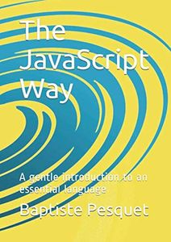

# The JavaScript Way

Pengenalan modern untuk satu bahasa yang esensi.

Hak Cipta © 2017-2020 [Baptiste Pesquet](http://bpesquet.fr).

## Pendahuluan

Buku ini dapat digunakan sebagai panduan bagi siapa saja yang ingin menemu-kembali JavaScript dari berbagai aspek. Keunggulan buku ini sebagai berikut.

* **Cocok untuk pemula namun komprehensif**. Mulai dari panduan dasar pemrograman sampai dengan *front-end* dan *back-end* pengembangan web, mencakup banyak topik yang dijelaskan secara sederhana dan mudah dipahami. Tidak perlu pengetahuan JavaScript sebelumnya!
* **Sudah disesuaikan dengan standar**. Buku ini seluruhnya ditulis menggunakan sintaks **ES2015**, sehingga Kamu mendapatkan pengetahuan yang dapat Kamu tetap gunakan di masa depan. Hal ini dapat membuat Kamu menerapkan kebiasaan pemrograman yang baik dari mulai awal sampai akhir, serta penggunaan JavaScript *tool* yang banyak digunakan seperti [ESLint](http://eslint.org) dan [Prettier](https://github.com/prettier/prettier). Selain itu juga mengikuti panduan ala AirBnb yang populer ([AirBnb Style Guide](https://github.com/airbnb/javascript)).
* **Banyak Latihan**. Pembelajaran Kamu tidak akan lengkap tanpa latihan! Setiap bab akan ada latihan yang dapat Kamu aplikasikan. Ada 3 proyek yang akan memandu Kamu agar bisa membuat aplikasi berita sosial berbasis web. Kamu bisa lihat contohnya [di sini](https://thejsway-publink.herokuapp.com).
* **Mudah diikuti**. Koding dilakukan langsung dari browser atau bisa juga dilakukan di *environment* lokal perangkat Kamu.

## Dukungan

Banyak waktu dan tenaga dicurahkan untuk konten ini. Kalau Kamu merasa ini berguna dan ingin mendukung karya ini, berikut yang bisa Kamu lakukan:

* Beli buku ini. Kamu bisa mendapatkannya dalam format yang tersedia (lihat di atas). Kontribusi finansial sangat diapresiasi.
* Nilai atau ulas buku ini di [Goodreads](https://www.goodreads.com/book/show/35875290-the-javascript-way-a-modern-introduction-to-an-essential-language?from_search=true) atau [Amazon](https://www.amazon.com/dp/2956444611?ref_=pe_3052080_397514860).
* Viralkan buku ini.

Terima kasih sebelumnya atas semua dukungan Kamu!

## Daftar isi

> Untuk kemudahan Kamu, sumber kode untuk [latihan](https://github.com/thejsway/thejsway-code) dan [proyek akhir](https://github.com/thejsway/thejsway-publink) sudah tersedia.

* Pengenalan
  * [Tentang buku ini](manuscript/intro01.md)
  * [Selamat datang di pemrograman](manuscript/intro02.md)
  * [Pengenalan JavaScript](manuscript/intro03.md)
  * [Environment setup](manuscript/intro04.md)
* Bagian I: Belajar kode pemrograman
  * [3, 2, 1... Kode!](manuscript/chapter01.md)
  * [Bermain dengan variabel](manuscript/chapter02.md)
  * [Tambah kondisi](manuscript/chapter03.md)
  * [Pernyataan berulang](manuscript/chapter04.md)
  * [Tulis fungsi](manuscript/chapter05.md)
  * [Buat object pertama Kamu](manuscript/chapter06.md)
  * [Simpan data di array](manuscript/chapter07.md)
  * [Bekerja dengan string](manuscript/chapter08.md)
  * [Memahami pemrograman object-oriented](manuscript/chapter09.md)
  * [Temukan pemrograman fungsional](manuscript/chapter10.md)
  * [Proyek: program berita sosial](manuscript/chapter11.md)
* Bagian II: Buat halaman web interaktif 
  * [Apa itu halaman web](manuscript/chapter12.md)
  * [Temukan DOM](manuscript/chapter13.md)
  * [Jelajahi DOM](manuscript/chapter14.md)
  * [Modifikasi struktur halaman](manuscript/chapter15.md)
  * [Reaksi terhadap event](manuscript/chapter16.md)
  * [Manipulasi form](manuscript/chapter17.md)
  * [Animasi elemen](manuscript/chapter18.md)
  * [Proyek: halaman web berita sosial](manuscript/chapter19.md)
* Bagian III: Bangun aplikasi web
  * [Pengembangan Web 101](manuscript/chapter20.md)
  * [Query web server](manuscript/chapter21.md)
  * [Gunakan web API](manuscript/chapter22.md)
  * [Kirim data ke web server](manuscript/chapter23.md)
  * [Temukan Node.js](manuscript/chapter24.md)
  * [Buat web server](manuscript/chapter25.md)
  * [Proyek: aplikasi web berita sosial](manuscript/chapter26.md)
* Kesimpulan
  * [Ringkasan dan perspektif](manuscript/concl01.md)
  * [Pengakuan](manuscript/concl02.md)
* Lampiran
  * [Style guide](manuscript/appendix02.md)
