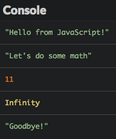
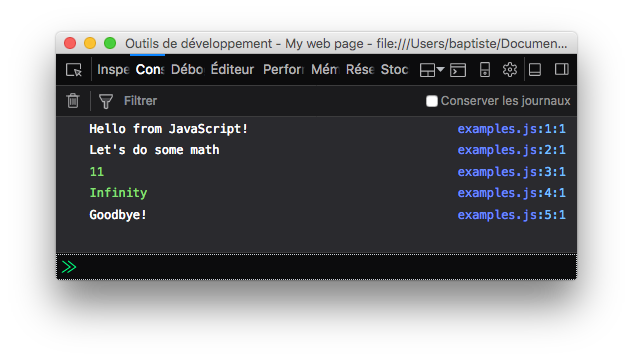
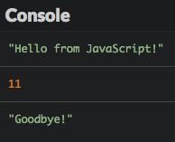
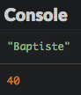

# 3, 2, 1... Kode!

Mari kita mulai! Di bab ini, Kamu akan belajar tentang pemrograman dasar seperti nilai, tipe, dan struktur program.

## TL;DR

* Perintah JavaScript `console.log()` menampilkan pesan di **console**, zona informasi yang ada di hampir semua *environment* JavaScript.

* **Nilai** adalah satu potongan informasi. **Tipe** dari nilai mendefinisikan fungsinya dan operasi yang berlaku pada tipe tersebut.

* Bahasa JavaScript menggunakan tipe **bilangan** untuk merepresentasikan nilai angka (dengan atau tanpa desimal) dan tipe **string** untuk merepresentasikan teks.

* Nilai string diapit oleh sepasang tanda kutip tunggal (`'...'`) atau sepasang tanda kutip ganda (`"..."`).

* Operasi aritmetika antar bilangan dapat digunakan operator `+`, `-`, `*` dan `/`. Operator `+` akan menggabungkan 2 string. Operasi ini dinamakan **concatenation**.

* Program komputer dibuat dari **beberapa baris kode** yang dibaca secara beruturan saat eksekusi.

* **Komentar** (`// ...` or `/* ... */`) adalah bagian kode yang tidak dieksekusi. Komentar ini berguna sebagai dokumentasi atau penjelasan program.

## Program pertama Kamu 

Berikut program JavaScript kita yang paling pertama.

```js
console.log("Hello from JavaScript!");
```

Program ini menampilkan teks `"Hello from JavaScript!"` di **console**, zona yang menampilkan informasi teks tersedia di hampir semua *environment* JavaScript, seperti browser.

Untuk bisa menampilkan ini, digunakan perintah JavaSript bernama `console.log()`, yang berfungsi menampilkan potongan informasi. Teks yang ditampilkan berada diantara tanda kurung diikuti dengan tanda titik koma, yang menandai akhir baris.

Menampilkan teks di layar ([Hello World](https://en.wikipedia.org/wiki/Hello_world) terkenal yang semua programer tahu) merupakan hal yang seringkali Kamu akan lakukan ketika Kamu belajar bahasa pemrograman yang baru. Ini adalah contoh klasik. Kamu telah mengambil langkah pertama!

## Nilai dan tipe 

**Nilai** adalah potongan informasi yang digunakan di program komputer. Nilai dapat ditampilkan dalam bentuk yang berbeda yang dinamakan tipe. **Tipe** dari nilai menentukan perannya dan operasi yang dapat dilakukan.

Setiap bahasa komputer mempunyai tipe dan nilai masing-masing. Mari kita lihat dua dari tipe yang tersedia di JavaScript.

### Bilangan

**Bilangan** adalah nilai angka (*ya jelaslah*). Mari kita perjelas! Seperti matematika, Kamu bisa menggunakan nilai integer (nilai bulat) seperti 0, 1, 2, 3, dan seterusnya, atau angka desimal untuk mendapatkan akurasi lebih tinggi.

Bilangan biasanya digunakan untuk perhitungan. Operasi utama bisa Kamu lihat di tabel berikut. Semua menghasilkan nilai bilangan.

|Operator|Fungsi|
|---------|----|
|`+`|Penambahan|
|`-`|Pengurangan|
|`*`|Perkalian|
|`/`|Pembagian|

### String

**String** di JavaScript adalah teks yang diapit oleh tanda kutip, seperti `"Ini adalah string"`.

Kamu juga mendefinisikan string dengan menggunakan sepasang tanda kutip tunggal: `'Ini adalah string lain'`. Penerapan praktis terbaik dalam menggunakan tanda kutip tunggal atau ganda sama seperti pilpres. Terserah Kamu, yang pasti, jangan dicampur di program yang sama!

> Selalu ingat untuk menutup string dengan tanda kutip yang sama dengan yang Kamu ketik di awal.

Untuk memuat karakter spesial dalam string, gunakan karakter `\` (*backslash*) sebelumnya. Contohnya, ketik `\n` untuk menambah baris baru dalam string:`"Ini adalah\n beberapa baris string"`.

Kamu tidak bisa menambah atau mengurangi nilai string seperti halnya tipe bilangan. Meskipun demikian, operator `+` memiliki arti spesial ketika diterapkan ke dua nilai string. Hal ini akan menggabungkan kedua string tersebut, dan operasi ini dinamakan **concatenation**. Contohnya, `"Ha" + "lo"` menghasilkan `"Hello"`.

## Struktur program 

Kita sudah mendefinisikan program komputer sebagai daftar perintah yang memberitahu komputer apa yang harus dilakukan. Perintah ini ditulis sebagai file teks dan membentuk yang dinamakan "sumber kode" program. Baris teks pada sumber kode disebut **baris kode**.

Sumber kode dapat memuat baris kosong: ini akan tidak akan dieksekusi oleh program.

### Statements

Setiap instruksi di dalam program dinamakan **pernyataan**. Pernyataan di JavaScript biasanya berakhir dengan **tanda titik koma** (walaupun bukan suatu keharusan). Program Kamu akan dibuat dari beberapa pernyataan.

> Kamu biasanya menulis hanya satu pernyataan per baris.

### Aliran eksekusi

Ketika program dieksekusi, pernyataan di dalamnya "dibaca" baris per baris. Kombinasi dari masing-masing ini akan menghasilkan program akhir.

Berikut contoh program JavaScript yang di dalamnya terdapat pernyataan yang diikuti hasil dari eksekusinya.

```js
console.log("Hello from JavaScript!");
console.log("Let's do some math");
console.log(4 + 7);
console.log(12 / 0);
console.log("Goodbye!");
```



Tergantung *environment* Kamu, hasil eksekusi kemungkinan tidak ada tanda kutip diantara teks.



> Sesuai perkiraan, pembagian oleh nol (`12/0`) menghasilkan nilai `Infinity`.

### Komentar

Secara normal, setiap baris teks dalam sumber file program dipertimbangkan sebagai pernyataan yang harus dieksekusi. Kamu bisa mencegah eksekusi baris tertentu dengan cara menempatkan garis miring ganda sebelumnya: `//`. Ini akan mengubah kode menjadi **komentar**.

```js
console.log("Hello from JavaScript!");
// console.log("Let's do some math");
console.log(4 + 7);
// console.log(12 / 0);
console.log("Goodbye!");
```

Saat eksekusi, baris yang di-komentar tidak menghasilkan apa-apa. Seperti yang kita harapkan, baris ini tidak dieksekusi.



Komentar sangatlah membantu developer dalam pengembangan program. Kamu bisa menulis komentar ke diri sendiri, penjelasan tentang kode Kamu, dan lainnya, tanpa dieksekusi oleh komputer.

Kamu juga bisa menulis komentar dengan mengetik `/*  */` di antara kode yang akan Kamu komentari.

```js
/* Komentar 
ditulis di 
beberapa baris*/

// Satu baris komentar
```

Komentar merupakan sumber informasi yang sangat baik tentang tujuan dan struktur program. Menambahkan komentar pada bagian kode yang kompleks adalah satu kebiasaan baik yang harus Kamu mulai sekarang juga!

## Waktu koding!

Mari kita coba keterampilan koding baru Kamu ke dalam latihan.

### Presentasi

Tulis program yang menampilkan nama dan usia. Berikut hasil yang saya buat.



### Kalkulator minimalis 

Tulis satu program yang menampilkan hasil dari penambahan, pengurangan, perkalian, dan pembagian 6 oleh 3.

### Prediksi nilai

Amati program berikut dan coba prediksi nilai yang akan ditampilkan.

```js
console.log(4 + 5);
console.log("4 + 5");
console.log("4" + "5");
```

Cek prediksi Kamu setelah program mengeksekusinya.
