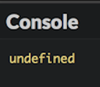
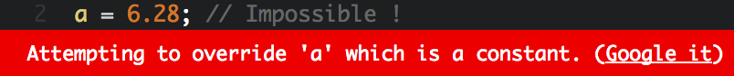

# Bermain dengan variabel

Kamu tahu cara menggunakan JavaScript untuk menampilkan nilai. Walaupun begitu, agar program bisa benar-benar berguna, harus memiliki kemampuan untuk menyimpan data, seperti informasi yang di-input oleh pengguna. Mari kita cek.

## TL;DR

* **Variabel** adalah area penyimpanan informasi. Setiap variabel memiliki **nama**, **nilai**, dan **tipe**. Di JavaScript, tipe variabel didapat dari nilai yang tersimpan di dalamnya: JavaScript adalah bahasa yang **dynamically typed**.

* Variabel dideklarasikan menggunakan kata kunci `let` diikuti dengan nama variabel. Untuk mendeklarasikan **konstanta** (variabel yang nilai awalnya tidak akan berubah), lebih baik menggunakan kata kunci `const`.

* Untuk memberikan nilai pada variabel, kita gunakan **operator penugasan** `=`. Untuk variabel bilangan, operator `+=` bisa menambahkan dan operator `++` bisa **menaikkan (increment)** nilainya.

* **Scope** variabel adalah bagian program di mana variabel terlihat. Variabel dengan deklarasi `let` atau `const` adalah **block-scoped**. **Code block** adalah porsi program yang diapit oleh sepasang kurung kurawal pembuka dan penutup `{ ... }`.

* **Ekspresi** adalah bagian kode yang mengkombinasikan variabel, nilai, dan operator. Mengevaluasi ekspresi menghasilkan nilai yang memiliki tipe.

* Ekspresi termasuk string yang diapit oleh sepasang backtick (\`). String seperti ini disebut **template literal**.

* **Konversi tipe** mungkin terjadi secara implisit ketika evaluasi ekspresi, atau secara eksplisit ketika menggunakan perintah `Number()` dan `String()`, untuk mendapatkan bilangan atau string.

* Perintah `prompt()` dan `alert()` menangani informasi tentang input dan tampilan berupa kotak dialog.

* Penamaan variabel sangat penting dalam visibilitas program. Ketentuan penamaan seperti [camelCase](https://en.wikipedia.org/wiki/Camel_case) merupakan praktik yang baik.

## Variabel

### Peran variabel 

Program komputer menyimpan data menggunakan variabel. **Variabel** adalah area penyimpanan informasi. Kita bisa membayangkannya sebagai kotak di mana Kamu bisa menaruh dan menyimpan barang-barang!

### Properti variabel 

Variabel memiliki 3 properti utama:

* **Nama**, yang mengidentifikasinya. Nama variabel bisa terdiri dari huruf kecil dan kapital, angka (tidak di posisi awal) dan karakter seperti tanda dollar (`$`) atau garis bawah (`_`).
* **Nilai**, yang merupakan data yang tersimpan dalam variabel.
* **Tipe**, yang menentukan peran dan perintah yang tersedia pada variabel.

> Kamu tidak harus mendefinisikan tipe variabel secara eksplisit di JavaScript. Tipenya didapat dari nilai yang tersimpan dalam variabel dan kemungkinan bisa berubah ketika program berjalan. Inilah kenapa JavaScript disebut bahasa yang **dynamically typed**. Bahasa lain, seperti C atau Java, membutuhkan tipe variabel yang selalu didefinisikan terlebih dulu. Ini dinamakan **static typing**.

### Mendeklarasikan variabel 

Sebelum Kamu bisa menyimpan informasi pada sebuah variabel, Kamu harus membuatnya dulu! Hal ini disebut mendeklarasikan variabel. **Mendeklarasikan** variabel artinya komputer mencadangkan memori di mana variabel tersebut disimpan. Program ini lalu bisa membaca atau menulis data di memori area tersebut dengan memanipulasi variabel.

Berikut contoh kode yang mendeklarasikan satu variabel dan menampilkan isinya:

```js
let a;
console.log(a);
```

Di JavaScript, Kamu mendeklarasikan variabel dengan kata kunci `let` diikuti oleh nama variabel. Di contoh ini, variabel yang dibuat dinamakan `a`.

> Sebelumnya, variabel JavaScript dideklarasikan menggunakan kata kunci `var`. Hal ini masih memungkinkan, tetapi di banyak kasus, lebih mudah menggunakan `let` dan `const`.

Berikut hasil eksekusinya.



Catatan: hasilnya `undefined`. Ini adalah tipe spesial di JavaScript yang menyatakan tidak ada nilai. Saya mendeklarasikan variabel, memanggilnya dengan `a`, tetapi tidak memberikan nilai!

### Mengisi nilai ke variabel 

Ketika program berjalan, nilai yang tersimpan di variabel bisa berubah. Untuk memberikan nilai baru ke variabel, gunakan operator `=` yang disebut **operator penugasan**.

Lihat contoh di bawah: 

```js
let a;
a = 3.14;
console.log(a);
```


Kita memodifikasi variabel dengan mengisinya dengan sebuah nilai. `a = 3.14` dibaca "a menerima nilai 3.14". 

> Hati-hati, jangan bingung antara operator penugasan `=` dengan persamaan matematika! Kamu akan lihat nanti bagaimana mengekspresikan persamaan di JavaScript.

Kamu juga bisa mengkombinasikan dalam mendeklarasikan variabel dan mengisinya dengan satu nilai di satu baris. Harus Kamu tahu bahwa di baris ini, Kamu melakukan dua hal yang berbeda sekaligus:

```js
let a = 3.14;
console.log(a);
```

### Mendeklarasikan variabel konstanta 

Jika nilai awal dari satu variabel tidak akan pernah berubah selama eksekusi program, maka variabel ini disebut **konstanta**. Hal ini bisa dilakukan dengan menggunakan kata kunci `const` dibandingkan `let` untuk mendeklarasikannya. Dengan ini, program lebih ekspresif dan ketika ada modifikasi terhadap variabel tersebut akan dideteksi sebagai eror.

```js
const a = 3.14; // Nilai a tidak akan bisa diubah 
a = 6.28;       // Mustahil!
```



### Menaikkan variabel bilangan 

Kamu juga bisa menaikkan nilai satu bilangan dengan `+=` dan `++`. Yang terahir disebut **increment operator**. Operator ini menaikkan/menambah nilai 1 pada nilai variabel.

Di contoh berikut, baris 2 dan 3 sama-sama menaikkan nilai variabel sebanyak 1.

```js
let b = 0;      // b bernilai 0
b += 1;         // b bernilai 1
b++;            // b bernilai 2
console.log(b); // Menampilkan 2
```

### Scope variabel 

**Scope** variabel adalah bagian program di mana variabel terlihat dan bisa digunakan. Variabel yang dideklarasikan dengan `let` atau `const` adalah **block-scoped**: visibilitasnya terbatas pada blok di mana variabel dideklarasikan (dan setiap sub-bloknya, jika ada). Di JavaScript dan banyak bahasa pemrograman lainnya, **code block** adalah bagian dari program yang diapit oleh sepasang tanda kurung kurawal pembuka dan penutup. Biasanya, program JavaScript membentuk satu kode blok.

```js
let num1 = 0;
{
  num1 = 1; // OK : num1 dideklarasikan di parent *block*
  const num2 = 0;
}
console.log(num1); // OK : num1 dideklarasikan di blok yang sama
console.log(num2); // Eror! num2 tidak dieksekusi
```

## Ekspresi

**Ekspresi** adalah bagian kode yang menghasilkan nilai. Ekspresi dibuat dari kombinasi variabel, nilai, dan operator. Setiap ekspresi memiliki satu nilai dan satu tipe. Menghitung nilai ekspresi disebut **evaluasi**. Saat evaluasi, variabel ditukar dengan nilainya.

```js
// 3 adalah ekspresi yang nilainya 3 
const c = 3;
// c adalah ekspresi yang nilainya adalah nilai c (3 di sini)
let d = c;
// (d + 1) adalah ekspresi yang nilainya adalah d + 1 (4 di sini)
d = d + 1; // d sekarang berisi nilai 4
console.log(d); // Menampilkan 4
```

Prioritas operator di dalam ekspresi sama dengan matematika. Namun, ekspresi bisa memakai **tanda kurung** yang bisa mengubah prioritas ini.

```js
let e = 3 + 2 * 4; // e bernilai 11 (3 + 8)
e = (3 + 2) * 4;   // e bernilai 20 (5 * 4)
```

Bisa juga memasukkan ekspresi dalam string menggunakan **backtick** (\`) untuk pembatasan. String ini dinamakan **template literal**. Di dalam template literal, ekspresi diidentifikasi oleh sintaks `${expression}`.

Hal ini sering digunakan untuk membuat string yang berisi nilai dari veraibel.

```js
const negara = "Indonesia";
console.log(`Saya tinggal di ${negara}`); // Menampilkan "Saya tinggal di Indonesia"
const x = 3;
const y = 7;
console.log(`${x} + ${y} = ${x + y}`); // Menampilkan "3 + 7 = 10"
```

## Konversi tipe

Evaluasi ekspresi bisa menghasilkan konversi tipe. Ini dinamakan konversi **implicit**, di mana hal tersebut terjadi secara otomatis tanpa invertensi programer. Contohnya, menggunakan operator `+` diantara string dan bilangan akan menggabungkan dua nilai menjadi string.

```js
const f = 100;
// Menampilkan "Variabel f bernilai 100"
console.log("Variabel f bernilai" + f);
```

JavaScript sangatlah toleran terhadap konversi tipe. Walaupun, terkadang konversi tipe tidak memungkinkan. Kalau nilai gagal dikonversi ke bilangan, Kamu akan mendapatkan hasil `NaN` (*Not a Number*).

```js
const g = "five" * 2;
console.log(g); // Menampilkan NaN
```

Terkadang, Kamu ingin mengkonversi nilai ke tipe lainnya. Ini dinamakan konversi **explicit**. JavaScript memiliki perintah `Number()` dan  `String()` yang mengkonversi nilai yang diapit tanda kurung untuk menjadi bilangan atau string.

```js
const h = "5";
console.log(h + 1); // Penggabungan: menampilkan string "51"
const i = Number("5");
console.log(i + 1); // Penambahan bilangan: menampilkan angka 6
```

## Interaksi pengguna

### Memasukkan informasi 

Ketika Kamu mulai menggunakan variabel. Kamu bisa menulis program yang dapat bertukar informasi dengan pengguna.

```js
const name = prompt("Enter your first name:");
alert(`Hello, ${name}`);
```

Saat eksekusi, kotak dialog muncul, menanyakan nama Kamu. 


Ini hasil dari perintah JavaScript `prompt("Enter your first name:")`.

Ketik nama Kamu dan klik **OK**. Kamu akan mendapatkan salam personal.


Nilai yang Kamu ketik pada kotak dialog pertama telah terimpan sebagai string pada variabel `name`. Perintah JavaScript `alert()` lalu memicu tampilan kotak kedua, berisi nilai dari penggabungan string `"Hello, "` dengan variabel `name`.

### Menampilkan informasi

`console.log()` (sudah dibahas di bab sebelumnya) dan `alert()` bisa digunakan untuk menampilkan informasi ke pengguna. Tidak seperti `alert()`, `console.log()` tidak memberhentikan eksekusi program dan sering menjadi pilihan lebih baik.

`console.log()` bisa juga menampilkan nilai yang dipisah oleh tanda koma sekaligus.

```js
const temp1 = 36.9;
const temp2 = 37.6;
const temp3 = 37.1;
console.log(temp1, temp2, temp3); // Menampilkan "36.9 37.6 37.1"
```

### Memasukkan bilangan

Terlepas dari data yang dimasukkan, perintah `prompt()` selalu mengembalikan nilai string. Jika nilai ini digunakan pada ekspresi bilangan, maka nilai ini *harus* dikonversi ke bilangan dengan perintah `Number()`.

```js
const input = prompt("Masukkan angka:"); // tipe input adalah string
const nb = Number(input); // tipe nb adalah bilangan 
```

Kedua operasi ini bisa dikombinasikan di satu baris dengan hasil yang sama.

```js
const nb = Number(prompt("Enter a number:")); // nb's type is number
```

Pada contoh ini, input pengguna langsung dikonversi ke nilai bilangan dengan perintah `Number()` dan disimpan di variabel`nb`.

## Penamaan variabel

Untuk menutup bab ini, mari kita diskusikan penamaan variabel. Komputer tidak peduli tentang penamaan variabel. Kamu bisa memberi nama variabel Kamu menggunakan contoh klasik: satu huruf (`a`, `b`, `c`...) atau pilih nama konyol seperti `burrito` atau `puppieskittens90210`.

Meskipun demikian, penamaan variabel yang baik bisa membuat kode Kamu lebih mudah dibaca. Lihat dua contoh berikut:


```js
const a = 5.5;
const b = 3.14;
const c = 2 * a * b;
console.log(c);
```

```js
const radius = 5.5;
const pi = 3.14;
const perimeter = 2 * pi * radius;
console.log(perimeter);
```

Kedua kode ini menghasilkan nilai yang sama, tetapi versi kedua lebih mudah dimengerti.

Penamaan variabel ini sangatlah penting dalam tugas programer. Lihat lampiran untuk saran yang berguna tentang ini.

## Waktu koding!

Bangun kebiasaan memilih nama variabel yang baik di semua latihan, mulai dari sini.

### Perbaikan hello

Tulis satu program yang menanyakan pengguna tentang nama pertama dan terakhirnya. Lalu program menampilkannya di satu kalimat.

### Nilai akhir

Observasi program berikut dan coba prediksi nilai akhir dari variabelnya.

```js
let a = 2;
a -= 1;
a++;
let b = 8;
b += 2;
const c = a + b * b;
const d = a * b + b;
const e = a * (b + b);
const f = a * b / a;
const g = b / a * a;
console.log(a, b, c, d, e, f, g);
```

Cek prediksi Kamu dengan mengeksekusinya.

### Perhitungan PPN

Tulis satu program yang menanyakan pengguna tentang harga. Setelah itu, hitung harga terakhir menggunakan PPN (Pajak Pertambahan Nilai) sebesar 20.6%.

### Dari Celsius ke Fahrenheit 

Tulis sebuah program yang menayakan temperatur Celsius, lalu menampilkannya dalam skala Fahrenheit.

> Konversi skala bisa menggunakan rumus berikut: [°F] = [°C] x 9/5 + 32.

### Penukaran variabel 

Observasi program berikut.

```js
let number1 = 5;
let number2 = 3;

// TODO: ketik kode Kamu di sini (tidak di baris yang lain)

console.log(number1); // Harus menampilkan 3
console.log(number2); // Harus menampilkan 5
```

Tambahkan kode yang diperlukan untuk menukar nilai dari variabel `number1` dan `number2`.

> Latihan ini memiliki beberapa solusi yang valid. Kamu bisa menggunakan lebih dari dua variabel untuk menyelesaikannya. 
