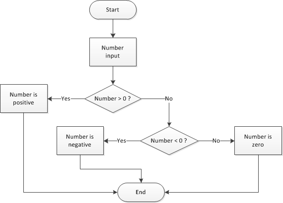

# Tambah kondisi

Sampai saat ini, semua kode di program kita telah dieksekusi secara berurutan. Mari perkaya kode kita dengan menambahkan eksekusi kondisi.

## TL;DR

* Kata kunci `if` mendefinisikan **pernyataan kondisi**, disebut juga **tes**. Blok kode terkait akan dieksekusi kalau **kondisi** terpenuhi (nilainya `true`). Jadi, ekspresi kondisi adalah evaluasi yang selalu menghasilkan nilai boolean: `true` (benar) atau `false` (salah).

```js
if (kondisi) {
  // Kode yang dieksekusi ketika kondisinya true
}
```

* Blok kode yang terdapat kata kunci `if` diapit sepasang tanda kurung pembuka dan penutup. Agar mudah dibaca, pernyataan ini biasanya **terindentasi** (spasi kosong ke kanan) pada baris kode. 

* **Operator pembanding** `===`, `!==`, `<`, `<=`, `>` dan `>=` digunakan untuk membandingkan bilangan di dalam pernyataan kondisi. Semua ini mengembalikan nilai boolean.

* Pernyataan `else` bisa diasosiasikan dengan `if` untuk mengekspresikan **alternatif**. Tergantung dari nilai kondisi, kode blok yang terdapat `if` atau `else` akan dieksekusi salah satu diantaranya, tetapi tidak pernah keduanya. Tidak ada batas terkait kedalaman kondisi bersarang.

```js
if (kondisi) {
  // Kode yang dieksekusi ketika kondisi true 
}
else {
  // Kode yang dieksekusi ketika kondisi false 
}
```

* Kondisi complex bisa dibuat menggunakan **operator logika** `&&` ("dan"), `||` ("atau") dan `!` ("tidak").

* Pernyataan `switch` digunakan mengeksekusi satu blok diantara beberapa kode, tergantung nilai dari suatu ekspresi. 

```js
switch (ekspresi) {
case nilai1:
  // Kode yang dieksekusi ketika ekspresi cocok dengan nilai1
  break;
case nilai2:
  // Kode yang dieksekusi ketika ekspresi cocok dengan nilai2
  break;
...
default:
  // Kode yang dieksekusi ketika ekspresi tidak ada yang ada cocok 
}
```

## Apa itu kondisi?

Misalnya kita ingin menulis satu program yang meminta pengguna untuk memasukkan angka, lalu menampilkan satu pesan apakah angkanya positif. Berikut algoritmanya.

```text
Masukkan angka
Jika angkanya positif
  Tampilkan pesan
```

Pesan harus tampil hanya jika angkanya positif; ini artinya pesan tersebut adalah "subyek" terhadap **kondisi**.

### Pernyataan `if`

Berikut bagaimana Kamu menerjemahkan program ke JavaScript.

```js
const angka = Number(prompt("Masukkan angka:"));
if (angka > 0) {
  console.log(`${angka} positif`);
}
```

Perintah `console.log(...)` dieksekusi hanya *jika* angkanya positif. Tes program ini dan lihat sendiri!

Sintaks kondisi terlihat seperti ini:

```js
if (kondisi) {
  // Kode yang akan dieksekusi ketika kondisi true
}
```

Sepasang tanda kurung pembuka dan penutup mendefinisikan blok kode yang diasosiasikan dengan pernyataan `if`. Pernyataan ini merepresentasikan **tes**. Hasilnya: "Jika kondisi true, maka eksekusi instruksi yang ada di blok kode".

Kondisi ini selalu ditempatkan di dalam tanda kurung setelah `if`. Pernyataan yang ada di dalam kode blok akan tergerser ke kanan. Praktik ini disebut **indentasi** dan membantu agar kode Kamu mudah dibaca. Seiring pengembangan program Kamu menjadi lebih besar dan lebih kompleks, hal ini akan menjadi sangat penting. Nilai indentasi biasanya 2 atau 4 spasi.

> Kalau blok kode hanya memiliki satu pernyataan, tanda kurung bisa dihilangkan. Sebagai pemula, Kamu sebaiknya selalu menggunakan tanda kurung ketika menulis kondisi pertama Kamu.

### Kondisi

**Kondisi** adalah ekspresi yang mengevaluasi nilai antara true (benar) atau false (salah): ini dinamakan nilai **boolean**. Kalau nilai kondisi bernilai true, kita katakan bahwa kondisi ini terpenuhi.

Kita sudah belajar bilangan dan string, dua tipe data di JavaScript. Booleans merupakan tipe lainnya. Tipe ini hanya memiliki dua kemungkinan nilai: `true` dan `false`.

Ekspresi apa pun yang mengasilkan nilai boolean (apakah `true` atau `false`) bisa digunakan sebagai kondisi dalam pernyataan `if`. Jika nilai ekspresi tersebut adalah `true`, kode blok terkait akan dieksekusi.

```js
if (true) {
  // Kondisi dari if ini selalu true
  // Blok kode ini selalu dieksekusi
}
if (false) {
  // Kondisi dari if ini selalu false
  // Blok kode ini tidak akan pernah dieksekusi
}
```

Ekspresi boolean bisa dibuat menggunakan operator pembanding yang terlihat di tabel berikut.

|Operator|Arti|
|---------|----|
|`===`|Sama dengan|
|`!==`|Tidak sama dengan|
|`<`|Kurang dari|
|`<=`|Kurang dari atau sama dengan|
|`>`|Lebih dari|
|`>=`|Lebih dari atau sama dengan|

Di beberapa bahasa pemrograman lainnya, operator persamaan dan pertidaksamaan menggunakan tanda `==` dan `!=`. Hal ini juga berlaku di JavaScript, tetapi lebih aman menggunakan `===` dan `!==` ([lebih detail](https://developer.mozilla.org/en-US/docs/Web/JavaScript/Equality_comparisons_and_sameness)).

> Jangan bingung terhadap operator pembanding seperti `===` (atau `==`) dengan operator penugasan `=`. Ini sangat, sangat berbeda. Hati-hati!

Sekarang mari kita modifikasi contoh kode berikut dengan menukar `>` dengan `>=` dan ganti pesannya, lalu tes dengan angka 0.


```js
const angka = Number(prompt("Masukkan angka:"));
if (angka >= 0) {
  console.log(`${angka} positif atau nol`);
}
```

Jika pengguna meng-input angka 0, pesan muncul di console, yang artinya kondisi `(angka >= 0)` terpenuhi.

## Kondisi alternatif

Kamu akan sering menginginkan kode Kamu dieksekusi satu kondisi ketika sesuatu bernilai true dan kondisi lainnya ketika sesuatu bernilai false.

### Pernyataan `else`

Mari kita perkaya contoh kode kita dengan pesan yang berbeda tergantung apakah angkanya positif atau tidak.

```js
const angka = Number(prompt("Masukkan angka:"));
if (angka > 0) {
  console.log(`${angka} positif`);
}
else {
  console.log(`${angka} negatif atau nol`);
}
```

Tes kode ini dengan angka positif, angka negatif, dan angka nol, saat melihat hasilnya di console. Kode tersebut dieksekusi tergantung jika kondisi`(angka > 0)` true atau false.

Sintaks untuk membuat alternatif adalah dengan menambahkan kata kunci `else` setelah inisial `if`.

```js
if (kondisi) {
  // Kode yang akan diekseksui jika kondisi true
}
else {
  // Kode yang akan diekseksui jika kondisi false
}
```

Kamu bisa terjemahkan pernyataan `if`/`else` seperti ini: "Jika kondisi true, maka eksekusi set kode pertama; jika tidak, eksekusi set kode selanjutnya". Hanya satu dari dua kode blok yang akan dieksekusi.

### Kondisi bersarang

Mari kita ke level selanjutnya dan tampilkan pesan spesifik jika angka yang dimasukkan adalah nol. Lihat contoh ini, yang memiliki tes postif, negatif tes, dan angka nol.

```js
const angka = Number(prompt("Masukkan angka:"));
if (angka > 0) {
  console.log(`${angka} positif`);
} else {
  // angka <= 0
  if (angka < 0) {
    console.log(`${angka} negatif`);
  } else {
    // angka === 0
    console.log(`${angka} nol`);
  }
}
```

Mari kita bahas. Jika blok kode yang diasosiasikan pada `else` berjalan, maka angka seharusnya antara negatif atau nol. Di dalam blok ini, pernyataan `if` kedua mengecek apakah angka bernilai negatif. Jika tidak, maka kita tahu betul bahwa angka tersebut adalah nol.

> Ketika belajar menulis kondisi bersarang, Kamu harus menambahkan komentar deskriptif untuk setiap kondisi, seperti contoh sebelumnya.

Aliran eksekusi untuk program sebelumnya dapat diekspresikan dengan menggunakan **flow diagram** berikut.



Contoh ini menunjukkan bahwa indentasi sangatlah penting untuk mengerti aliran dari satu program. Tidak ada batas kedalaman kondisi bersarang, tetapi kalau terlalu banyak akan mempengaruhi kerapihan program.

Kasus tertentu terjadi saat pernyataan satu-satunya dalam blok `else` adalah `if`. Kamu bisa menulis `else` ini pada baris yang sama dengan baris`if` dan tapa tanda kurung. Berikut cara yang lebih ringkas untuk menulis contoh program kita.

```js
const angka = Number(prompt("Masukkan angka:"));
if (angka > 0) {
  console.log(`${angka} positif`);
} else if (angka < 0) {
  console.log(`${angka} negatif`);
} else {
  console.log(`${angka} nol`);
}
```

## Tambah logika kondisi

### Operator "dan" 

Misalnya, Kamu ingin mengecek apakah angka diantara 0 dan 100. Kamu sebenarnya mengecek apakah nilai tersebut "lebih besar atau sama dengan 0" dan "lebih kecil atau sama dengan 100". Kedua sub-kondisi ini harus terpenuhi secara bersamaan.

> ekspresi `0 <= angka <= 100` adalah benar jika dilihat dari sudut pandang matematika, tetapi tidak bisa ditulis di javascript (tidak juga di kebanyakan bahasa pemrograman lainnya).

Berikut bagaimana Kamu terjemahkan ke JS.

```js
if ((angka >= 0) && (angka <= 100)) {
  console.log(`${angka} diantara 0 dan 100, kedua angka termasuk`);
}
```

> Tanda kurung diantara sub-kondisi tidaklah wajib tetapi saya menyarankan Kamu untuk menambahkannya, untk mencegah bug pada beberapa kasus tertentu.

operator `&&` ("logika dan") bisa diterapkan pada kedua tipe nilai boolean. `true` akan dihasilkan jika kedua kondisi adalah benar.

```js
console.log(true && true);   // true
console.log(true && false);  // false
console.log(false && true);  // false
console.log(false && false); // false
```

Hasil sebelumnya merupakan **tabel truth** dari operator `&&`.

### operator "atau" 

Sekarang bayangkan Kamu ingin mengecek apakah angka di luar 0 dan 100. Untuk memenuhi syarat ini, angka harus lebih kecil dari 0 dan lebih besar dari 100.

Berikut translasinya ke JavaScript:

```js
if ((angka < 0) || (angka > 100)) {
  console.log(`${angka} is not in between 0 and 100`);
}
```

Operator `||` ("logika atau") menghasilkan pernyataan `true` jika setidaknya satu dari beberapa pernyataan benilai true. Berikut tabel truth-nya:

```js
console.log(true || true);   // true
console.log(true || false);  // true
console.log(false || true);  // true
console.log(false || false); // false
```

### Evaluasi short-circuit 

Ekspresi logika dievaluasi dari kiri ke kanan. Ekspresi ini dites untuk kemungkinan evaluasi "short-circuit" menggunakan aturan berikut:

* `false && expr` mengembalikan nilai `false`.
* `true || expr` mengembalikan nilai `true`.

Pada kedua contoh di atas, ekspresi `expr` tidak dievaluasi.

### Penggunaan pada nilai non-boolean 

Operator `&&` dan `||` juga bisa diterapkan pada nilai non-boolean. Pada kasus ini, operator ini mungkin juga tidak mengembalikan nilai boolean.

* `expr1 && expr2` mengembalikan `expr1` jika ekspresi ini bisa dikonversi ke `false`. Sebaliknya, ekspresi ini mengembalikan `expr2`.
* `expr1 || expr2` mengembalikan `expr1` jika ekspresi ini bisa dikonversi ke `true`. Sebaliknya, ekspresi ini mengembalikan `expr2`.

Di JavaScript, nilai atau ekspresi yang dapat dikonversi ke `false` disebut *falsy*. Sebaliknya, bisa juga dikonversi ke `true`, ini disebut *truthy*. Semua nilai bisa disimpulkan *truthy* kecuali *falsy* berikut:

* `false` (jelas!)
* `undefined`
* `null`
* `NaN` (*Not A Number*)
* `0`
* `""` or `''`

Berikut sedikit contohnya.

```js
console.log(true && "Hello");      // "Hello"
console.log(false && "Hello");     // false
console.log(undefined && "Hello"); // undefined
console.log("" && "Hello");        // ""
console.log("Hello" && "Goodbye")  // "Goodbye"

console.log(true || "Hello");      // true
console.log(false || "Hello");     // "Hello"
console.log(undefined || "Hello"); // "Hello"
console.log("" || "Hello");        // "Hello"
console.log("Hello" || "Goodbye")  // "Hello"
```

### Operator "tidak"

Ada operator yang bisa digunakan ketika Kamu tahu apa yang tidak Kamu inginkan: operator tidak! Untuk ini, Kamu akan menggunakan `!`.

```js
if (!(angka > 100)) {
  console.log(`${angka} kurang dari atau sama dengan 100`);
}
```

Berikut tabel truth dari operator `!`.

```js
console.log(!true);  // false
console.log(!false); // true
```

## Pilihan ganda

Mari kita tulis kode yang membantu orang memutuskan apa yang akan dipakai berdasarkan cuaca menggunakan `if`/`else`.

```js
const cuaca = prompt("Bagaimana cuacanya?");
if (cuaca === "cerah") {
  console.log("Waktunya pakai T-shirt!");
} else if (cuaca === "berangin") {
  console.log("Pakai jaket");
} else if (cuaca === "hujan") {
  console.log("Bawa payung!");
} else if (cuaca === "salju") {
  console.log("Di rumah saja!");
} else {
  console.log("Bukan cuaca yang valid");
}
```

Saat program harus memicu satu blok dari beberapa operasi tergantung dari ekspresinya, Kamu bisa menuliskannya dengan menggunakan pernyataan JavaScript `switch` untuk melakukan hal yang sama.

```js
const cuaca = prompt("Bagaimana cuacanya?");
switch (cuaca) {
  case "cerah":
    console.log("Waktunya pakai T-shirt!");
    break;
  case "berangin":
    console.log("Pakai jaket");
    break;
  case "hujan":
    console.log("Bawa payung!");
    break;
  case "salju":
    console.log("Di rumah saja!");
    break;
  default:
    console.log("Bukan cuaca yang valid");
}
```

Kalau Kamu tes, hasilnya akan sama dengan versi sebelumnya.

Pernyataan `switch` memulai eksekusi satu blok kode dari beberapa baris yang ada. Hanya kode blok yang cocok dengan situasi yang relevan yang akan dieksekusi.

```js
switch (ekspresi) {
  case nilai1:
    // Kode yang akan dieksekusi ketika ekspresi cocok dengan nilai1
    break;
  case nilai2:
    // Kode yang akan dieksekusi ketika ekspresi cocok dengan nilai2
    break;
  // ...
  default:
  // Kode yang berjalan ketika tidak ada kasus atau ekspresi yang cocok
}
```

Kamu bisa menge-set case sebanyak yang Kamu inginkan! Kata `default`, yang ditempatkan di akhir `switch`, adalah opsional. Hal ini dilakukan agar Kamu bisa menangani eror atau nilai yang tidak diinginkan. 

Menambahkan `break;` pada setiap blok merupakan hal yang penting sehingga Kamu bisa keluar dari pernyataan switch!

```js
const x = "abc";
switch (x) {
  case "abc":
    console.log("x = abc");
  // break diabaikan: blok selanjutnya akan dieksekusi juga!
  case "def":
    console.log("x = def");
    break;
}
```

Pada contoh sebelumnya menunjukkan `"x = abc"` (hasil yang benar) tetapi juga `"x = def"`.

## Waktunya koding!

Berikut beberapa saran tentang latihan ini:

* Pilih nama variabel Kamu dengan bijak, dan gunakan indentasi saat membuat kode blok terkait `if`, `else` dan pernyataan `switch`.

* Coba cari solusi alternatif. Contohnya, satu solusi menggunakan `if` dan solusi lainnya menggunakan `switch`.

* Tes program Kamu secara menyeluruh, jangan takut salah. Ini merupakan keterampilan yang sangat penting.

### Hari selanjutnya

Tulis program yang menerima satu nama hari dari pengguna, lalu tampilkan nama hari selanjutnya. Input yang tidak benar harus diperhatikan juga.

### Perbandingkan angka

Tulis program yang menerima dua angka, lalu bandingkan nilainya dan tampilkan pesan di semua kondisi.

### Nilai akhir

Lihat program berikut.

```js
let nb1 = Number(prompt("Masukkan nb1:"));
let nb2 = Number(prompt("Masukkan nb2:"));
let nb3 = Number(prompt("Masukkan nb3:"));

if (nb1 > nb2) {
  nb1 = nb3 * 2;
} else {
  nb1++;
  if (nb2 > nb3) {
    nb1 += nb3 * 3;
  } else {
    nb1 = 0;
    nb3 = nb3 * 2 + nb2;
  }
}
console.log(nb1, nb2, nb3);
```

Sebelum mengeksekusinya, coba tebak nilai akhir dari variabel `nb1`, `nb2` dan `nb3` tergantung nilai awalnya. Isi tabel berikut.

|Nilai awal           |nilai akhir `nb1`|nilai akhir `nb2`|nilai akhir `nb3`|
|---------------------|------------------|-----------------|-----------------|
|`nb1=nb2=nb3=4`      |                  |                 |                 |
|`nb1=4,nb2=3,nb3=2`  |                  |                 |                 |
|`nb1=2,nb2=4,nb3=0`  |                  |                 |                 |

Cek prediksi Kamu dengan mengeksekusi programnya.

### Jumlah hari dalam satu bulan 

Tulis program yang menerima bilangan bulan (antara 1 dan 12), lalu tampilkan jumlah hari dari bulan tersebut. Tahun kabisat tidak perlu dimasukkan. Perhatikan kesalahan input.

### Detik selanjutnya

Tulis program yang menerima waktu dalam bentuk tiga informasi (jam, menit, detik). Program mengkalkulasi dan menampilkan waktu satu detik setelahnya. Kesalahan input harus diperhatikan.

> Hal ini tidaklah semudah yang dikira... Kamu bisa lihat contoh dan hasilnya berikut ini:
>
> * 14j17m59d => 14j18m0d
> * 6j59m59d => 7j0m0d
> * 23j59m59d => 0j0m0d (tengah malam)
