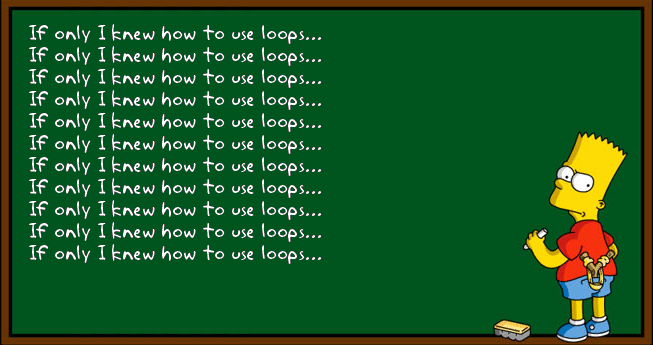
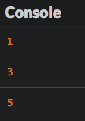

# Pernyataan berulang

Di bab ini, kita akan membahas tentang bagaimana mengeksekusi kode secara berulang.

## TL;DR

* **Loop** digunakan untuk mengulang rangkaian pernyataan. Setiap pengulangan disebut **iterasi**. Blok kode yang berkaitan dengan loop disebut **body**.

* Loop `while` mengulangi pernyataan *ketika* kondisi tertentu adalah true. Loop `for` digunakan sebelum loop dimulai dan setelah setiap iterasi loop sudah berjalan. gives the ability to manage what happens just before the loop starts and after each loop iteration has run.

```js
// While loop
while (kondisi) {
  // Kode yang akan dieksekusi ketika kondisi true
}

// For loop
for (inisialisasi; kondisi; ekspresi akhir) {
  // Kode yang akan dieksekusi ketika kondisi true
}
```

* Variabel yang berkaitan dengan kondisi loop disebut loop **counter** dan seringkali dinamakan `i`.

* Awas! Kondisi loop `while` harus menjadi false, untuk mencegah risiko terjadinya **infinite loop**. Juga, meng-update counter loop `for` di dalam **body** nya adalah ide yang buruk. 

* Semua loop bisa ditulis dengan `while`, tetapi kalau Kamu sebelumnya sudah tahu berapa banyak loop yang akan Kamu jalankan, maka `for` adalah pilihan terbaik.

## Pengenalan

Kalau Kamu ingin menulis kode yang menampilkan angka antara 1 dan 5, Kamu bisa melakukannya dengan apa yang Kamu sudah pelajari:

```js
console.log(1);
console.log(2);
console.log(3);
console.log(4);
console.log(5);
```

Ini sangat melelahkan dan akan jauh lebih kompleks untuk daftar angka antara 1 dan 1000, misalnya. Bagaimana cara mendapatkan hasil yang sama dengan lebih mudah?

JavaScript mengizinkan Kamu menulis kode di dalam **loop** yang dapat mengeksekusi secara berulang sampai diperintah untuk berhenti. Setiap kali kode dieksekusi, dinamakan **iterasi**.



## Loop `while` 

Loop `while` mengizinkan Kamu mengulang kode ketika kondisi tertentu terpenuhi.

### Contoh

Berikut contoh program yang ditulis dengan loop `while`.

```js
let angka = 1;
while (angka <= 5) {
  console.log(angka);
  angka++;
}
```

Seperti kode sebelumnya, blok kode ini menampilkan semua bilangan integer antara 1 dan 5.


### Bagaimana cara kerjanya

Kamu akan menggunakan sintaks berikut untuk menulis `while` loop.

```js
while (kondisi) {
  // Kode yang akan dieksekusi ketika kondisi true
}
```

Setiap sebelum interasi loop, kondisi di dalam kurung dievaluasi untuk menentukan apakah nilainya true atau bukan. Kode terkait loop dinamakan **body**.

* Jika nilai kondisi adalah `true`, kode di dalam body loop `while` berjalan. Setelah itu, kondisi di evaluasi kembali untuk mengecek apakah masih terpenuhi. Siklusnya berlanjut!

* Jika nilai kondisi `false`, kode di dalam loop akan berhenti berjalan.

> Body loop harus ditempatkan diantara tanda kurung kurawal, kecuali jika hanya satu pernyataan. Untuk sekarang, selalu gunakan tanda kurung kurawal untuk loop Kamu.

## Loop `for` 

Kamu akan sering memerlukan loop dengan kondisi berdasarkan nilai variabel yang ter-update di dalam body loop. seperti pada contoh. JavaScript menawarkan tipe loop lainnya untuk ini: loop `for`.

### Contoh

Berikut program yang sama ditulis dengan menggunakan loop `for`.

```js
let angka;
for (angka = 1; angka <= 5; angka++) {
  console.log(angka);
}
```

Hal ini akan menghasilkan output yang sama. 

### Bagaimana cara kerjanya 

Berikut sintaks loop `for`.

```js
for (inisialisasi; kondisi; ekspresi akhir) {
  // kode yang akan dieksekusi ketika kondisi true.
}
```

Ini sedikit kompleks dibandingkan sintaks loop `while`:

* **Inisialisasi** hanya dilakukan sekali, ketika kode pertama kali berjalan. Inisialisasi ini sering digunakan untuk menge-set nilai pertama dari variabel yang terkait dengan kondisi loop.

* **Kondisi** dievaluasi sekali sebelum loop berjalan setiap kali. Jika tida, kode tidak akan berjalan.

* **Ekspresi akhir** dievaluasi setelah loop berjalan setiap kali. Sering digunakan untuk meng-update nilai variabel yang terkait dengan kondisi loop, seperti kita lihat pada contoh sebelumnya.

### Counter loop 

Variabel yang digunakan saat inisialisasi, kondisi, dan ekspresi akhir dari loop disebut **counter** dan juga sering dinamakan `i`. Counter ini bisa dideklarasikan pada inisialisasi loop untuk membatasi lingkup dari body loop.

```js
for (let i = 1; i <= 5; i++) {
  console.log(i); // OK
}
console.log(i); // Eror: variabel i tidak berjalan di baris ini. 
```

## Kesalahan umum 

### Loop `while` tidak terbatas

Risiko utama pada loop `while` adalah menghasilkan **loop tak terbatas**, artinya, kondisi selalu true, dan kode berjalan selamanya. Ini akan merusak program Kamu! Misalnya, Kamu lupa baris kode yang menaikkan nilai variabel `angka`.

```js
let angka = 1;
while (angka <= 5) {
  console.log(angka);
  // Variabel angka tidak akan pernah ter-update: kondisi loop bertahan dengan nilai true selamanya.
}
```

Untuk melindungi diri dari loop tak terbatas, Kamu harus pastikan kondisi loop nantinya akan bernilai false.

### Manipulasi counter loop `for` 

Bayangkan Kamu secara tidak sengaja mengubah counter loop pada body loop, seperti contoh berikut.

```js
for (let i = 1; i <= 5; i++) {
  console.log(i);
  i++; // Variabel i ter-update di body loop
}
```

Program ini menghasilkan output berikut.



Setiap kali loop berjalan, variabel counter naik *dua kali*: satu kali di body dan satu kali di ekspresi akhir setelah loop berjalan. Ketika Kamu menggunakan loop `for`, Kamu harus hilangkan counter di body loop Kamu. Biarkan counter ini ada di baris pertama! 

## Loop mana yang harus saya gunakan?

Loop `for` sangat baik karena format kode perulangan yang sudah tersedia secara standar, mencegah permasalahan loop tak terbatas. Namun, Kamu harus tahu berapa kali Kamu ingin loop berulang saat Kamu menulis kode Kamu. Untuk situasi di mana Kamu tidak tahu berapa kali kode Kamu harus berjalan, loop `while` menjadi pilihan yang masuk akal. Berikut contoh loop `while` di mana pengguna diminta untuk mengetik huruf selamanya sampai memasukkan huruf X:

```js
let huruf = "";
while (huruf !== "X") {
  letter = prompt("Ketik satu huruf atau ketik X untuk keluar:");
}
```

Kamu tidak akah tahu berapa kali pengguna memasukkan `X`, maka dari itu, `while` secara umum baik digunakan untuk loop yang tergantung dari interaksi pengguna. 

Pada akhirnya, memilih loop tergantung pada konteksnya. Semua loop bisa ditulis dengan `while`, tetapi kalau Kamu tahu sebelumnya berapa kali Kamu ingin loop berjalan, `for` merupakan pilihan terbaik.

## Waktunya koding!

Coba untuk kode dua kali setiap latihan, satu kali menggunakan loop `while` dan satu lagi dengan `for`, agar Kamu tahu sendiri mana yang paling tepat digunakan.

### Carousel

Tulis program carousel untuk 10 putaran, menampilkan angka secara bergantian.

Jika sudah, tambahkan kode sehingga jumlah putaran ditentukan oleh input dari pengguna.

### Paritas

Cek program berikut yang menampilkan angka genap (terbagi habis oleh 2) antara 1 dan 10.

```js
for (let i = 1; i <= 10; i++) {
  if (i % 2 === 0) {
    console.log(`${i} adalah genap`);
  }
}
```

Program ini menggunakan operator modulo `%`, yang mengkalkulasi sisa angka setelah dibagi satu angka dengan angka yang lainnya. Hal ini sering digunakan untuk megecek paritas angka.

```js
console.log(10 % 2); // 0 karena 10 = 5 * 2 + 0
console.log(11 % 2); // 1 karena 11 = 5 * 2 + 1
console.log(18 % 3); // 0 karena 18 = 3 * 6 + 0
console.log(19 % 3); // 1 karena 19 = 3 * 6 + 1
console.log(20 % 3); // 2 karena 20 = 3 * 6 + 2
```

Tingkatkan program sehingga dapat menampilkan angka ganjil. Tingkatkan lagi sehingga program dapat mengganti angka awal, `1` dengan angka yang dimasukkan oleh pengguna.

> Program ini harus menampilkan 10 angka termasuk yang angka yang pertama, tidak 11 angka!

### Validasi input

Tulis program yang meminta angka ke pengguna secara terus menerus sampai angka yang dimasukkan kurang dari atau sama dengan 100.

Kalau sudah selesai, tambah kode sehingga program berhenti ketika angka yang dimasukkan di antara 50 dan 100.

### Tabel perkalian

Write a program yang meminta memasukkan angka dari pengguna, lalu tampilkan tabel perkalian dari angka tersebut.

Jika sudah, tingkatkan program sehingga hanya menerima angka antara 2 dan 9 (gunakan latihan sebelumnya sebagai blueprint).

### Bukan ya bukan tidak

Tulis program permainan "bukan ya, bukan tidak" dengan pengguna. Program meminta pengguna untuk memasukkan teks sampai dia memasukkan "ya" atau "tidak", yang mengakhiri permainan.

### FizzBuzz

Buat program yang menampilkan angka dari 1 sampai 100 dengan ketentuan berikut:

* Menampilkan `"Fizz"` jika angka habis dibagi oleh 3.

* Menampilkan `"Buzz"` jika angka habis dibagi oleh 5 dan tidak dibagi habis oleh 3.

Kalau sudah selesai, tambahkan sehingga program menampilkan `"FizzBuzz"` untuk angka yang habis dibagi oleh 3 dan 5.

> Latihan ini memiliki [banyak sekali solusi](http://www.tomdalling.com/blog/software-design/fizzbuzz-in-too-much-detail/). Ini adalah [wawancara kerja klasik](http://imranontech.com/2007/01/24/using-fizzbuzz-to-find-developers-who-grok-coding/) yang banyak sekali kandidat gagal karenanya. Berikanlah yang terbaik!
