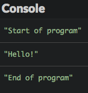
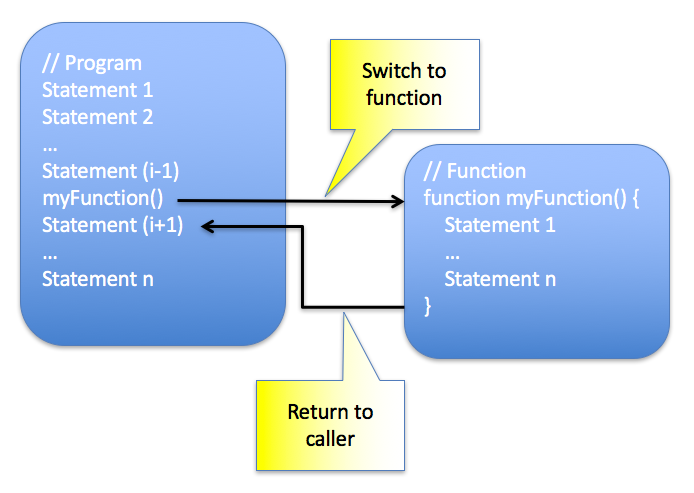

# Tulis Fungsi

Di bab ini, Kamu akan belajar bagaimana membagi program menjadi beberapa bagian yang dinamakan fungsi.

## TL;DR

* **Fungsi** adalah sekelompok pernyataan yang memiliki tugas tertentu. Fungsi JavaScript dibuat menggunakan kata kunci `function`.

* Ditulis dengan kombinasi beberapa fungsi pendek dan terfokus, program secara umum akan lebih mudah dibaca dan lebih **modular** dibandingkan dengan yang monolitik.

* **Pemanggilan fungsi** memicu ekeskusi kode fungsi. Setelah selesai, eksekusi dilanjutkan di tempat di mana pemanggilan dilakukan.

* Variabel dideklarasi di dalam fungsi terbatas pada lingkup body fungsi. Ini dinamakan **variabel lokal**.

* Pernyataan `return` di dalam body fungsi mendefinisikan **pengembalian nilai** dari fungsi. Fungsi bisa menerima parameter kosong, satu atau beberapa **parameter** untuk bisa bekerja. Untuk pemanggilan tertentu, pemenuhan nilai parameter dinamakan **argument**.

* Ada beberapa cara untuk membuat fungsi di JavaScript. Yang pertama adalah dengan menggunakan **deklarasi fungsi**.

```js
// Deklarasi fungsi
function myFunction(param1, param2, ...) {
  // Kode fungsi menggunakan param1, param2, ...
}

// Pemanggilan fungsi
myFunction(arg1, arg2, ...);
```

* Cara lain untuk membuat fungsi adalah dengan menggunakan **ekspresi fungsi**. Ekspresi fungsi bisa dilakukan pada variabel karena di JavaScript, nilai variabel bisa merupakan sebuah fungsi. Ekspresi fungsi sering digunakan untuk membuat **fungsi anonim** (fungsi tanpa nama).

```js
// Fungsi anonim dibuat dengan ekspresi fungsi dan ditempatkan pada satu variabel
const myFunc = function(param1, param2, ...) {
  // Kode fungsi menggunakan param1, param2, ...
};

// Pemanggilan fungsi
myFunc(arg1, arg2, ...);
```

* Cara ketiga untuk membuat fungsi anonim adalah dengan menggunakan **sintaks panah gemuk**.

```js
// Fungsi anonim panah gemuk ditempatkan pada satu variabel
const myFunc = (param1, param2, ...) => {
  // Kode fungsi menggunakan param1, param2, ...
};

// Pemanggilan fungsi
myFunc(arg1, arg2, ...);
```

* Bagaimanapun cara dibuatnya, fungsi harus memiliki **tujuan** dan nama yang tepat (sering menggunakan kata kerja). JavaScript menawarkan banyak **fungsi predefined** yang mencakupi segala kebutuhan.

## Pengenalan: peran fungsi

Untuk mengerti kenapa fungsi itu penting, lihat contoh pada bab sebelumnya: algoritma burrito :)

```text
Mulai
    Ambil penanak nasi
    Isi dengan beras
    Isi dengan air
    Masak nasi
    Potong sayuran
    Tumis sayuran
    Cicipi sayuran
        Kalau sayurannya enak
            Keluarkan dari kompor
        Kalau sayurannya kurang enak
            Tambahkan lada dan bumbu
        Kalau sayurannya kurang matang
            Tumis kembali sayurannya
    Panaskan tortilla
    Tambahkan nasi ke tortilla
    Tambahkan sayuran ke tortilla
    Gulung tortilla
Selesai
```

Berikut ide yang sama, ditulis dengan cara berbeda.

```text
Mulai
  Masak nasi
  Tumis sayuran
  Tambah bumbu dan isinya
  Gulung bersamaan
End
```

Versi pertama mendetail semua tindakan dalam proses memasak. Versi kedua membagi resep ke dalam **langkah umum** dan mengenalkan konsep yang dapat digunakan untuk makanan lainnya seperti *masak*, *tumis*, *tambah*, dan *gulung*.

Program kita sampai sini meniru contoh pertama, tetapi sekarang saatnya memulai membagi kode kita menjadi langkah kecil sehingga kita bisa menggunakan kembali potongan dan bagian kode sesuai kebutuhan. Di JavaScript, langkah kecil ini dinamakan **fungsi**!

## Menemukan fungsi

**Fungsi** adalah sekelompok pernyataan yang melakukan tugas tertentu.

 Berikut contoh dasar dari sebuah fungsi.

```js
function sayHello() {
  console.log("Hello!");
}

console.log("Start of program");
sayHello();
console.log("End of program");
```



Mari kita pelajari apa yang baru saja terjadi.

### Mendeklarasikan fungsi

Cek baris pertama dari contoh di atas. heck out the first lines of the example above.

```js
function sayHello() {
  console.log("Hello!");
}
```

Di baris ini ada fungsi yang dinamakan `sayHello()`. Fungsi ini terdiri dari satu pernytaan yang akan menampilan pesan di console: `"Hello!"`.

Ini adalah contoh dari **deklarasi** fungsi.

```js
// Deklarasi fungsi bernama myFunction
function myFunction() {
  // Kode fungsi
}
```

Deklarasi fungsi dilakukan dengan menggunakan kata kunci JavaScript `function`, diikuti oleh nama fungsi dan sepasang tanda kurun. Pernyataan yang ada di dalam fungsi dinamakan **body**. Pernyataan ini diapit oleh tanda kurung kurawal dan terindentasi. 

### Pemanggilan fungsi

Fungsi harus dipanggil untuk bisa berjalan. Berikut bagian kedua dari contoh program kita.

```js
console.log("Start of program");
sayHello();
console.log("End of program");
```

Pernyataan pertama dan ketiga menampilkan pesan di console secara eksplisit. Pada baris kedua di **panggil** fungsi `sayHello()`.

Kamu bisa memanggil fungsi dengan menuliskan nama fungsi diikuti dengan sepasang tanda kurung.

```js
// ...
myFunction(); // Memanggil fungsi myFunction
// ...
```

Memanggil fungsi memicu eksekusi daftar tindakan (kode di dalam body). Setelah selesai, eksekusi dilanjutkan di baris di mana panggilan dilakukan.



### Kegunaan fungsi

Permasalahan kompleks biasanya lebih mudah dikelola jika dipecah menjadi permasalahan kecil. Program komputer juga sama. Dengan penulisan kombinasi beberapa fungsi singkat dan terfokus, program akan lebih mudah dimengerti dan lebih mudah diperbaruhi daripada fungsi monolitik. Bonus tambahan, beberapa fungsi dapat digunakan kembali di program yang lain!

Membuat fungsi juga bisa menjadi solusi dari permasalahan [duplikasi kode](https://en.wikipedia.org/wiki/Duplicate_code); daripada menduplikasi di beberapa program, sebagian kode bisa disentralisasi di sebuah fungsi dan dapat dipanggil dari mana saja ketika diperlukan.

## Konten fungsi

### Nilai kembali

Berikut variasi dari contoh program kita.

```js
function sayHello() {
  return "Hello!";
}

console.log("Awal program");
const message = sayHello(); // Menyimpan fungsi nilai kembali di variabel
console.log(message);       // Menampilkan nilai kembali
console.log("Akhir program");
```

Jalankan kode ini, dan Kamu akan melihat hasil yang sama dengan sebelumnya.

Di contoh ini, body dari fungsi `sayHello()` telah berubah: pernyataan `console.log("Hello!")` diganti oleh `return "Hello!"`.

Kata kunci `return` mengindikasikan bahwa fungsi akan mengembalikan satu nilai, yang ditentukan secara langsung setelah kata kunci. **Nilai kembali** ini bisa didapatkan oleh pemanggil. 

```js
// Deklarasi myFunction
function myFunction() {
  let returnValue;
  // Hitung nilai kembali
  // returnValue = ...
  return returnValue;
}

// Mendapatkan nilai kembali dari myFunction
const hasil = myFunction();
// ...
```

Nilai kembali ini bisa berupa tipe apa saja (bilangan, string, dan lainnya). Namun, satu fungsi hanya bisa mengembalikan satu nilai.

> Mendapatkan nilai kembali dari fungsi tidaklah wajib, tetapi dalam hal ini nilai kembali "hilang".

Kalau Kamu mencoba mendapatkan nilai kembali dari fungsi yang tidak ada pemiliknya, kita akan mendapatkan nilai JavaScript: `undefined`.

```js
function myFunction() {
  // ...
  // Tidak ada nilai kembali
}

const hasil = myFunction();
console.log(hasil); // undefined
```

> Fungsi langsung berhenti setelah pernyataan `return` dieksekusi. Pernyataan apapun setelahnya tidak akan pernah berjalan. 

Mari sederhanakan sedikit contoh kita dengan menghilangkan variabel yang menyimpan fungsi nilai kembali.

```js
function sayHello() {
  return "Hello!";
}

console.log(sayHello()); // "Hello!"
```

Nilai kembali dari fungsi `sayHello()` dapat dilihat melalui perintah `console.log()`.

### Variabel lokal 

Kamu bisa mendeklarasikan variabel di dalam fungsi, seperti contoh berikut.

```js
function sayHello() {
  const message = "Hello!";
  return message;
}

console.log(sayHello()); // "Hello!"
```

Fungsi `sayHello()` mendeklarasikan variabel yang dinamakan `message` dan mengembalikan nilainya.

Variabel yang dideklarasikan di body fungsi disebut **variabel lokal**. **Lingkup** variabel ini terbatas di body fungsi (sesuai namanya). Kalau Kamu coba menggunakan variabel lokal ini di luar fungsi, maka Kamu tidak akan bisa!

```js
function sayHello() {
  const message = "Hello!";
  return message;
}

console.log(sayHello()); // "Hello!"
console.log(message); // Eror: variabel message tidak berjalan 
```

Setiap pemenggilan fungsi akan mendeklarasikan ulang fungsi variabel lokal, membuat pemanggilan tersebut berlaku independen antara satu dengan lainnya.

Tidak bisa menggunakan variabel lokal di luar fungsi di mana variabel tersebut dideklarasikan mungkin dianggap sebagai keterbatasan. Sebenarnya, ini adalah hal yang baik! Ini artinya fungsi bisa di desain dengan autonomous dan bisa digunakan kembali. Selain itu, hal ini juga akan mencegah **konflik penamaan**: variabel yang dideklarasikan di fungsi yang berbeda namun memiliki nama yang sama. 

### Parameter fungsi

**Parameter** adalah informasi yang dibutuhkan fungsi agar bisa bekerja. Parameter fungsi didefinisikan langsung di dalam tanda kurung setelah nama fungsi. Kamu bisa menggunakan nilai parameter di dalam body fungsi. 

Kamu menempatkan nilai parameter saat memanggil fungsi. Nilai ini disebut **argumen**.

Mari kita ubah contoh di atas untuk menambah sapaan personal:

```js
function sayHello(name) {
  const message = `Hello, ${name}!`;
  return message;
}

console.log(sayHello("Baptiste")); // "Hello, Baptiste!"
console.log(sayHello("Thomas"));   // "Hello, Thomas!"
```

Deklarasi fungsi `sayHello()` sekarang mengandung satu parameter bernama `name`.

Di contoh ini, pemanggilan pertama `sayHello()` dijalankan dengan argumen `"Baptiste"` dan yang kedua dengan argumen `"Thomas"`. Di pemanggilan pertama, nilai parameter `name` adalah `"Baptiste"`, dan yang kedua adalah `"Thomas"`.

Berikut adalah sintaks umum dari deklarasi fugsi dari parameter. Jumlah parameter tidak terbatas, tetapi biasanya tidak lebih dari 3 atau 4.

```js
// Deklarasi fungsi myFunction dengan parameter
function myFunction(param1, param2, ...) {
  // Pernyataan menggunakan param1, param2, ...
}

// Pemanggilan fungsi 
// Nilai param1 di-set ke arg1, param2 ke arg2, ...
myFunction(arg1, arg2, ...);
```

Seperti halnya pada variabel lokal, lingkup parameter dibatasi di hody fungsi. Maka, variabel eksternal yang digunakan sebagai argumen dalam pemanggilan fungsi kemungkinan memiliki nama yang sama dengan parameter fungsi. Berikut contoh yang valid.

```js
function sayHello(name) {
  // Di sini, "name" adalah parameter fungsi
  const message = `Hello, ${name}!`;
  return message;
}

// Di sini, "name" adalah variabel yang digunakan sebagai argumen
let name = "Baptiste";
console.log(sayHello(name)); // "Hello, Baptiste!"
name = "Thomas";
console.log(sayHello(name)); // "Hello, Thomas!"
```

Saat pemanggilan fungsi, mematuhi jumlah dan urutan parameter sangatlah penting! Cek contoh berikut.

```js
function presentation(name, age) {
  console.log(`Your name is ${name} and you're ${age} years old`);
}

presentation("Garance", 9); // "Your name is Garance and you're 9 years old"
presentation(5, "Prosper"); // "Your name is 5 and you're Prosper years old"
```

Pemanggilan argumen kedua dilakukan secara kebalikannya, jadi `name` mendapatkan nilai `5` dan `age` mendapatkan nilai `"Prosper"` di pemanggilan ini.

## Fungsi anonim

Deklarasi bukan satu-satunya cara untuk membuat fungsi di JavaScript. Cek contoh berikut.

```js
const hello = function(name) {
  const message = `Hello, ${name}!`;
  return message;
};

console.log(hello("Richard")); // "Hello, Richard!"
```

Di contoh ini, fungsi ditempatkan pada variabel `hello`. Nilai variabel ini adalah sebuah fungsi. Kita memanggil fungsi menggunakan variabel tersebut. Ini adalah contoh **ekspresi fungsi**. Ekspresi fungsi mendefinisikan fungsi sebagai bagian dari ekspresi yang besar, tepatnya pada penempatan variabel.

Fungsi yang dibuat pada contoh ini tidak memiliki nama: ini adalah **anonim**. Nanti Kamu akan menemukan, fungsi anonim sangat sering digunakan di JavaScript.

Berikut cara membuat fungsi anonim dan menempatkannya pada sebuah variabel.

```js
// Penempatan fungsi anonim pada variabel myFunc 
const myFunc = function(param1, param2, ...) {
  // Pernyataan menggunakan param1, param2, ...
};

// Pemanggilan fungsi anonim
// nilai param1 di-set ke arg1, param2 ke arg2, ...
myFunc(arg1, arg2, ...);
```

Evolusi bahasa akhir-akhir ini telah mengenalkan cara singkat untuk membuat fungsi anonim:

```js
const hello = (name) => {
  const message = `Hello, ${name}!`;
  return message;
};

console.log(hello("William")); // "Hello, William!"
```

Fungsi yang dibuat dengan cara ini dinamakan **fungsi panah gemuk**.

```js
// Penempatan fungsi anonim pada variabel myFunc 
const myFunc = (param1, param2, ...) => {
  // Pernyataan menggunakan param1, param2, ...
};

// Pemanggilan fungsi anonim
// nilai param1 di-set ke arg1, param2 ke arg2, ...
myFunc(arg1, arg2, ...);
```

Sintaks fungsi panah gemuk bisa disederhanakan pada kasus tertentu:

* Ketika hanya ada satu pernytaan di dalam body fungsi, semuanya bisa ditulis di baris yang sama tanpa tanda kurung kurawal. Pernyataan `return` dihilangkan dan implisit.
* Ketika fungsi menerima hanya satu parameter, tanda kurung disekitarnya bisa dihilangkan.

```js
// Super minimalis
const hello = name => `Hello, ${name}!`;

console.log(hello("Kate")); // "Hello, Kate!"
```

Fungsi adalah bagian inti dari toolset JavaScript. Kamu akan sering menggunakannya di program Kamu.

## Pedoman pemrograman dengan fungsi

### Buat fungsi dengan bijak

Fungsi bisa mencakup segala yang Kamu gunakan di program reguler: variabel, kondisi, loop, dan lainnya. Fungsi bisa memanggil semuanya, memberikan programer banyak kebebasan dalam membangun program.

Namun, tidak semuanya pantas untuk dibuat fungsi. Lebih baik menulis fungsi yang singkat dan terfokus, untuk membatasi ketergantungan dan meningkatkan pemahaman program.

### Memaksimalkan fungsi predefine JavaScript 

Kita sudah menggunakan beberapa fungsi predefine seperti `prompt()` dan `alert()`. Ada banyak fungsi predefine lainnya di spesifikasi bahasa JavaScript. Kamu harus tahu hal ini daripada harus membuat ulang fungsi yang Kamu perlukan!

Berikut contoh demonstrasi 2 fungsi matematika JavaScript.

```js
console.log(Math.min(4.5, 5)); // 4.5
console.log(Math.min(19, 9));  // 9
console.log(Math.min(1, 1));   // 1
console.log(Math.random());    // Angka acak antara 0 dan 1
```

Function `Math.min()` menembalikan angka minimum di antara argumennya. Fungsi `Math.random()` menghasilkan angka acak antara 0 dan 1.

Buku ini akan mengenalkan fungsi JavaScript lainnya.

### Membatasi kompleksitas fungsi

Body fungsi harus sederhana, atau dipecah menjadi beberapa sub-fungsi. Aturan praktisnya, 30 baris kode maksimum untuk kasus tidak spesifik.

### Penamaan fungsi dan parameter dengan baik

Penamaan fungsi sama pentingnya dengan penamaan variabel. Kamu harus pilih nama yang menekspresikan tujuan fungsi dengan jelas dan mengikuti aturan penamaan. Sebagai saran, Kamu bisa mengacu lampiran pada buku ini.

> Kalau Kamu mempunyai kesulitan dalam memberi nama fungsi, lalu mungkin tujuan dari fungsi ini tidak terlalu jelas dan Kamu harus tanya kepada diri sendiri apakah fungsi ini benar-benar diperlukan.

## Waktunya koding!

### Peningkatan hello

Lengkapi program berikut sehingga dapat meminta pengguna untuk memasukkan nama pertama dan terakhirnya, lalu tampilkan hasil dari fungsi `sayHello()`.

```js
// Say hello to the user
function sayHello(firstName, lastName) {
  const message = `Hello, ${firstName} ${lastName}!`;
  return message;
}

// TODO: meminta nama pertama dan terakhir dari pengguna
// TODO: memanggil sayHello() dan tampilkan hasilnya.
```

### Kuadrat angka

Lengkapi program berikut sehingga fungsi `square1()` dan `square2()` berjalan dengan baik

```js
// Kuadrat dari angka x
function square1(x) {
  // TODO: lengkapi kode fungsi 
}

// Kuadrat dari angka x
const square2 = x => // TODO: lengkapi kode fungsi 

console.log(square1(0)); // Harus menampilkan 0
console.log(square1(2)); // Harus menampilkan 4
console.log(square1(5)); // Harus menampilkan 25

console.log(square2(0)); // Harus menampilkan 0
console.log(square2(2)); // Harus menampilkan 4
console.log(square2(5)); // Harus menampilkan 25
```

Ketika sudah selesai, perbarui program sehingga dapat menampilkan kuadrat untuk setiap angka antara 0 dan 10.

> Dilarang menulis 10 panggilan bodoh fungsi `square()`! Kamu tahu cara pengulangan (repeat) pernyataan, kan? ;)

### Minimum dari dua angka

Mari berpura-pura bahwa fungsi JavaScript `Math.min()` tidak ada. Lengkapi program berikut sehingga fungsi `min()` dapat mengembalikan nilai minimum dari dua angka yang diterima.

```js
// TODO: tulis fungsi min() 

console.log(min(4.5, 5)); // Harus menampilkan 4.5
console.log(min(19, 9));  // Harus menampilkan 9
console.log(min(1, 1));   // Harus menampilkan 1
```

### Kalkulator

Lengkapi program berikut sehingga dapat melakukan 4 operasi aritmetik dasar: penambahan, pangurangan, perkalian dan pembagian. Kamu bisa menggunakan deklarasi fungsi atau ekspresi fungsi.

```js
// TODO: lengkapi program

console.log(calculate(4, "+", 6));  // Harus menampilkan 10
console.log(calculate(4, "-", 6));  // Harus menampilkan -2
console.log(calculate(2, "*", 0));  // Harus menampilkan 0
console.log(calculate(12, "/", 0)); // Harus menampilkan Infinity
```

### Keliling dan luas lingkaran

Tulis satu program mengandung 2 fungsi untuk menghitung keliling dan luas lingkaran dari jari-jarinya. Tes dengan input pengguna.

Berikut beberapa tips untuk menyelesaikan latihan ini: 

* Formula perhitungan keliling dan lingkaran sudah diajarkan di SD, kan? Kalau lupa, tinggal Googling. 
* Nilai π (Pi) didapat dengan menggunakan fungsi `Math.PI` di JavaScript.
* Kamu juga mungkin ingin menggunakan [exponentiation operator](https://developer.mozilla.org/en-US/docs/Web/JavaScript/Reference/Operators/Arithmetic_Operators) `**` untuk melakukan komputasi.

```js
console.log(2 ** 3); // 8: 2 * 2 * 2
console.log(3 ** 2); // 9: 3 * 3
```
