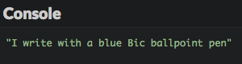
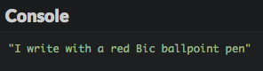
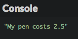
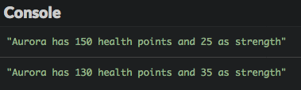
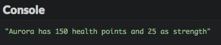
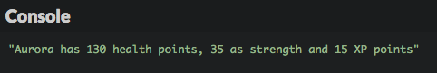
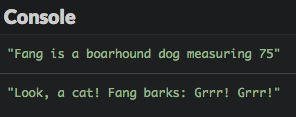
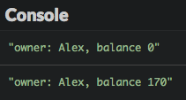

# Buat objek pertama Kamu

Di bab ini akan dibahas tentang object dan bagaimana cara membuat dan menggunakannya di JavaScript.

## TL;DR

* **Objek** (object) JavaScript adalah entintas yang memiliki properti (property). Setiap properti adalah sepasang kunci/nilai. Kunci adalah nama properti.

* Nilai properti bisa merupakan satu bagian informasi (angka, string, dan lainnya) atau sebuah fungsi. Pada kasus yang terakhir, properti ini dinamakan **method**.

* **Object literal** JavaScript dibuat dengan menge-set propertinya di dalam tanda kurung kurawal. 

```js
const myObject = {
  property1: value1,
  property2: value2,
  // ... ,
  method1(/* ... */) {
    // ...
  },
  method2(/* ... */) {
    // ...
  }
  // ...
};

myObject.property1 = newValue; // Mengset nilai baru dari property1 untuk myObject
console.log(myObject.property1); // Menampilkan nilai dari property1 untuk myObject
myObject.method1(...);           // Memanggil method1 pada myObject
```

* Di dalam sebuah method, kata kunci `this` merepresentasikan  objek di mana method dipanggil.

* Banyak objek predefine dari bahasa JavaScript yang sangat berguna seperti `console` atau `Math`.

## Pengenalan

### Apa itu objek?

Bayangkan tentang objek di luar pemrograman, seperti pulpen. Sebuah pulpen bisa memiliki warna tinta yang berbeda, diproduksi oleh orang-orang yang berbeda, memiliki ujung pena yang berbeda, dan banyak properti lainnya.

Sama juga, **objek** pada pemrograman adalah **entitas yang memiliki properti** . Setiap properti mendefinisikan karakteristik objek. Sebuah properti bisa berupa sebagian informasi yang terasosiasi dengan objek (warna pulpen) atau tindakan/aksi (kemampuan pulpen untuk menulis). 

### Apa hubungannya dengan kode?

**Pemrograman berorientasi objek atau Object-oriented programming** (disingkat OOP) adalah satu cara menulis program menggunakan objek. Ketika menggunakan OOP, Kamu menulis, membuat, dan memodifikasi objek, dan objek membuat program Kamu.

OOP mengubah cara program ditulis dan dikelola. Sejauh ini, Kamu telah menulis kode berbasis fungsi, terkadang dinamakan [pemrograman prosedural](https://en.wikipedia.org/wiki/Procedural_programming). Sekarang akan kita bahas bagaimana cara menulis kode berorientasi objek.

## JavaScript dan objek

Seperti bahasa lainnya, JavaScript mendukung pemrograman dengan objek. JavaScript menyediakan beberapa objek predefine juga bisa membuat objek buatan Kamu sendiri. 

### Membuat objek

Berikut representasi JavaScript untuk pulpen (ballpoint) biru dengan brand Bic.

```js
const pen = {
  type: "ballpoint",
  color: "blue",
  brand: "Bic"
};
```

Seperti disebutkan sebelumnya, objek JavaScript bisa dibuat dengan menge-set objek properti didalam tanda kurung kurawal: `{...}`. Setiap properti adalah sepasang kunci/nilai. Hal ini dinamakan **object literal**.

> Tanda titik koma `;` setelah tanda kurung penutup adalah opsional, tetapi lebih aman menambahkan tanda ini.

Kode di atas mendefinisikan variabel bernama `pen` yang nilainya adalah sebuah objek: Kamu bisa katakan bahwa `pen` adalah sebuah objek. Objek ini memiliki tiga properti: `type`, `color` dan `brand`. Setiap properti memiliki nama dan nilai dan diikuti oleh tanda koma `,` (kecuali yang terakhir).

### Mengakses properti objek

Setelah membuat sebuah objek, Kamu bisa mengakses nilai dari properti menggunakan **notasi dot** seperti `myObject.myProperty`.

```js
const pen = {
  type: "ballpoint",
  color: "blue",
  brand: "Bic"
};

console.log(pen.type);  // "ballpoint"
console.log(pen.color); // "blue"
console.log(pen.brand); // "Bic"
```

Mengakses properti objek adalah **ekspresi** yang menghasilkan sebuah nilai. Ekspresi ini bisa dimasukkan dalam objek yang kompleks. Contohnya, berikut ini bagaimana menampilkan properti pulpen dalam satu pernyataan baris.

```js
const pen = {
  type: "ballpoint",
  color: "blue",
  brand: "Bic"
};

console.log(`I write with a ${pen.color} ${pen.brand} ${pen.type} pen`);
```



### Memodifikasi objek

Sesudah objek dibuat, Kamu bisa mengubah nilai properti dengan sintaks `myObject.myProperty = newValue`.

```js
const pen = {
  type: "ballpoint",
  color: "blue",
  brand: "Bic"
};

pen.color = "red"; // Memodifikasi properti warna pulpen 

console.log(`I write with a ${pen.color} ${pen.brand} ${pen.type} pen`);
```



JavaScript bahkan menawarkan kemampuan untuk menambahkan properti baru secara dinamis ke objek yang sudah dibuat. 

```js
const pen = {
  type: "ballpoint",
  color: "blue",
  brand: "Bic"
};

pen.price = "2.5"; // Set properti harga pulpen

console.log(`My pen costs ${pen.price}`);
```



## Pemrograman dengan objek 

Banyak buku dan kursus mengajarkan pemrograman berorientasi objek melalui contoh yang melibatkan hewan, mobil, atau akun bank. Mari kita coba sesuatu yang lebih keren dan membuat mini-role playing game (RPG) menggunakan objek.

Di RPG, setiap karakter didefinisikan oleh banyak atribut seperti strength (kekuatan), stamina atau intelligence (kecerdasan). Berikut ini adalah layar karakter dari game RPG online yang sangat populer.


Di contoh sederhana kita, satu karakter akan memiliki tiga atribut:

* name (nama),
* health (jumlah poin hidup),
* strength.

### Contoh sederhana

Saya kenalkan Kamu ke Aurora, karakter RPG kita yang pertama.

```js
const aurora = {
  name: "Aurora",
  health: 150,
  strength: 25
};
```

Objek `aurora` memiliki tiga properti: `name`, `health` dan `strength`.

> Seperti yang Kamu lihat, Kamu bisa menempatkan angka, string, dan bahkan objek lainnya ke properti!

Aurora akan memulai serangkaian petualangannya, beberapa atributnya nanti akan di update. Cek contoh berikut ini.

```js
const aurora = {
  name: "Aurora",
  health: 150,
  strength: 25
};

console.log(`${aurora.name} has ${aurora.health} health points and ${aurora.strength} as strength`);

// Aurora dilukai oleh sebuah panah
aurora.health -= 20;

// Aurora memakai kalung penguat
aurora.strength += 10;

console.log(`${aurora.name} has ${aurora.health} health points and ${aurora.strength} as strength`);
```



### Pengenalan method

Di kode di atas, kita harus menulis pernyataan panjang `console.log` setiap kali menampilkan status karakter kita. Ada cara yang lebih rapih untuk menampilkan status ini.

#### Menambah method ke sebuah objek

Perhatikan contoh berikut.

```js
const aurora = {
  name: "Aurora",
  health: 150,
  strength: 25
};

// Menampilkan deskripsi karakter
function describe(character) {
  return `${character.name} has ${character.health} health points and ${character.strength} as strength`;
}

console.log(describe(aurora));
```



Fungsi `describe()` menempatkan objek sebagai parameter. Fungsi ini mengakses properti objek tersebut untuk membuat string deskripsi.

Berikut ini alternatif lainnya, menggunakan properti `describe()` *di dalam* objek.

```js
const aurora = {
  name: "Aurora",
  health: 150,
  strength: 25,

  // Menampilkan deskripsi karakter
  describe() {
    return `${this.name} has ${this.health} health points and ${this
      .strength} as strength`;
  }
};

console.log(aurora.describe());
```


Sekarang objek kita punya properti baru yang tersedia: `describe()`. Nilai properti ini adalah fungsi yang mengembalikan deskripsi teks dari objek. Hasil eksekusi sama persis dengan yang sebelumnya.

Objek properti yang nilainya adalah fungsi dinamakan **method**. Method digunakan untuk mendefinisikan  **aksi** dari sebuah objek. Method menambakan beberapa **perilaku** kepada objek. 

#### Memanggil method pada objek

Mari lihat baris terakhir pada contoh sebelumnya.

```js
console.log(aurora.describe());
```

Untuk menampilkan deskripsi karakter, kita menggunakan ekspresi `aurora.describe()` dibandingkan `describe(aurora)`. Hal ini merupakan satu perbedaan yang *krusial*:

* `describe(aurora)` memanggil fungsi `describe()` dengan objek `aurora` sebagai argumen. Fungsi ini adalah eksternal terhadap objek. Ini adalah contoh dari pemrograman prosedural.

* `aurora.describe()` memanggil fungsi `describe()` pada objek `aurora`. Fungsi ini adalah salah satu properti objek: method. Ini aadlah contoh dari pemrograman berorientasi objek.

Untuk memanggil method bernama `myMethod()` pada objek `myObject`, sintaksnya adalah `myObject.myMethod()`.

> Ingat tanda kurung, walaupun kosong, ketika memanggil method!

### Kata kunci `this` 

Sekarang perhtaikan baik-baik body dari method `describe()` pada objek kita.

```js
const aurora = {
  name: "Aurora",
  health: 150,
  strength: 25,

  // Menampilkan deskripsi karakter 
  describe() {
    return `${this.name} has ${this.health} health points and ${this
      .strength} as strength`;
  }
};
```

Kamu lihat kata kunci baru: `this`. Kata kunci ini diset secara otomatis oleh JavaScript di dalam method dan merepresentasikan **objek di mana method dipanggil**.

Method `describe()` tidak mengambil parameter apapun. Method ini menggunakan `this` untuk mengakses properti objek di mana objek dipanggil.

## Objek predefined JavaScript 

Bahasa JavaScript memiliki banyak objek predefine yang dapat digunakan untuk berbagai tujuan. Kita sudah kenal beberapa di antaranya:

* Objek `console` memberikan akses ke environment console. `console.log()` sebenarnya adalah panggilan method.

* Objek `Math` mengandung banyak properti tentang matematika. Contohnya, `Math.PI` mengembalikan nilai perkiraan dari π (Pi) dan fungsi `Math.random()` mengembalikan nilai acak antara 0 dan 1.

## Waktu koding!

### Menambah experience (pengalaman) karakter

Perbaharui program RPG kita sehingga ada penambahan properti experience bernama `xp` pada karakter. Nilai awalnya adalah 0. Experience harus muncul di deskripsi karakter.

```js
// TODO: Buat objek karakter di sini

// Aurora terluka oleh panah
aurora.health -= 20;

// Aurora memakai kaluing penguat
aurora.strength += 10;

// Aurora belajar keterampilan (skill) baru
aurora.xp += 15;

console.log(aurora.describe());
```



### Memodelkan seekor dog (anjing)

Lengkapi program berikut untuk menambah definisi objek `dog`.

```js
// TODO: Buat objek dog di sini

console.log(`${dog.name} is a ${dog.species} dog measuring ${dog.size}`);
console.log(`Look, a cat! ${dog.name} barks: ${dog.bark()}`);
```



### Memodelkan sebuah lingkaran

Lengkapi program berikut untuk menambah definisi objek `circle`. Nilai jari-jarinya didapat dari inputan pengguna.  

```js
const r = Number(prompt("Masukkan jari-jari lingkaran"));

// TODO: Buat objek circle di sini

console.log(`Kelilingnya adalah ${circle.circumference()}`);
console.log(`Luasnya adalah ${circle.area()}`);
```

### Memodelkan akun bank

Tulis program dengan membuat objek `account` yang memiliki karakteristik sebagai berikut:

* Properti `name` diset ke "Alex".
* Properti `balance` diset ke nilai 0.
* Method `credit` yang menambahkan nilai (positif atau negatif) digunakan sebagai argumen ke account balance.
* Method `describe` yang menampilkan deskripsi akun.

Gunakan objek ini untuk menampilkan deskripsi, credit 250, debit 80, lalu tampilkan deskripsinya lagi.


