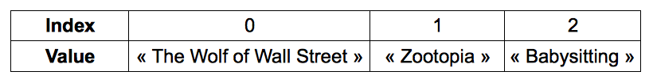

# Simpan data di array

Bab ini akan mengenalkan Kamu ke [array]( https://en.wikipedia.org/wiki/Array_data_type ), satu tipe variabel yang banyak digunakan program komputer untuk menyimpan data. 

## TL;DR

* **Array** merepresentasikan sekumpulan daftar elemen. Array JavaScript adalah objek yang memiliki properti spesial, seperti `length` untuk mengakses ukuran array (jumlah elemen).

* Kamu bisa bayangkan array sebagai sejumlah kotak. Setiap kotak menyimpan nilai spesifik dan berkaitan dengan angka yang dinamakan **index**. Elemen pertama dari array adalah 0, bukan 1.

* Kamu bisa mengakses elemen tertentu dengan menempatkan index di dalam tanda **kurung siku** `[]`.

* Untuk meng-iterasi array (mengecek setiap elemen), Kamu bisa gunakan loop `for`, metodh `forEach()` atau loop baru `for-of`.

```js
for (let i = 0; i < myArray.length; i++) {
  // Gunakan  myArray[i] untuk mengakses setiap elemen array satu demi satu 
}

myArray.forEach(myElement => {
  // Gunakan  myArray[i] untuk mengakses setiap elemen array satu demi satu 
});

for (const myElement of myArray) {
  // Gunakan  myArray[i] untuk mengakses setiap elemen array satu demi satu 
}
```

* Method `push()` menambahkan satu elemen di akhir array. Method `unshift()` menambahkan satu elemen di awal.

* `pop()` dan `splice()` digunakan untuk menghapus dari array.

## Pengenalan array

Bayangkan Kamu ingin membuat daftar semua film yang Kamu tonton di tahun ini.

Satu solusinya adalah dengan membuat beberapa variabel:

```js
const movie1 = "The Wolf of Wall Street";
const movie2 = "Zootopia";
const movie3 = "Babysitting";
// ...
```

Kalau Kamu maniak film, Kamu akan mendapati banyak variabel di program Kamu. Lebih parahnya lagi adalah variabel ini independen satu dengan yang lainnya.

Kemungkinan lainnya adalah dengan mengelompokkan film di satu objek.

```js
const movies = {
  movie1: "The Wolf of Wall Street",
  movie2: "Zootopia",
  movie3: "Babysitting",
  // ...
};
```

Kali ini, data dipusatkan di objek `movies`. Nama propertinya (`movie1`, `movie2`, `movie3`...) sebenarnya tidak perlu dan repetitif.

Kamu perlu satu solusi untuk menyimpan data secara bersamaan tanpa menamainya satu per satu!

Untungnya, ada solusi: menggunakan array. **Array** adalah tipe data yang bisa menyimpan satu set elemen.

## Memanipulasi array di JavaScript

Di JavaScript, array adalah objek yang memiliki properti spesial.

### Membuat array

Begini cara membuat daftar film kita dalam bentuk array.

```js
const movies = ["The Wolf of Wall Street", "Zootopia", "Babysitting"];
```

Array dibuat dengan sepasang tanda kurung siku `[]`. Apapun yang ada di dalam tanda kurung siku adalah array.

Kamu bisa menyimpan tipe elemen yang berbeda di dalam array, termasuk string, angka, boolean, dan bahkan objek.

```js
const elements = ["Hello", 7, { message: "Hi mom" }, true];
```

> Karena array mungkin mengandung bermacam elemen, alangkah baiknya jika menamai array dengan kata jamak (seperti, `movies`).

### Mendapatkan ukuran array

Jumlah elemen tersimpan di array dinamakan **ukuran**. Berikut bagaimana cara mengaksesnya.

```js
const movies = ["The Wolf of Wall Street", "Zootopia", "Babysitting"];
console.log(movies.length); // 3
```

Kamu mengakses ukuran array melalui properti `length`, menggunakan notasi titik.

Tentu saja, properti `length` ini mengembalikan 0 jika array-nya kosong.

```js
const emptyArray = []; // Membuat array kosong
console.log(emptyArray.length); // 0
```

### Akses satu elemen array

Setiap isi di dalam array diidentifikasi dengan angka yang dinamakan **index** - pointer integer yang mengidentifikasi satu elemen di dalam array. Kita bisa bayangkan array sebagai satu set kotak. Setiap kotak menyimpan nilai spesifik dan berkaitan dengan index. Begini triknya: elemen pertama dari array adalah index nomor 0 - bukan 1. Elemen kedua berindex nomor 1, dan seterusnya. Index dari elemen terakhir adalah ukuran array dikurangi 1.

Berikut cara bagaimana Kamu merepresentasikan array `movies`:



Kamu bisa mengakses elemen tertentu dengan menempatkan index di dalam tanda **kurung siku** `[]`:

```js
const movies = ["The Wolf of Wall Street", "Zootopia", "Babysitting"];
console.log(movies[0]); // "The Wolf of Wall Street"
console.log(movies[1]); // "Zootopia"
console.log(movies[2]); // "Babysitting"
```

Menggunakan index yang tidak valid untuk mengakses array JavaScript akan mengembalikan nilai `undefined`.

```js
const movies = ["The Wolf of Wall Street", "Zootopia", "Babysitting"];
console.log(movies[3]); // undefined: elemen terakhir berada di index 2
```

## Iterasi array

Ada beberapa cara untuk menjelajahi array elemen demi elemen.

Yang pertama adalah dengan menggunakan loop `for` seperti yang sudah dibahas sebelumnya.

```js
const movies = ["The Wolf of Wall Street", "Zootopia", "Babysitting"];
for (let i = 0; i < movies.length; i++) {
  console.log(movies[i]);
}
```

Loop `for` menjelajahi setiap elemen di array dimulai dari index 0 sampai dengan ukuran atau panjang array dikurangi 1, yang merupakan elemen terakhir.

Cara lainnya adalah dengan memanggil method `forEach()` pada array. Method ini mengambil parameter sebagai **fungsi** yang akan dijalankan di setiap elemen array.

```js
myArray.forEach(myElement => {
  // Menggunakan myElement untuk mengakses setiap elemen satu demi satu
});
```

Berikut contoh sebelumnya, ditulis ulang dengan menggunakan metode ini dan fungsi panah gemuk.

```js
const movies = ["The Wolf of Wall Street", "Zootopia", "Babysitting"];
movies.forEach(movie => {
  console.log(movie);
});
```

Saat eksekusi, setiap elemen array dijadikan sebagai parameter (dinamakan `movie` di contoh ini) ke fungsi anonim yang berkaitan dengan `forEach()`.

Terakhir, Kamu bisa gunakan loop `for-of` loop, satu jenis loop spesial untuk menangani [objek yang dapat di-iterasi](https://developer.mozilla.org/en-US/docs/Web/JavaScript/Reference/Iteration_protocols#iterable) seperti array. Berikut ini sintaksnya.

```js
for (const myElement of myArray) {
  // Menggunakan myElement untuk mengakses setiap elemen satu demi satu
}
```

Lihat contoh sebelumnya yang ditulis dengan loop `for-of`.

```js
const movies = ["The Wolf of Wall Street", "Zootopia", "Babysitting"];
for (const movie of movies) {
  console.log(movie);
}
```

## Update konten array 

### Menambah elemen pada array

Jangan bohongi saya: Kamu baru saja nonton Ghostbusters. Mari kita tambah dalam daftar. Berikut caranya.

```js
const movies = ["The Wolf of Wall Street", "Zootopia", "Babysitting"];
movies.push("Ghostbusters");
console.log(movies[3]); // "Ghostbusters"
```

Kamu menambah *item* baru ke array dengan method `push()`. Elemen baru ini dilalui sebagai parameter pada method dan disisipkan di akhir array.

Untuk menambah elemen di awal array, gunakan method `unshift()` dibandingkan `push()`.

```js
const movies = ["The Wolf of Wall Street", "Zootopia", "Babysitting"];
movies.unshift("Pacific Rim");
console.log(movies[0]); // "Pacific Rim"
```

### Menghapus elemen dari array

Kamu bisa menghapus elemen terakhir dari array menggunakan method `pop()`.

```js
const movies = ["The Wolf of Wall Street", "Zootopia", "Babysitting"];
movies.pop(); // Remove the last array element
console.log(movies.length); // 2
console.log(movies[2]); // undefined
```

Alternatif lainnya, Kamu bisa gunakan method `splice()` dengan dua parameter: yang pertama adalah nomor index awal dan yang kedua jumlah elemen yang akah dihapus.

```js
const movies = ["The Wolf of Wall Street", "Zootopia", "Babysitting"];
movies.splice(0, 1); // Menghapus 1 elemen dimulai dari 0
console.log(movies.length); // 2
console.log(movies[0]); // "Zootopia"
console.log(movies[1]); // "Babysitting"
```

## Waktu koding!

Buat program ini secara generik: ouput pogram harus merefleksikan semua update di konten array.

### Musketeers

Tulis program sebagai berikut:

* Buat satu array bernama `musketeers` dengan nilai "Athos", "Porthos" dan "Aramis".
* Tampilkan setiap elemen array menggunakan loop`for`.
* Tambah nilai "D'Artagnan" ke array.
* Tampilkan setiap elemen array mengunakan method `forEach()`.
* Hapus Aramis.
* Tampilkan setiap elemen array menggunakan loop `for-of`.

### Penjumlahan nilai

Tulis satu program yang membuat array berikut, lalu hitung dan tampilkan jumlah dari semua nilainya (42 di sini).

```js
const values = [3, 11, 7, 2, 9, 10];
```

### Maksimum array 

Tulis satu program yang membuat array berikut, lalu hitung dan tampilkan nilai maksimumnya.

```js
const values = [3, 11, 7, 2, 9, 10];
```

### Daftar kata

Tulis program yang meminta pengguna untuk memasukkan satu kata, yang berhenti meminta sampai dengan pengguna mengetikkan `"stop"`. Program lalu menampilkan semua kata, kecuali `"stop"`.
