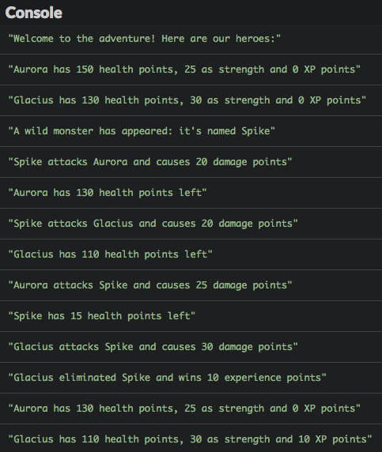
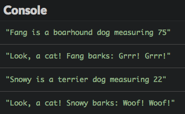
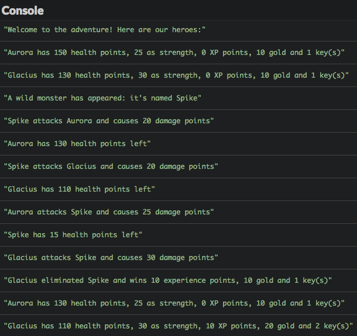
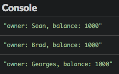

# Memahami pemrograman object-oriented 

Pada bab sebelumnya, Kamu belajar bagaimana cara membuat objek pertama Kamu di JavaScript. Sekarang waktunya untuk lebih memahami cara menggunakannya.

## TL;DR

* **Pemrograman object-Oriented** (Object Oriented Programming), atau OOP, adalah [paradigma pemrograman](https://en.wikipedia.org/wiki/Programming_paradigm) yang menggunakan objek, mengandung **data** dan **perilaku** untuk membuat program.

* **class** adalah abstraksi object-oriented untuk ide atau konsep yang dimanipluasi oleh program. Class menawarkan kemudahan sintaks untuk membuat objek yang merepresentasikan konsep ini.

* Class JavaScript didefinisikan dengan kata kunci `class`. Di dalamnya terdapat **methods**. Method `constructor()`, dipanggil saat pembuatan objek, digunakan untuk meng-inisialisasi objek, seringnya dengan memberikan data properti. Di dalam method, the kata kunci `this` merepresentasikan **objek di mana method dipanggil**.

```js
class MyClass {
  constructor(param1, param2, ...) {
    this.property1 = param1;
    this.property2 = param2;
    // ...
  }
  method1(/* ... */) {
    // ...
  }
  method2(/* ... */) {
    // ...
  }
  // ...
}
```

* Objek dibuat dari class dengan operator `new`. Operator ini memanggil constructor class untuk meng-inisialisasi objek yang baru dibuat.

```js
const myObject = new MyClass(arg1, arg2, ...);
// ...
```

* Model OOP JavaScript berdasarkan **prototype**. Semua objek JavaScript memiliki properti internal yang merupakan kaitan (**referensi**) ke objek lainnya: prototype objek tersebut. Prototype digunakan untuk membagi properti dan mendelegasikan perilaku antar objek.

* Ketika mencoba mengakses properti yang tidak ada di sebuah objek, JavaScript mencoba untuk mencari properti ini di **rantai prototype** dari objek ini dengan cara pertama-tama mencari prototype objek ini, lalu protoype objek dari prototype-nya itu sendiri, dan seterusnya. 

* Ada beberapa cara untuk membuat dan menghubungkan objek JavaScript melalui prototype. Salah satunya dengan menggunakan method `Object.create()`.

```js
// Membuat sebuah objek terhubung ke myPrototypeObject
const myObject = Object.create(myPrototypeObject);
```

* Sintaks JavaScript `class` adalah cara lainnya, bisa dibilang cara lebih mudah untuk membuat hubungan antar objek. Cara ini meniru model OOP berbasis class yang berada di pemrograman lainnya seperti C++, Java atau C#. Namun, hal ini hanyalah **syntactic sugar** yang ditambahkan pada model OOP berbasis prototype pada JavaScript.

## Konteks: multiplayer RPG

Sebagai pengingat, berikut adalah kode minimalis RPG kita yang diambil dari bab sebelumnya. Kita membuat objek literal bernama `aurora` dengan empat properti (`name`, `health`, `strength` dan `xp`) dan sebuah  method `describe()`.

```js
const aurora = {
  name: "Aurora",
  health: 150,
  strength: 25,
  xp: 0,

  // Mengembalikan deskripsi karakter 
  describe() {
    return `${this.name} has ${this.health} health points, ${this
      .strength} as strength and ${this.xp} XP points`;
  }
};

// Aurora terluka oleh panah
aurora.health -= 20;

// Aurora mendapatkan kekuatan dari kalungnya
aurora.strength += 10;

// Aurora mempelajari keterampilan baru
aurora.xp += 15;

console.log(aurora.describe());
```

Untuk membuat permainan menjadi lebih menarik, kita akan menambahkan karakter baru. Sambutlah Glacius, teman Aurora.

```js
const glacius = {
  name: "Glacius",
  health: 130,
  strength: 30,
  xp: 0,

  // Mengembalikan deskripsi karakter 
  describe() {
    return `${this.name} has ${this.health} health points, ${this
      .strength} as strength and ${this.xp} XP points`;
  }
};
```

Kedua karakter kita sangatlah mirip. Mereka memiliki properti yang sama, dengan perbedaan nilai propertinya.

Kamu harusnya sudah tahu betul bahwa duplikasi kode adalah hal berbahaya dan harus dihindari. Kita harus cari cara untuk mengetahui apa saja persamaan karakter kita.

## Class JavaScript 

Kebanyakan bahasa object-oriented menggunakan class sebagai **abstraksi** untuk ide atau konsep yang dimanipulasi oleh program. **class** digunakan untuk membuat objek yang merepresentasikan konsep. Hal ini menawarkan kemudahan sintaks untuk menempelkan **data** dan **perilaku** pada objek ini.

JavaScript bukan pengecualian dan mendukung pemrograman dengan class (tetapi ada twist-nya -- kita bahas nanti).

### Membuat class

Contoh RPG kita terpusat pada karakter, mari kita buat satu class `Character` untuk mengekspresikan seperti apa karakternya.

```js
class Character {
  constructor(name, health, strength) {
    this.name = name;
    this.health = health;
    this.strength = strength;
    this.xp = 0; // XP selalu nol untuk karakter baru
  }
  // Mengembalikan deskripsi karakter
  describe() {
    return `${this.name} has ${this.health} health points, ${this
      .strength} as strength and ${this.xp} XP points`;
  }
}
```

Contoh ini mendemonstrasikan beberapa fakta kunci tentang class JavaScript:

* Sebuah class dibuat dengan kata kunci `class`, diikuti oleh namanya (biasanya dimulai dengan huruf kapital).
* Kebalikan dari objek literal, tidak ada tanda baca pemisah antar elemen di dalam class.
* Sebuah class hanya bisa memiliki **method**, dan tidak memiliki properti data. 
* Seperti halnya objek literal, kata kunci `this` di-set secara otomatis oleh JavaScript di dalam method dan merepresentasikan **objek di mana method dipanggil**.
* Method spesial dinamakan `constructor()` bisa ditambahkan ke definisi class. Method ini dipanggil saat pembuatan objek dan sering digunakan untuk menempelkan properti data. 

### Menggunakan class

Saat class didefinisikan, Kamu bisa menggunakannya untuk membuat objek. Cek program selanjutnya.

```js
const aurora = new Character("Aurora", 150, 25);
const glacius = new Character("Glacius", 130, 30);

// Aurora terluka oleh panah
aurora.health -= 20;

// Aurora mendaptkan kalung penguat
aurora.strength += 10;

// Aurora mempelajari skill baru
aurora.xp += 15;

console.log(aurora.describe());
console.log(glacius.describe());
```


Objek `aurora` dan `glacius` dibuat sebagai karakter dengan operator `new`. Pernyataan ini memanggil class constructor untuk menginisialisasi objek yang baru dibuat. Setelah pembuatan, objek memiliki akses ke properti yang didefinisikan di dalam class.

Berikut sintaks resmi untuk membuat objek menggunakan class.

```js
class MyClass {
  constructor(param1, param2, ...) {
    this.property1 = param1;
    this.property2 = param2;
    // ...
  }
  method1(/* ... */) {
    // ...
  }
  method2(/* ... */) {
    // ...
  }
  // ...
}

const myObject = new MyClass(arg1, arg2, ...);
myObject.method1(/* ... */);
// ...
```

## Di balik layar: objek dan prototype

Jika Kamu memiliki pengetahuan di pemrograman yang lain, Kamu seharusnya sudah familiar dengan class. Tetapi, nanti Kamu akan mengetahui bahwa class JavaScript tidak seperti pemrograman C++, Java or C#.

### Model object-oriented JavaScript

Untuk membuat hubungan antar object, JavaScript menggunakan **prototype**.

Sebagai tambahan dari properti khususnya sendiri, objek JavaScript memiliki properti internal yang merupakan kaitan (dikenal sebagai **referensi**) ke objek lain yang dinamakan **prototype**. Ketika mencoba mengakses satu properti yang tidak ada di sebuah objek, JavaScript mencoba mencari properti ini pada prototype dari objek ini.

Berikut contohnya (diambil dari seri buku Simpson [You Don't Know JS](https://github.com/getify/You-Dont-Know-JS/blob/master/this%20%26%20object%20prototypes/ch5.md)).

```js
const anObject = {
  myProp: 2
};

// Membuat anotherObject menggunakan anObject sebagai prototype
const anotherObject = Object.create(anObject);

console.log(anotherObject.myProp); // 2
```

Di contoh ini, pernyataan JavaScript `Object.create()` digunakan untuk membuat objek `anotherObject` dengan objek `anObject` sebagai prototype-nya.

```js
// Membuat sebuah objek yang terkait ke myPrototypeObject
const myObject = Object.create(myPrototypeObject);
```

Ketika pernyataan `anotherObject.myProp` dijalankan, properti `myProp` dari `anObject` digunakan karena `myProp` tidak ada di `anotherObject`.

Jika objek prototype tidak memiliki properti yang diinginkan, pencarian selanjutnya di dalam prototype objek itu sendiri sampai akhir **rantai prototype**. Jika di akhir rantai ini tercapai tanpa penemuan properti, percobaan akses ke properti mengembalikan nilai `undefined`.

```js
const anObject = {
  myProp: 2
};

// Membuat anotherObject menggunakan anObject sebagai prototype
const anotherObject = Object.create(anObject);

// Membuat yetAnotherObject menggunakan anotherObject sebagai prototype
const yetAnotherObject = Object.create(anotherObject);

// myProp ditemukan di rantai prototype yetAnotherObject (di anObject)
console.log(yetAnotherObject.myProp); // 2

// myOtherProp tidak dapat ditemukan di rantai prototype yetAnotherObject 
console.log(yetAnotherObject.myOtherProp); // undefined
```

Tipe relasi antar objek JavaScript ini dinamakan **delegasi**: sebuah objek mendelegasikan bagian dari operasinya ke prototype-nya sendiri.

### Sifat sejati class JavaScript 

Pada bahasa *class-based* object-oriented seperti C++, Java and C#, class adalah **blueprints** (templates) yang statis. Saat objek dibuat, method dan properti dari class disalin ke entitas baru, dinamakan **instance**. Setelah *instantiation*, objek yang baru saja dibuat tidak memiliki relasi apapun juga dengan class-nya.

Model object-oriented JavaScript berdasarkan prototype, *bukan* class, untuk membagi properti dan mendelegasikan perilaku antar objek. Di JavaScript, sebuah class adalah objek itu sendiri, bukan blueprint yang statis. "Instantiating" class membuat objek baru yang berkaitan ke objek prototype. Tentang perilaku class, bahasa JavaScript sangatlah berbeda dengan C++, Java atau C#, tetapi mirip dengan bahasa seperti Python, Ruby dan Smalltalk.

Sintaks `class` JavaScript hanyalah sebuah cara yang lebih mudah untuk membuat relasi antar objek melalui prototype. Class diintroduksi untuk menyerupai model class berbasis OOP di atas model berbasi prototype JavaScript. Ini merupakan contoh dari apa yang progammer sebut sebagai [syntactic sugar](https://en.wikipedia.org/wiki/Syntactic_sugar).

> Kegunaan sintaks `class` banyak diperdebatkan di komunitas JavaScript.

## Pemrograman berbasis objek (object-oriented)

Sekarang kembali ke game RPG kita, yang masih membosankan. Apa yang kurang? Monster dan pertarungan, tentu saja!

Berikut adalah bagaimana pertarungan ditangani. Jika diserang, life point karakter berkurang dari kekuatan penyerang. Jika nilai health-nya berkurang di bawah nol, karakter akan dimatikan dan tidak bisa menyerang lagi. Pemusnah karakter mendapatkan nilai tetap sebanyak 10 poin experience.

Pertama-tama, mari kita tambah kapabilitas karakter kita untuk bertarung satu dengan yang lainnya. Karena kemampuan ini bisa dibagi, kita definisikan sebagai method bernama `attack()` di class `Character`.

```js
class Character {
  constructor(name, health, strength) {
    this.name = name;
    this.health = health;
    this.strength = strength;
    this.xp = 0; // XP selalu nol untuk karakter baru
  }
  // Serang satu target
  attack(target) {
    if (this.health > 0) {
      const damage = this.strength;
      console.log(
        `${this.name} attacks ${target.name} and causes ${damage} damage points`
      );
      target.health -= damage;
      if (target.health > 0) {
        console.log(`${target.name} has ${target.health} health points left`);
      } else {
        target.health = 0;
        const bonusXP = 10;
        console.log(
          `${this
            .name} eliminated ${target.name} and wins ${bonusXP} experience points`
        );
        this.xp += bonusXP;
      }
    } else {
      console.log(`${this.name} can't attack (they've been eliminated)`);
    }
  }
  // Mengembalikan deskripsi karakter
  describe() {
    return `${this.name} has ${this.health} health points, ${this
      .strength} as strength and ${this.xp} XP points`;
  }
}
```

Sekarang kita bisa memperkenalkan satu monter di dalam game dan membuatnya bertarung dengan pemain kita. Berikut kode akhir dari RPG kita.

```js
const aurora = new Character("Aurora", 150, 25);
const glacius = new Character("Glacius", 130, 30);

console.log("Welcome to the adventure! Here are our heroes:");
console.log(aurora.describe());
console.log(glacius.describe());

const monster = new Character("Spike", 40, 20);
console.log("A wild monster has appeared: it's named " + monster.name);

monster.attack(aurora);
monster.attack(glacius);
aurora.attack(monster);
glacius.attack(monster);

console.log(aurora.describe());
console.log(glacius.describe());
```



Program sebelumnya merupakan contoh singkat dari **Object-Oriented Programming** (disingkat: OOP), [paradigma](https://en.wikipedia.org/wiki/Programming_paradigm) pemrograman (gaya pemrograman) berbasis pada objek yang mengandung data dan perilaku.

## Waktu koding!

### Dogs

Lengkapi program berikut sehingga ada penambahan definisi class `Dog`.

> Dogs taller than 60 emote `"Grrr! Grrr!"` when they bark, other ones yip `"Woof! Woof!"`.

```js
// TODO: definisikan class Dog di sini

const fang = new Dog("Fang", "boarhound", 75);
console.log(`${fang.name} is a ${fang.species} dog measuring ${fang.size}`);
console.log(`Look, a cat! ${fang.name} barks: ${fang.bark()}`);

const snowy = new Dog("Snowy", "terrier", 22);
console.log(`${snowy.name} is a ${snowy.species} dog measuring ${snowy.size}`);
console.log(`Look, a cat! ${snowy.name} barks: ${snowy.bark()}`);
```



### Inventori karakter

Kembangkan contoh RPG sehingga ada penambahan manajemen inventori karakter dengan aturan sebagai berikut:

* Satu inventori karakter terdiri dari beberapa emas dan beberapa kunci. 

* Setiap karakter mulai dengan 10 emas dan 1 kunci.

* Deskripsi karakter harus menampilkan status inventori.

* Ketika karakter memusnahkan karakter lainnya, inventori korban menjadi milik pemusnahnya.

Berikut hasil eksekusi yang diharapkan. 



### Daftar akun

Mari kita buat dari latihan objek akun sebelumnya. Akun bank masih didefinisikan sebagai:

* Satu properti `name`.
* Satu properti `balance` yang awalnya di-set ke nilai 0.
* Satu method `credit`, penambahan nilai yang dilewatkan sebagai argumen ke saldo akun. 
* Satu method `describe` yang mengembalikan deskripsi akun.

Tulis program yang membuat tiga akun: satu milik Sean, lainnya milik Brad dan yang ketiga untuk Georges. Akun ini disimpan di sebuah array. Selanjutnya, program meng-kredit 1000 di setiap akun dan menampilkan deskripsinya.


