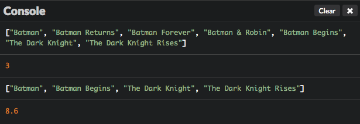
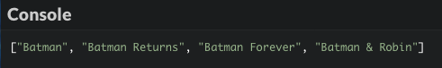
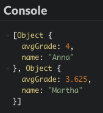

# Temukan pemrograman fungsional

Pemrograman berorientasi objek, walaupun populer, bukanlah satu-satunya cara untuk membuat program. Di bab ini akan mengenalkan Kamu paradigma penting lainnya: pemrograman fungsional.

## TL;DR

* **Pemrograman fungsional** adalah tentang menulis program dengan mengkombinasikan fungsi yang mengekspresikan *apa* yang harus program lakukan, dibandingkan *cara* mengerjakannya (yang merupakan cara imperatif).

* **Keadaan** program adalah nilai dari **variabel global** pada saat itu. Tujuan pemrograman fungsional adalah untuk meminimalisir keadaan **mutasi** (perubahan) yang membuat kode lebih sulit dipahami. Beberapa kemungkinan solusi adalah dengan mendeklarasikan variabel dengan `const` daripada `let`, membagi kode ke dalam fungsi, dan memilih variabel lokal dibandingkan variabel global.

* **Fungsi murni** tergantung sepenuhnya pada input-nya untuk menghitung output-nya dan tidak memiliki **efek samping**. Fungsi murni lebih mudah dipahami, digabungkan, dan debug. Pemrograman fungsional mementingkan penggunakan fungsi murni sebisa mungkin.

* Method `map()`, `filter()` dan `reduce()` bisa menggantikan loop untuk menjelajahi array dan memungkinkan Kamu memprogram array dengan cara fungsional.

* Fungsi JavaScript bisa dipindahkan seperti halnya nilai lainnya: fungsi ini adalah **penduduk kelas utama**, yang memungkinkan pemrograman fungsional. Fungsi yang mengoperasikan fungsi lainnya (mengambil fungsi tersebut sebagai parameter dan mengembalikannya) dinamakan **fungsi higher-order**.

* JavaScript adalah bahasa **multi-paradigma** language: Kamu bisa menulis program menggunakan imperatif, berorientasi objek atau dengan gaya pemrograman fungsional.

## Konteks: daftar film

Di bab ini, kita akan memulai dengan contoh program dan mengembangkannya sedikit demi sedikit, tanpa menambah fungsi baru. Aktivitas penting ini dinamakan **refactoring**.

Program awal kita adalah tentang film Batman terbaru. Data dalam bentuk objek array, di mana setiap objek mendeskripsikan satu film.

```js
const movieList = [
  {
    title: "Batman",
    year: 1989,
    director: "Tim Burton",
    imdbRating: 7.6
  },
  {
    title: "Batman Returns",
    year: 1992,
    director: "Tim Burton",
    imdbRating: 7.0
  },
  {
    title: "Batman Forever",
    year: 1995,
    director: "Joel Schumacher",
    imdbRating: 5.4
  },
  {
    title: "Batman & Robin",
    year: 1997,
    director: "Joel Schumacher",
    imdbRating: 3.7
  },
  {
    title: "Batman Begins",
    year: 2005,
    director: "Christopher Nolan",
    imdbRating: 8.3
  },
  {
    title: "The Dark Knight",
    year: 2008,
    director: "Christopher Nolan",
    imdbRating: 9.0
  },
  {
    title: "The Dark Knight Rises",
    year: 2012,
    director: "Christopher Nolan",
    imdbRating: 8.5
  }
];
```

Dan berikut ini adalah keseluruhan program yang menggunakan data ini untuk menampilkan beberapa hasil tentang film. Coba lihat, program ini cukup jelas.

```js
// Menampilkan judul film
const titles = [];
for (const movie of movieList) {
  titles.push(movie.title);
}
console.log(titles);

// Menghitung film Christopher Nolan
const nolanMovieList = [];
for (const movie of movieList) {
  if (movie.director === "Christopher Nolan") {
    nolanMovieList.push(movie);
  }
}
console.log(nolanMovieList.length);

// Menampilkan judul film yang memiliki rating IMDB lebih dari atau sama dengan 7.5
const bestTitles = [];
for (const movie of movieList) {
  if (movie.imdbRating >= 7.5) {
    bestTitles.push(movie.title);
  }
}
console.log(bestTitles);

// Menghitung rata-rata rating film Christopher Nolan
let ratingSum = 0;
let averageRating = 0;
for (const movie of nolanMovieList) {
  ratingSum += movie.imdbRating;
}
averageRating = ratingSum / nolanMovieList.length;
console.log(averageRating);
```



## Keadaan program 

Program sebelumnya adalah contoh dari yang dinamakan **pemrograman imperatif**. Pada paradigma ini, pemrogram memberikan perintah pada komputer melalui serangkain pernyataan yang memodifikasi keadaan program. Pemrograman imperatif fokus dalam mendeskripsikan *bagaimana* program beroperasi.

Konsep keadaan merupakan hal yang penting. **Keadaan** program adalah nilai dari **variabel globalnya** (variabel yang dapat diakses dari mana saja di dalam kode) pada saat itu. Pada contoh kita, nilai dari `movieList`, `titles`, `nolanMovieCount`, `bestTitles`, `ratingSum` dan `averageRating` membentuk keadaan program. Perintah apapun ke salah satu variabel ini adalah perubahan keadaan, atau sering disebut **mutasi**.

Pada pemgrograman imperatif, keadaan bisa dimodifikasi di manapun di sumber kode. Hal ini memudahkan, tapi bisa berujung kepada bug dan pemeliharaan yang rumit. Seiring program berkembang dalam skala besar dan kompleksitasnya, akan lebih mudah bagi pemrogram untuk memutasi bagian dari keadaan program secara tidak sengaja dan lebih sulit untuk memonitor modifikasi keadaan.

### Membatasi mutasi dengan variabel `const` 

Untuk menurunkan risiko kejadian mutasi keadaan, langkah pertama adalah dengan lebih memilih `const` dibandingkan `let` kapanpun dimungkinkan untuk deklarasi variabel. Deklarasi variabel dengan kata kunci `const` tidak bisa di-assign kembali. Konten array dan objek masih bisa dimutasi, sebenarnya. Cek kode berikut untuk detailnya.

```js
const n = 10;
const fruit = "Banana";
const obj = {
  myProp: 2
};
const animals = ["Elephant", "Turtle"];

obj.myProp = 3; // Memutasi properti boleh saja walaupun untuk objek const
obj.myOtherProp = "abc"; // Menambah properti baru boleh saja walaupun untuk objek const
animals.push("Gorilla"); // Meng-update kontent boleh saja untuk array const

n++; // Illegal
fruit = "orange"; // Illegal
obj = {}; // Illegal
animals = ["Bee"]; // Illegal
```

### Membagi program ke beberapa fungsi

Solusi lainnya adalah dengan membagi sumber kode ke sub-rutin yang dinamakan prosedur atau **fungsi**. Pendekatan ini dinamakan **pemrograman prosedural** dan memiliki keunggulan dapat mengubah variabel ke **variabel lokal**, yang hanya bisa dilihan di kode sub-rutin.

Mari kita coba untuk memperkenalkan fungsi di kode kita.

```js
// Mendapatkan judul film 
const titles = () => {
  const titles = [];
  for (const movie of movieList) {
    titles.push(movie.title);
  }
  return titles;
};

const nolanMovieList = [];

// Mendapatkan film Christopher Nolan
const nolanMovies = () => {
  for (const movie of movieList) {
    if (movie.director === "Christopher Nolan") {
      nolanMovieList.push(movie);
    }
  }
};

// Mendapatkan judul film dengan rating IMDB lebih dari atau sama dengan 7.5
const bestTitles = () => {
  const bestTitles = [];
  for (const movie of movieList) {
    if (movie.imdbRating >= 7.5) {
      bestTitles.push(movie.title);
    }
  }
  return bestTitles;
};

// Menghitung rata-rata rating film Christopher Nolan
const averageNolanRating = () => {
  let ratingSum = 0;
  for (const movie of nolanMovieList) {
    ratingSum += movie.imdbRating;
  }
  return ratingSum / nolanMovieList.length;
};

console.log(titles());
nolanMovies();
console.log(nolanMovieList.length);
console.log(bestTitles());
console.log(averageNolanRating());
```

Keadaan program kita sekarang terbatas pada dua variabel: `movieList` dan `nolanMovieList` (yang terakhir diperlukan pada fungsi `nolanMovies()` dan `averageNolanRating()`). Variabel lainnya sekarang lokal terhadap fungsi yang biasa digunakan, yang membatasi kemungkinan terjadinya mutasi keadaan program secara tidak sengaja.

Selain itu, versi program ini lebih mudah dipahami dari sebelumnya. FUngsi dengan nama yang tepat dapat membantu mendeskripsikan perilaku program. Komentar sekarang sedikit tidak diperlukan dari sebelumnya.

## Fungsi murni

Hanya mengenalkan beberapa fungsi pada program tidaklah cukup untuk mengikuti paradigma pemgrograman fungsional. Sebisa mungkin, kita juga perlu menggunakan fungsi murni.

**Fungsi murni** adalah satu fungsi yang memiliki karakteristik berikut:

* Outputnya tergantung sepenuhnya pada input.
* Tidak memiliki efek samping.

**Efek samping** adalah perubahan pada keadaan program atau interaksi dengan dunia luar. Akses database atau pernyataan`console.log()` adalah contoh dari efek samping.

Dengan data yang sama, fungsi murni akan selalu memberikan hasil yang sama. Secara desain, fungsi murni independen dari keadaan program dan tidak boleh mengakses fungsi tersebut. Fungsi ini harus menerima **parameter** untuk melakukan hal yang berguna. Satu-satunya cara fungsi tanpa parameter untuk menjadi murni adalah dengan mengembalikan nilai yang konstan.

Fungsi murni lebih mudah dipahami, dikombinasikan, dan debug: berbeda dengan yang *tidak murni*, tidak perlu melihat body fungsi-nya agar mudah dimengerti. Meskipun begitu, beberapa efek samping diperlukan di program apapun, seperti menampilkan output ke pengguna atau meng-update database. Pada pemrograman fungsional, nama permainannya adalah dengan membuat efek samping tersebut hanya di beberapa bagian program yang terdedikasi dan teridentifikasi secara jelas. Kode sisanya harus ditulis dengan fungsi murni.

Mari kita refactor contoh kode kita untuk mengenali fungsi murni.

```js
// Mendapatkan judul film
const titles = movies => {
  const titles = [];
  for (const movie of movies) {
    titles.push(movie.title);
  }
  return titles;
};

// Mendapatkan film Christopher Nolan
const nolanMovies = movies => {
  const nolanMovies = [];
  for (const movie of movies) {
    if (movie.director === "Christopher Nolan") {
      nolanMovies.push(movie);
    }
  }
  return nolanMovies;
};

// Mendapatkan judul film dengan rating IMDB lebih besar atau sama dengan 7.5
const bestTitles = movies => {
  const bestTitles = [];
  for (const movie of movies) {
    if (movie.imdbRating >= 7.5) {
      bestTitles.push(movie.title);
    }
  }
  return bestTitles;
};

// Menghitung rata-rata rating di daftar film
const averageRating = movies => {
  let ratingSum = 0;
  for (const movie of movies) {
    ratingSum += movie.imdbRating;
  }
  return ratingSum / movies.length;
};

console.log(titles(movieList));
const nolanMovieList = nolanMovies(movieList);
console.log(nolanMovieList.length);
console.log(bestTitles(movieList));
console.log(averageRating(nolanMovieList));
```

Karena kita hanya melakukan refactoring, output program masih sama.

Keadaan program (`movieList` dan `nolanMovieList`) belum berubah. Walaupun begitu, semua fungsi kita sekarang murni; daripada mengakses keadaan, fungsi ini menggunakan parameter untuk mendapatkan perilaku yang diinginkan. Sebagai tambahan keunggulan, fungsi `averageRating()` sekarang bisa menghitung rata-rata rating dari daftar film; fungsi ini menjadi lebih **generik**.

## Operasi array 

Pemrograman fungsional adalah tentang bagaimana menulis program dengan mengkombinasikan fungsi yang mengekspresikan *apa* yang harus program lakukan, dibandingkan dengan *bagaimana* melakukannya. JavaScript menawarkan beberapa array yang berelasi dengan method yang lebih mengutamakan gaya pemrograman fungsional.

### Method `map()` 

Method `map()` mengambil array sebagai parameter dan membuat array baru dengan hasil dari pemanggilan fungsi yang tersedia pada setiap elemen di array ini. Penggunaan `map()` secara khusus adalah dengan menggantikan loop untuk menjelajahi array.

Mari kita lihat aksi `map()`.

```js
const numbers = [1, 5, 10, 15];
// Fungsi yang diasosiasikan mengali setiap angka array dengan 2
const doubles = numbers.map(x => x * 2);

console.log(numbers); // [1, 5, 10, 15] (no change)
console.log(doubles); // [2, 10, 20, 30]
```

Berikut cara `titles()` kita bisa ditulis ulang dengan `map()`. Lihat bagaimana kode fungsi sekarang lebih ringkas dan ekspresif.

```js
// Mendapatkan judul film
const titles = movies => {
  /* Kode sebelumnya
  const titles = [];
  for (const movie of movies) {
    titles.push(movie.title);
  }
  return titles;
  */

  // Mengembalikan array baru yang di dalamnya ada judul film
  return movies.map(movie => movie.title);
};
```

### Method `filter()` 

Method `filter()` menawarkan satu cara untuk mengetes setiap elemen array terhadap fungsi yang tersedia. Hanya elemen yang lulus tes ini ditambahkan pada array yang dikembalikan.

Berikut contoh menggunakan `filter()`.

```js
const numbers = [1, 5, 10, 15];
// Simpan hanya angka yang lebih dari atau sama dengan 10
const bigOnes = numbers.filter(x => x >= 10);

console.log(numbers); // [1, 5, 10, 15] (tidak ada perubahan)
console.log(bigOnes); // [10, 15]
```

Kita bisa menggunakan method ini pada fungsi `nolanMovies()`.

```js
// Mendapatkan film Christopher Nolan
const nolanMovies = movies => {
  /* Kode sebelumnya
  const nolanMovies = [];
  for (const movie of movies) {
    if (movie.director === "Christopher Nolan") {
      nolanMovies.push(movie);
    }
  }
  return nolanMovies;
  */

  // Mengembalikan nilai array baru yang mengandung hanya film Christopher Nolan
  return movies.filter(movie => movie.director === "Christopher Nolan");
};
```

Method `map()` dan `filter()` bisa digunakan bersamaan untuk mendapatkan efek yang powerful. Lihat versi baru dari fungsi `bestTitles()` ini.

```js
// Mendapatkan judul film dengan rating IMDB rating lebih besar atau sama dengan 7.5
const bestTitles = movies => {
  /* Kode sebelumnya
  const bestTitles = [];
  for (const movie of movies) {
    if (movie.imdbRating >= 7.5) {
      bestTitles.push(movie.title);
    }
  }
  return bestTitles;
  */

  // Mem-filter film berdasarkan rating IMDB rating, lalu membuat array judul film
  return movies.filter(movie => movie.imdbRating >= 7.5).map(movie => movie.title);
};
```

### Method `reduce()` 

Method `reduce()` menerapkan fungsi yang tersedia pada setiap elemen array untuk *memperkecil* ke satu nilai. Method ini biasanya digunakan untuk mengkalkulasi array.

Berikut contoh memperkecil array menjadi penjumlahan seluruh nilainya.

```js
const numbers = [1, 5, 10, 15];
// Menghitung jumlah elemen array
const sum = numbers.reduce((acc, value) => acc + value, 0);

console.log(numbers); // [1, 5, 10, 15] (tidak ada perubahan)
console.log(sum);     // 31
```

Method `reduce()` bisa dimasukkan beberapa parameter:

* Yang pertama adalah fungsi yang berkaitan dengan `reduce()` dan dipanggil untuk setiap elemen array. Fungsi ini dua parameter: yang pertama adalah **accumulator** yang terdiri dari nilai yang diakumulasi sebelum dikembalikan oleh permintaan terakhir dari fungsi. Fungsi lainnya adalah elemen array.

* Yang kedua aadlah nilai inisial accumulator (seringnya bernilai 0).

Berikut cara menerapkan `reduce()` untuk menghitung rata-rata rating film.

```js
// Menghitung rata-rata rating film
const averageRating = movies => {
  /* Kode sebelumnya
  let ratingSum = 0;
  for (const movie of movies) {
    ratingSum += movie.imdbRating;
  }
  return ratingSum / movies.length;
  */

  // Menghitung semua jumlah rating film IMDB 
  const ratingSum = movies.reduce((acc, movie) => acc + movie.imdbRating, 0);
  return ratingSum / movies.length;
};
```

Kemungkinan solusi lainnya adalah dengan menghitung jumlah rating dengan menggunakan `map()` sebelum memperkecil array yang mengandung rating film saja.

```js
// ...
// Menghitung jumlah rating semua film IMDB 
const ratingSum = movies.map(movie => movie.imdbRating).reduce((acc, value) => acc + value, 0);
// ...
```

## Fungsi higher-order 

Pada bab ini, kita sudah mengetahui bahwa fungsi JavaScript bisa dipindah-pindah seperti nilai lainnya. Kita namakan fungsi ini **penduduk kelas utama** di JavaScript, yang artinya fungsi ini diperlakukan sama dengan tipe lainnya.

Terima kasih ke sifat penduduk kelas utamanya, fungsi bisa dikombinasikan bersama, membuat program lebih ekspresif dan memungkinkan gaya pemrograman fungsional. Fungsi yang mengambil fungsi lain sebagai parameter atau mengembalikan fungsi lainnya dinamakan **fungsi higher-order**.

Lihat versi akhir dari contoh program kita.

```js
const titles = movies => movies.map(movie => movie.title);
const byNolan = movie => movie.director === "Christopher Nolan";
const filter = (movies, func) => movies.filter(func);
const goodRating = movie => movie.imdbRating >= 7.5;
const ratings = movies => movies.map(movie => movie.imdbRating);
const average = array => array.reduce((sum, value) => sum + value, 0) / array.length;

console.log(titles(movieList));
const nolanMovieList = filter(movieList, byNolan);
console.log(nolanMovieList.length);
console.log(titles(filter(movieList, goodRating)));
console.log(average(ratings(nolanMovieList)));
```

Kita telah mendefinisikan fungsi pembantu yang kita kombinasikan untuk mendapatkan hasil yang diinginkan. Kodenya ringkas dan jelas. Karena fungsi ini mengambil fungsi filter sebagai parameter, fungsi `filter()` adalah contoh dari fungsi higher-order.

## JavaScript: bahasa multi paradigma

Bahasa JavaScript penuh dengan paradox. Bahasa ini telah terkenal dengan [penemuannya dalam sepuluh hari](https://www.w3.org/community/webed/wiki/A_Short_History_of_JavaScript), dan sekarang menikmati popularitasnya yang unik dalam sejarah pemrograman. Sintaksnya lebih banyak meminjam dari bahasa imperatif yang mainstream seperti C atau Java, tetapi prinsip desainnya lebih dekat ke bahasa fungsional seperti [Scheme](https://en.wikipedia.org/wiki/Scheme_(programming_language)).

Sifat alami JavaScript yang multi-paradigma membuat Kamu bisa menulis imperatif, object-oriented atau kode fungsional, memilih alat yang tepat untuk tugas dan memanfaatkan secara maksimal pengalaman pemrograman Kamu. Seperti biasa, perbedaan adalah sumber dari fleksibilitas dan kekuatan yang luar biasa.

## Waktu koding!

### Film lawas

Kembangkan contoh program sebelumnya di atas sehingga bisa menampilkan judul film yang dirilis sebelum tahun 2000, menggunakan pemrograman fungsional.

```js
const movieList = [
  {
    title: "Batman",
    year: 1989,
    director: "Tim Burton",
    imdbRating: 7.6
  },
  {
    title: "Batman Returns",
    year: 1992,
    director: "Tim Burton",
    imdbRating: 7.0
  },
  {
    title: "Batman Forever",
    year: 1995,
    director: "Joel Schumacher",
    imdbRating: 5.4
  },
  {
    title: "Batman & Robin",
    year: 1997,
    director: "Joel Schumacher",
    imdbRating: 3.7
  },
  {
    title: "Batman Begins",
    year: 2005,
    director: "Christopher Nolan",
    imdbRating: 8.3
  },
  {
    title: "The Dark Knight",
    year: 2008,
    director: "Christopher Nolan",
    imdbRating: 9.0
  },
  {
    title: "The Dark Knight Rises",
    year: 2012,
    director: "Christopher Nolan",
    imdbRating: 8.5
  }
];

// TODO: Buat satu array judul film yang dirilis sebelum tahun 2000

console.log(moviesBefore2000);
```



### Formulir pemerintah

Lengkapi program berikut untuk menghitung dan menampilkan istilah politik yang berakhir dengan `"cy"`.

```js
const governmentForms = [
  {
    name: "Plutocracy",
    definition: "Rule by the wealthy"
  },
  {
    name: "Oligarchy",
    definition: "Rule by a small number of people"
  },
  {
    name: "Kleptocracy",
    definition: "Rule by the thieves"
  },
  {
    name: "Theocracy",
    definition: "Rule by a religious elite"
  },
  {
    name: "Democracy",
    definition: "Rule by the people"
  },
  {
    name: "Autocracy",
    definition: "Rule by a single person"
  }
];

// TODO: komputasi array formsEndingWithCy 

// Harus menampilkan ["Plutocracy", "Kleptocracy", "Theocracy", "Democracy", "Autocracy"]
console.log(formsEndingWithCy);
```

### Jumlah array 

Lengkapi program berikut untuk menghitung dan menampilkan jumlah total nilai di setiap elemen array.

```js
const arrays = [[1, 4], [11], [3, 5, 7]];

// TODO: hitung nilai variabel arraysSum 

console.log(arraysSum); // Harus menampilkan 31
```

### Hasil siswa 

Berikut program yang menampilkan hasil siswi (nama dan rata-rata nilai).

```js
const students = [
  {
    name: "Anna",
    sex: "f",
    grades: [4.5, 3.5, 4]
  },
  {
    name: "Dennis",
    sex: "m",
    country: "Germany",
    grades: [5, 1.5, 4]
  },
  {
    name: "Martha",
    sex: "f",
    grades: [5, 4, 2.5, 3]
  },
  {
    name: "Brock",
    sex: "m",
    grades: [4, 3, 2]
  }
];

// Hitung hasil siswi
const femaleStudentsResults = [];
for (const student of students) {
  if (student.sex === "f") {
    let gradesSum = 0;
    for (const grade of student.grades) {
      gradesSum += grade;
    }
    const averageGrade = gradesSum / student.grades.length;
    femaleStudentsResults.push({
      name: student.name,
      avgGrade: averageGrade
    });
  }
}

console.log(femaleStudentsResults);
```

Refactor program di atas dengan menggunakan pemrograman fungsional. Hasil eksekusi haruslah sama.


