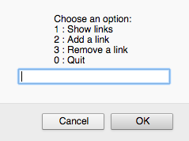
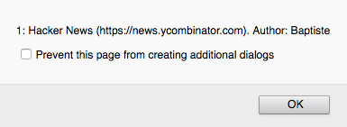

# Proyek: program berita sosial

Sekarang Kamu sudah mengetahui pemrograman dasar, mari kita lanjutkan dan membuat proyek nyata.

## Tujuan

Tujuan proyeik ini adalah untuk membuat program berita sosial sederhana. Pengguna akan bisa menampilkan daftar link dan menambah link baru.

## Kebutuhan fungsional

* Sebuah link didefinisikan oleh judulnya, URL-nya, dan pengirimnya (submitter).
* Jika URL link tidak dimulai dengan "http://"` atau `"https://"`, `"http://"` otomatis ditambahkan di awalnya.
* Saat pertama kali dibuka, program menampilkan menu awal dengan beberapa aksi yang dapat dilakukan dalam bentuk window alert dan menanyakan ke pengguna mau pilih apa. Aksi yang dapat dilakukan sebagai berikut:
  * Menampilkan daftar link.
  * Menambah link baru.
  * Menghapus link eksisting.
  * Keluar program.
* Menampilkan daftar indeks untuk setiap link (rank) dalam window alert dan propertinya dalam window alert, atau pesan jika ada link yang tidak valid.
* Ketika menambah link, program menanyakan pengguna untuk properti link (judul, URL, pengirim). Lalu link dibuat. Selain itu, link ini juga muncul di daftar link yang ditampilkan.
* Ketika menghapus link, pengguna ditanya untuk indeks link sampai indeks-nya valid. Link tersebut lalu dihapus. Selanjutnya, link tersebut harus hilang dalam daftar link yang ditampilkan. Menghapus sebuah link tidak dapat dilakukan jika tidak ada link eksisting.
* Setelah satu aksi dilakukan, menu awal kembali tampil. Hal ini berlangsung terus sampai dengan pengguna memilih untuk keluar dari program.

## Kebutuhan teknikal

* Semua kode Kamu harus teridentasi dengan benar.
* Nama variable harus dipilih dengan baik dan mengikuti kaidah konvensi camelCase.
* Kode duplikasi haru dihindari.

## Hasil yang diharapkan

Berikut beberapa tampilan untuk hasil yang diharapkan.

