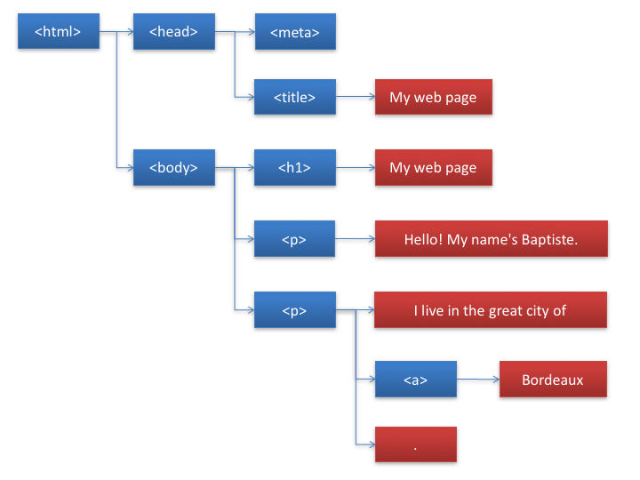

# Temukan DOM

Bab ini akan membantu Kamu untuk menemukan bagaimana halaman web ditampilkan dengan manggunakan browser.

## TL;DR

* **Halaman web** adalah dokumen terstruktur yang mengandung teks dan tag HTML. **DOM**, atau *Document Object Model*, adalah cara terstandarisasi untuk mendefinisikan struktur halaman web.

* DOM juga adalah **API** yang memungkinkan interaksi secara programatik dengan halaman web. Dengan JavaScript, Kamu bisa mengakses struktur halaman yang ditampilkan di browser dan memodifikasinya.

* DOM merepresentasikan halaman web sebagai hirearki **objek**, di mana setiap objek berkorespondensi ke satu node pada pohon elemen bersarang HTML.

* Variabel `document` menyediakan akses ke akar dari pohon DOM dan berkoresponden ke elemen `<html>` di dalam HTML itu sendiri.

* Objek DOM memiliki **properti** dan **method** yang dapat Kamu manipulasi dengan JavaScript. Contohnya, `nodeType` mengembalikan tipe node, `childNodes` mengandung koleksi dari node child, dan `parentNode` mengembalikan node parent.

## Pengenalan DOM

Kamu sudah mengetahui bahwa halaman web adalah dokumen yang mengandung teks dan tag seperti heading, paragraf, link, dan lainnya. Hal ini terjadi di bahasa yang dinamakan **HTML**.

Mari kita lihat contoh halaman web sederhana ini. Silakan tambahkan informasi dari Kamu sendiri!

```html
<!doctype html>
<html>

<head>
    <meta charset="utf-8">
    <title>My web page</title>
</head>

<body>
    <h1>My web page</h1>
    <p>Hello! My name's Baptiste.</p>
    <p>I live in the great city of <a href="https://en.wikipedia.org/wiki/Bordeaux">Bordeaux</a>.</p>
</body>

</html>
```


Untuk membuat hasil ini, browser pertama-tama mengambil kode HTML dan membangun representasi dari strukturnya. Lalu struktur ini ditampilkan di browser.

Browser juga menawarkan akses *programatik* pada representasi strukturnya dari halaman web yang ditampilkan. Menggunakan antar muka ini, Kamu bisa meng-update halaman dengan menambah atau menghapus elemen, mengubah style, dan lainnya secara dinamis. Beginilah Kamu membuat halaman web yang **interaktif**. 

Representasi terstruktur dari halaman web dinamakan **DOM**, singkatan dari *Document Object Model*. DOM mendefinisikan struktur halaman dan bagaimana cara berinteraksi dengannya. Hal ini berarti pemrograman antar muka, atau **API** (*Application Programming Interface*). JavaScript adalah pilihan bahasa untuk berinteraksi dengan DOM.

> Waktu dulu, setiap browser menggunakan DOM-nya masing-masing, membuat pusing pengembang JavaScript saat mencoba kode halaman web. Waktu sulit ini berakhir. Melalui usaha [World Wide Web Consortium](https://w3c.org) (W3C), versi pertama DOM gabungan telah dibuat di tahun 1998. Sekarang, semua browser terbaru sudah menggunakan DOM yang terstandarisasi. 

## Struktur halaman web

Halaman web adalah sekumpulan tag bersarang. Kamu bisa representasi halaman web pada bentuk hirearki yang dinamakan **pohon**. Elemen `<html>` menge-set dokumen Kamu sebagai HTML dan mengndung dua sub-elemen, `<head>` dan `<body>`, yang di dalamnya lagi mengandung beberapa sub-elemen.

Berikut adalah korespondensi pohon terhadap contoh halaman HTML kita.



Setiap entitas di pohon dinamakan **node**. Ada dua tipe node:

* Yang berwarna biru berkoresponden ke tag HTML tag seperti `<body>` atau `<p>`. Node ini dinamakan **elemen node** dan node ini bisa memiliki subnode, dinamakan **node child**.

* Yang berwarna merah, cocok dengan konten tekstual dari halaman. Node ini dinamakan **node teks** dan tidak memiliki child.

## Mulai dengan DOM JavaScript

DOM merepresentasikan halaman web sebagai hirearki objek, di mana setiap objek berkoresponden ke satu node di pohon elemen bersarang HTML. Objek DOM memiliki **properti** dan **method** yang bisa Kamu manipulasi dengan JavaScript.

### Akses DOM dengan variabel `document` 

Ketika program JavaScript berjalan di dalam konten browser web, program tersebut bisa mengakses akar DOM menggunakan variabel `document`. Variabel ini mirip dengan elemen `<html>`.

`document` adalah satu objek yang memiliki properti `head` dan `body` yang memungkinkan untuk mengakses elemen `<head>` dan `<body>` dari halaman web.

```js
const h = document.head; // "h" variabel mengandung konten dari head DOM 
const b = document.body; // "b" variabel mengandung konten dari body DOM 
```

### Temukan tipe node 

Setiap objek memiliki properti dinamakan `nodeType` yang mengindikasikan tipenya. Nilai dari properti ini adalah `document.ELEMENT_NODE` untuk satu node "elemen" (atau dikenal dengan tag HTML) dan `document.TEXT_NODE` untuk teks node.

```js
if (document.body.nodeType === document.ELEMENT_NODE) {
  console.log("Body is an element node!");
} else {
  console.log("Body is a textual node!");
}
```


Sesuai ekspektasi, objek DOM `body` adalah satu elemen node karena ini adalah tag HTML.

### Akses child node 

Setiap objek bertipe elemen di DOM memiliki properti dinamakan `childNodes`. Ini adalah koleksi terurut yang mengandung semua child node sebagai objek DOM. Kamu bisa menggunakan koleksi seperti array ini untuk mengakses anak node yang berbeda.

> Properti `childNodes` dari node elemen bukanlah array JavaScript sebenarnya, melainkan objek [NodeList](https://developer.mozilla.org/en-US/docs/Web/API/NodeList). Tidak semua mehtod array standar bisa diterapkan.

Kode berikut akan menampilkan child pertama dari node `body`.

```js
// Akses child pertama dari node body 
console.log(document.body.childNodes[0]);
```


> Tunggu... Kenapa child pertama bukan adalah `h1`, karena ini merupakan elemen pertama dari HTML body? 

Ini karena jarak antara tag dan garis pengembalian di kode HTML dipertimbangkan sebagai node teks oleh browser. Node `h1` jadinya dianggap sebagai child *kedua* dari body. Mari kita cek lagi bahwa:

```js
// Akses child kedua dari node body 
console.log(document.body.childNodes[1]);
```


Untuk menghilangkan node teks di antara tag, Kamu bisa menulis halaman HTML page secara ringkas.

```html
<body><h1>My web page</h1><!-- ... -->
```

Ini lebih baik, namun pertimbangkan hal ini. Kalau ditulis seperti ini, maka kode jadi agak sulit dibaca karena tidak menggunakan indentasi kode.

### Jelajahi child node

Untuk menjelajahi daftar child node, Kamu bisa menggunakan loop `for`, method `forEach()` atau yang lebih baru `for-of` berikut ini:

```js
// Jelajahi child body node menggunakan loop for
for (let i = 0; i < document.body.childNodes.length; i++) {
  console.log(document.body.childNodes[i]);
}

// Jelajahi child body node menggunakan methode forEach()
document.body.childNodes.forEach(node => {
  console.log(node);
});

// Jelajahi child body node menggunakan loop for-of 
for (const node of document.body.childNodes) {
  console.log(node);
}
```

Setiap teknik ini memberikan hasil berikut.


Lagi, jarak dan garis pengembalian dihitung sebagai node teks di DOM.

### Akses parent node 

Setiap objek DOM memiliki properti dinamakan `parentNode` yang mengembalikan parent node-nya sebagai objek DOM.

> Untuk akar node DOM (`document`), nilai dari `parentNode` adalah `null` karena tidak memiliki node parent.

```js
const h1 = document.body.childNodes[1];
console.log(h1.parentNode);       // Menampilkan node body 
console.log(document.parentNode); // Akan menampilkan null, karena tidak memiliki node parent
```


> Ada properti lain yang tidak kita diskusikan di sini yang memungkinkan Kamu menavigasi melalu DOM, seperti `firstChild`, `lastChild` atau `nextSibling`.

## Waktu koding!

### Menampilkan child node 

Misi Kamu di sini adalah untuk membuat fungsi `showChild()` yang menampilkan satu dari child node elemen DOM. Fungsi ini mengambil parent node parameter dan child node index. Kasus eror seperti node non-elemen atau atau out-of-limits index harus dipertimbangkan juga.

Berikut kode HTML yang digunakan.

```html
<h1>A title</h1>
<div>Some text with <a href="#">a link</a>.</div>
```

Lengkapi program berikut untuk mendapatkan hasil yang diharapkan.

```js
// Tampilkan child node dari objek DOM 
// "node" adalah objek DOM 
// "index" adalah indeks dari child node
const showChild = (node, index) => {
  // TODO: tambahkan kode di sini 
};

// Harus menampilkan node h1 
showChild(document.body, 1);

// Harus menampilkan "Incorrect index"
showChild(document.body, -1);

// Harus menampilkan "Incorrect index"
showChild(document.body, 8);

// Harus menampilkan "Wrong node type"
showChild(document.body.childNodes[0], 0);
```

> Gunakan `console.error()` daripada `console.log()` untuk menampilkan pesan eror di console.
