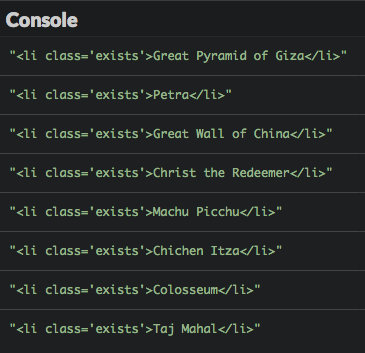
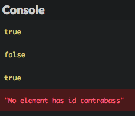

# Jelajahi DOM

Di bab ini, Kamu akan tahu bagaimana cara menggunakan JavaScript untuk menjelajahi DOM.

## TL;DR

* Daripada memapai DOM node satu per satu, Kamu bisa mengakses satu atau lebih elemen menggunakan **metode seleksi** dengan cepat.

* Method `getElementsByTagName()`, `getElementsByClassName()` dan `getElementById()` masing-masing mencari item berdasarkan **nama tag**, **class**, dan **ID**. Dua method yang pertama mengembalikan satu daftar yang nantinya bisa dikonversi menjadi array dengan `Array.from()`. Method yang terakhir mengembalikan satu item.

* Method `querySelectorAll()` dan `querySelector()` memungkinkan untuk mencari item menggunakan **CSS selector**. Method yang pertama mengembalikan seluruh item yang cocok, dan method yang kedua mengembalikan hanya item yang pertama.

* Properti `innerHTML` mengembalikan **konten HTML** dari satu elemen. Properti `textContent` mengembalikan **konteks tekstualnya** tanpa markup HTML.

* Method `getAttribute()` dan `hasAttribute()` memungkinkan untuk bisa mengakses **atribut** elemen. Properti `classList` dan method-nya `contains()` digunakan untuk mengakses elemen **class**.

## Contoh halaman web 

Berikut adalah contoh halaman web yang digunakan di seluruh bab ini.

```html
<h1>Seven wonders of the world</h1>
<p>Do you know the seven wonders of the world?</p>
<div id="content">
    <h2>Wonders from Antiquity</h2>
    <p>This list comes to us from ancient times.</p>
    <ul class="wonders" id="ancient">
        <li class="exists">Great Pyramid of Giza</li>
        <li>Hanging Gardens of Babylon</li>
        <li>Lighthouse of Alexandria</li>
        <li>Statue of Zeus at Olympia</li>
        <li>Temple of Artemis at Ephesus</li>
        <li>Mausoleum at Halicarnassus</li>
        <li>Colossus of Rhodes</li>
    </ul>
    <h2>Modern wonders of the world</h2>
    <p>This list was decided by vote.</p>
    <ul class="wonders" id="new">
        <li class="exists">Petra</li>
        <li class="exists">Great Wall of China</li>
        <Li class="exists">Christ the Redeemer</Li>
        <Li class="exists">Machu Picchu</Li>
        <li class="exists">Chichen Itza</li>
        <li class="exists">Colosseum</li>
        <li class="exists">Taj Mahal</li>
    </ul>
    <h2>References</h2>
    <ul>
        <li><a href="https://en.wikipedia.org/wiki/Seven_Wonders_of_the_Ancient_World">Seven Wonders of the Ancient World</a></li>
        <li><a href="https://en.wikipedia.org/wiki/New7Wonders_of_the_World">New Wonders of the World</a></li>
    </ul>
</div>
```

## Memilih elemen

### Keterbatasan penjelajahan node satu per satu 

Di bab sebelumnya, Kamu sudah tahu cara menavigasi struktur node DOM dari halaman web yang dimulai dari akar node dan menggunakan properti `childNodes` untuk turun tingkat pada struktur halaman web.

Misalnya Kamu ingin memilih judul `"Wonders from Antiquity"` dari halaman web kita. Perhatikan node teks diantara elemen, node ini adalah child node kedua dari enam child node dari elemen `body`. Jadi Kamu bisa menulis sesuatu seperti ini.

```js
// Menampilkan elemen h2: "Wonders from Antiquity" 
console.log(document.body.childNodes[5].childNodes[1]);
```


Teknik ini sangatlah aneh dan rentan eror. Kodenya sulit untuk dibaca dan harus di-update jika elemen baru disisipkan di halaman web. Untungnya, ada solusi yang lebih baik. 

### Memilih item berdasarkan tag HTML 

Semua elemen DOM memiliki satu method dinamakan `getElementsByTagName()`. Method ini mengembalikan, dalam bentuk objek [NodeList](https://developer.mozilla.org/en-US/docs/Web/API/NodeList), daftar item yang memiliki nama tag yang ditempatkan sebagai parameter. Pencarian terjadi melalui semua sub-elemen dari node di mana method dipanggil -- tidak hanya child-nya secara langsung.

Dengan method `getElementsByTagName()`, memilih elemen `h2` pertama menjadi super mudah:

```js
// Mendapatkan semua elemen h2 dalam bentuk array 
const titleElements = document.getElementsByTagName("h2");

console.log(titleElements[0]);     // Menampilkan h2 yang pertama 
console.log(titleElements.length); // 3 (jumlah total elemen h2 yang ada di halaman)
```


> Memberikan nama variabel JavaScript yang berhubungan dengan node elemen DOM dengan `Element` (atau `Elements` ketika variabel mengandung beberapa node) adalah konvensi penamaan yang populer. Kita akan menggunakan ini di seluruh buku ini. 

### Memilih item berdasarkan class

Elemen DOM juga ada method dinamakan `getElementsByClassName()`. Method ini mengembalikan elemen objek `NodeList` dengan nama class sebagai parameter. Lagi, pencarian mencakup semua sub-elemen node di mana method dipanggil.

It's important to note that `NodeList` objects are *not* real JavaScript arrays, so not all array operations are applicable to them. To turn a `NodeList` object into an array, use the `Array.from()` method.

Untuk memilih dan menampilkan semua elemen dokumen dengan menggunakan class `"exists"`, Kamu bisa menulis kode berikut.

```js
// Menampilkan semua elemen yang memiliki class "exists"
const existingElements = Array.from(document.getElementsByClassName("exists"));
existingElements.forEach(element => {
  console.log(element);
});
```



### Memilih item berdasarkan ID

Terakhir, variabel `document` menyediakan method dinamakan `getElementById()` yang mengembalikan elemen dengan ID spesifik diantara semua elemen yang ada di dokumen. Method ini mengembalikan `null` jika tidak ada elemen terkait yang bisa ditemukan.

Kode berikut memilih dan menampilkan daftar dengan ID `"new"`.

```js
// Menampilkan elemen dengan ID "new"
console.log(document.getElementById("new"));
```


> Hati-hati: kebalikan dari yang lain, method `getElementById()` tidak mengandung `'s'` setelah kata `"Element"`.

### Memilih elemen melalui CSS selector

Untuk kasus yang lebih kompleks, Kamu juga bisa menggunakan CSS selector untuk mengakses elemen DOM.

Contohnya, katakanlah Kamu ingin mengambil semua elemen `<li>` dari keajaiban kuno (ancient) dan masih ada. 

```js
// Semua keajaiban "ancient" yang masih ada 
console.log(document.getElementById("ancient").getElementsByClassName("exists").length); // 1
```

Sintaks ini sedikit aneh. Mari kita belajar dua method baru yang membuat pencarian elemen menjadi lebih mudah.

Yang pertama adalah `querySelectorAll()`, yang Kamu bisa gunakan CSS selector untuk mengidentifikasi elemen.

```js
// Semua paragraf 
console.log(document.querySelectorAll("p").length); // 3

// Semua paragraf di dalam blok ID "konten"
console.log(document.querySelectorAll("#content p").length); // 2

// Semua elemen dengan class "exists" 
console.log(document.querySelectorAll(".exists").length); // 8

// Semua keajaiban "ancient" yang masih ada 
console.log(document.querySelectorAll("#ancient > .exists").length); // 1
```

> Cek [Mozilla Developer Network](https://developer.mozilla.org/en-US/docs/Web/CSS/CSS_Selectors) untuk CSS selector utama yang bisa digunakan.

Method kedua menggunakan CSS selector dinamakan `querySelector()`. Method ini mirip dengan `querySelectorAll()` tetapi hanya mengembalikan elemen pertama yang cocok. Jika tidak ada elemen yang cocok, maka akan mengembalikan nilai `null`.

```js
// Menampilkan paragraf pertama
console.log(document.querySelector("p"));
```


### Menentukan metode pemilihan 

Kamu baru saja mengetahui beberapa cara memilih elemen DOM. Bagaimana Kamu memilih yang benar?

Karena Kamu menggunakan CSS selector, `querySelectorAll()` dan `querySelector()` bisa mencakup semua keperluan Kamu, tetapi cara ini mungkin [lebih lambat](https://jsperf.com/getelementsbyclassname-vs-queryselectorall/195) daripada cara yang lain.

Berikut aturan umum yang bisa Kamu ikuti.

| Jumlah item yang akan didapat | Kriteria pemilihan | Metode yang digunakan |
|---|---|---|
| Banyak | Dengan tag | `getElementsByTagName()` |
| Banyak | Dengan class | `getElementsByClassName()` |
| Banyak | Tidak dengan class atau tag | `querySelectorAll()` |
| Hanya satu | Dengan ID | `getElementById()` |
| Hanya satu (yang pertama) | Tidak dengan ID | `querySelector()` |

## Mendapatkan informasi tentang elemen 

DOM juga menyediakan informasi tentang item yang baru saja Kamu pilih.

### Konten HTML 

Properti `innerHTML` akan mengambil konten HTML dari elemen DOM Kamu.

```js
// Konten HTML dari elemen DOM dengan ID "content"
console.log(document.getElementById("content").innerHTML);
```


> Properti ini telah diperkenalkan oleh Microsoft dan tidak menjadi bagian dari spesifikasi W3C DOM. Walaupun begitu, properti ini tetap didukung oleh kebanyakan browser populer. 

### Konten tekstual 

Properti `textContent` mengembalikan semua konten teks dari elemen DOM, tanpa markup HTML.

```js
// Konten tekstual dari elemen DOM dengan ID "content"
console.log(document.getElementById("content").textContent);
```


### Atribut

Method `getAttribute()` bisa diterapkan pada elemen DOM dan akan mengembalikan nilai dari atributnya.

```js
// Menampilkan atribut href  dari link yang pertama
console.log(document.querySelector("a").getAttribute("href"));
```


Beberapa atribut bisa langsung diakses sebagai properti. Hal ini benar untuk atribut `id`, `href`, dan `value`.

```js
// Menampilkan atribut ID dari daftar yang pertama
console.log(document.querySelector("ul").id);

// Menampilkan atribut href dari daftar yang pertama
console.log(document.querySelector("a").href);
```


Kamu bisa memeriksa keberadaan dari atribut dengan menggunakan method `hasAttribute()` seperti contoh berikut ini.

```js
if (document.querySelector("a").hasAttribute("target")) {
  console.log("The first link has a target attribute.");
} else {
  console.log("The first link does not have a target attribute."); // Akan ditampilkan
}
```

### Class

Di halaman web, sebuah tag bisa memiliki beberapa class. Properti `classList` mengambil daftar class elemen DOM.

```js
// Daftar class dari elemen yang diidentifikasi oleh "ancient"
const classes = document.getElementById("ancient").classList;
console.log(classes.length); // 1 (karena elemen hanya memiliki satu class)
console.log(classes[0]);     // "wonders"
```

Kamu juga bisa menge-tes keberadaan class dari elemen dengan memanggil `contains()` pada daftar class, menempatkan class untuk dites sebagai satu parameter.

```js
if (document.getElementById("ancient").classList.contains("wonders")) {
  console.log("The element with ID 'ancient' has the class 'wonders'."); // Akan ditampilkan
} else {
  console.log("The element with ID 'ancient' does not have the class 'wonders'.");
}
```

> Ini hanyalah sebagian dari penjelajahan API DOM. Untuk lebih detail, cek[Mozilla Developer Network](https://developer.mozilla.org/en-US/docs/Web/API/Element).

## Waktu koding!

### Menghitung elemen 

Berikut ini beberapa kode HTML code (konten dari puisi Prancis Paul Verlaine).

```html
<h1>Mon rêve familier</h1>

<p>Je fais souvent ce rêve <span class="adjective">étrange</span> et <span class="adjective">pénétrant</span></p>
<p>D'une <span>femme <span class="adjective">inconnue</span></span>, et que j'aime, et qui m'aime</p>
<p>Et qui n'est, chaque fois, ni tout à fait la même</p>
<p>Ni tout à fait une autre, et m'aime et me comprend.</p>
```

Lengkapi program berikut untuk menulis fungsi `countElements()`, yang mengambil CSS selector sebagai satu parameter dan mengembalikan jumlah elemen yang berkoresponden. 

```js
// TODO: tulis fungsi countElements() di sini

console.log(countElements("p"));              // Harus menampilkan 4
console.log(countElements(".adjective"));     // Harus menampilkan 3
console.log(countElements("p .adjective"));   // Harus menampilkan 3
console.log(countElements("p > .adjective")); // Harus menampilkan 2
```

### Menangani atribut

Berikut ini deskripsi dari beberapa instrumen musik.

```html
<h1>Some musical instruments</h1>
<ul>
  <li id="clarinet" class="wind woodwind">
    The <a href="https://en.wikipedia.org/wiki/Clarinet">clarinet</a>
  </li>
  <li id="saxophone" class="wind woodwind">
    The <a href="https://en.wikipedia.org/wiki/Saxophone">saxophone</a>
  </li>
  <li id="trumpet" class="wind brass">
    The <a href="https://en.wikipedia.org/wiki/Trumpet">trumpet</a>
  </li>
  <li id="violin" class="chordophone">
    The <a href="https://en.wikipedia.org/wiki/Violin">violin</a>
  </li>
</ul>
```

Tulis program JavaScript yang di dalamnya terdapat fungsi `linkInfo()` yang menampilkan:

* Jumlah total link.
* Sasaran link pertama dan terakhir.

Fungsi ini harus jalan walaupun saat ini tidak ada link.


Tambah instrumen baru berikut di akhir daftar HTML list, lalu cek hasil terbaru dari program Kamu.

```html
<li id="harpsichord">
  The <a href="https://en.wikipedia.org/wiki/Harpsichord">harpsichord</a>
</li>
```


### Menangani class

Kembangkan program sebelumnya, tambahkan fungsi `has()` yang memeriksa apakah satu elemen yang dibuat dengan ID memiliki class. Fungsi ini menampilkan `true`, `false` atau pesan eror jika elemen tidak dapat ditemukan.

```js
// Menampilkan apakah elemen memiliki class
const has = (id, someClass) => {
  // TODO: tulis kode fungsi
};

has("saxophone", "woodwind");     // Harus menampilkan true
has("saxophone", "brass");        // Harus menampilkan false
has("trumpet", "brass");          // Harus menampilkan true
has("contrabass", "chordophone"); // Harus menampilkan pesan eror 
```

> Gunakan `console.error()` dibandingkan `console.log()` untuk menampilkan pesan eror di console.


