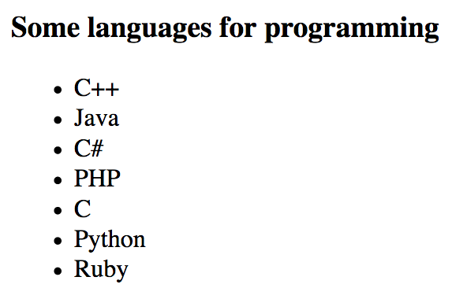
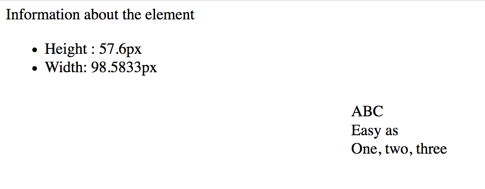

# Modifikasi struktur halaman 

Mari kita lihat bagaimana menggunakan JavaScript untuk memodifikasi halaman web ketika halaman sudah terbuka oleh browser! Lalu kamu bisa membuat konten Kamu menjadi lebih dinamis dan interaktif. 

## TL;DR

* Properti `innerHTML`, `textContent` dan `classList` properties, juga method `setAttribute`, memungkinkan Kamu memodifikasi informasi elemen DOM.

* Kamu membuat node DOM baru melalui method `createTextNode()` (untuk node teks) dan `createElement()` (untuk elemen itu sendiri).

* Method `appendChild()` memungkinkan Kamu menyisipkan satu node baru sebagai child terakhir dari elemen DOM.

* Method `insertBefore()` dan `insertAdjacentHTML()` adalah kemungkinan alternatif untuk menambah konten.

* Kamu bisa mengganti node eksisting dengan method `replaceChild()` atau menghapusnya dengan `removeChild()`.

* Properti JavaScript `style` merepresentasikan atribut `style` dari node DOM. Properti ini memungkinkan Kamu untuk memodifikasi tampilan elemen dengan mendefinisikan nilai properti CSS-nya.

* Properti CSS yang terdiri dari beberapa kata ditulis dalam **camelCase** saat berurusan dengan JavaScript. Contohnya, `font-family` menjadi `fontFamily`.

* properti `style` tidak digunakan untuk mengakses tampilan elemen. Kamu harus menggunakan fungsi `getComputedStyle()`.

* Memanipulasi DOM dengan JavaScript harus dilakukan tidak dengan berlebihan sehingga performansi halaman tidak terganggu.

## Modifikasi elemen eksisting 

Properti penjelajahan DOM yang dipelajari pada bab sebelumnya bisa juga digunakan untuk meng-update elemen pada halaman web.

### Contoh halaman

Contoh di paragraf selanjutnya menggunakan kode HTML berikut.

```html
<h3 class="beginning">Some languages</h3>
<div id="content">
    <ul id="languages">
        <li id="cpp">C++</li>
        <li id="java">Java</li>
        <li id="csharp">C#</li>
        <li id="php">PHP</li>
    </ul>
</div>
```

### Konten HTML 

Properti `innerHTML` bisa digunakan untuk mengubah konten elemen di dalam DOM.

Contohnya, Kamu bisa menambah bahasa baru pada daftar kita dengan kode di bawah. Kita akan mengakses tag `<ul>` yang diidentifikasi oleh `"languages"` lalu menambahkan entri di akhir daftar melalui operator (`+=`) dan `<li>`.

```js
// Memodifikasi elemen HTML element: menambah <li>
document.getElementById("languages").innerHTML += '<li id="c">C</li>';
```


Properti `innerHTML` sering digunakan untuk "mengosongkan" konten. Coba contoh berikut:

```js
// Menghapus daftar konten HTML, menggantinya dengan kosong 
document.getElementById("languages").innerHTML = "";
```

> Sebelum lanjut, hapus kode di atas dari program JavaScript Kamu. Jika tidak, Kamu tidak memiliki konten!

> Ketika menggunakan `innerHTML`, Kamu menaruh konten HTML di dalam string. Untuk menjaga kode Kamu tetap terbaca dan mencegah kesalahan, Kamu harus menggunakan `innerHTML` untuk membuat sedikit perubahan konten. Kamu nanti akan mengetahui alternatif solusi lainnya di bawah.

### Konten teks

Gunakan properti `textContent` untuk memodifikasi konten teks dari elemen DOM. Berikut cara melengkapi judul yang ditampilkan oleh halaman kita.

```js
// Memodifikasi konten teks judul
document.querySelector("h3").textContent += " for programming";
```


### Atribut

Method `setAttribute()` mengeset nilai atribut elemen. Kamu menempatkan nama dan nilai dari atribut sebagai parameter.

```js
// Mendefinisikan atribut id dari judul pertama
document.querySelector("h3").setAttribute("id", "title");
```

Seperti yang Kamu lihat di bab sebelumnya, beberapa atribut eksis sebagai properti dan bisa langsung di update.

```js
// Mendefinisikan atribut id dari judul pertama
document.querySelector("h3").id = "title";
```

### Class

Kamu bisa menggunakan properti `classList` untuk menambah atau menghapus class elemen DOM!

```js
const titleElement = document.querySelector("h3"); // Ambil h3 pertama
titleElement.classList.remove("beginning");        // Hapus class "beginning"
titleElement.classList.add("title");               // Tambah class bernama "title"
console.log(titleElement);
```


## Menambah elemen baru

Menambah elemen baru pada halaman web bisa dibagi menjadi tiga langkah:

* Buat elemen baru.
* Set properti elemen.
* Sisipkan elemen baru pada DOM.

Misalnya Kamu ingin menambah bahasa "Python" pada daftar bahasa di halaman kita. Berikut kode JavaScript yang bisa Kamu gunakan.

```js
const pythonElement = document.createElement("li"); // Buat elemen "li" 
pythonElement.id = "python";          // Definisikan elemen ID
pythonElement.textContent = "Python"; // Definisikan konten teksnya 
document.getElementById("languages").appendChild(pythonElement); // Sisipkan elemen baru pada DOM
```


Mari kita pelajari setiap langkah tersebut.

### Membuat elemen 

Kamu akan membuat elemen menggunakan method `createElement()` (mengagetkan ya?). Method ini digunakan pada objek dokumen dan mengambil tag dari elemen baru sebagai parameter. Method ini juga mengembalikan elemen yang dibuat sebagai objek (disimpan di variabel bernama `pythonElement`).

```js
const pythonElement = document.createElement("li"); // Buat elemen li 
```

### Mengeset properti elemen 

Setelah elemen dibuat dan disimpan di sebuah variabel, Kamu bisa menambah beberapa detail seperti ID, class, konten teks, dan lainnya dengan menggunakan properti DOM tersebut di atas.

Di contoh, elemen ID menjadi `"python"` dan konten teksnya menjadi `"Python"`.

```js
// ...
pythonElement.id = "python";          // Definisikan elemen ID
pythonElement.textContent = "Python"; // Definisikan konten teksnya
```

### Menyisipkan elemen pada DOM

Ada beberapa teknik untuk menyisipkan node baru pada DOM. Biasanya adalah dengan memanggil method `appendChild()` pada elemen yang akan menjadi parent masa depan dari node baru tersebut. Node baru ini ditambahkan di akhir daftar child node dari parent tersebut.

Di contoh kita, item baru ditambahkan sebagai child baru dari tag `<ul>` diidentifikasi oleh `"languages"`, setelah semua child lainnya di tag ini.

```js
// ...
document.getElementById("languages").appendChild(pythonElement); // Sisipkan elemen baru pada DOM 
```

## Variasi penambahan elemen 

### Menambah node tekstual

Daripada menggunakan properti `textContent` untuk mendefinisikan konten tekstual elemen baru, Kamu bisa membuat node tekstual dengan method `createTextNode()`. Node ini lalu bisa ditambahkan ke elemen baru dengan `appendChild()`.

Kode berikut mendemonstrasikan kemungkinan ini dengan menyisipkan bahasa Ruby di akhir daftar.

```js
const rubyElement = document.createElement("li"); // Buat elemen "li" 
rubyElement.id = "ruby"; // Definisikan elemen ID
rubyElement.appendChild(document.createTextNode("Ruby")); // Definisikan konten teksnya
document.getElementById("languages").appendChild(rubyElement); // Sisipkan elemen baru pada DOM
```



### Menambah node sebelum lainnya 

Terkadang, menyisipkan node baru di akhir parent dari daftar child tidaklah ideal. Di kasus ini, Kamu bisa menggunakan method `insertBefore()`. Dipanggil di parent masa depan, method ini mengambil node baru dan node di mana yang baru akan disisipkan sebagai parameter.

Sebagai contoh, berikut bagaimana bahasa Perl bisa disisipkan sebelum PHP di dalam daftar.

```js
const perlElement = document.createElement("li"); // Buat elemen "li" 
perlElement.id = "perl"; // Definisikan elemen ID
perlElement.textContent = "Perl"; // Definisikan konten teksnya
// Sisipan elemen baru sebelum node "PHP" 
document.getElementById("languages").insertBefore(perlElement, document.getElementById("php"));
```


### Menentukan posisi node baru dengan tepat

Ada method yang bisa mendefinisikan posisi elemen yang disisipkan secara tepat: `insertAdjacentHTML()`. Panggil method ini di elemen eksisting dan tempatkan posisi dan HTML karakter string yang merepresentasikan konten baru yang akan ditambahkan. Posisi konten baru harus ditempatkan sebagai berikut:

* `beforebegin`: sebelum elemen eksisting.
* `afterbegin`: di dalam elemen eksisting, sebelum child pertamanya.
* `beforeend`: di dalam elemen eksisting, setelah child terakhirnya.
* `afterend`: setelah elemen eksisting.

Berikut bagaimana posisi ini relatif diterjemahkan ke tag `<p>` eksisting.

```html
<!-- beforebegin -->
<p>
  <!-- afterbegin -->
  foo
  <!-- beforeend -->
</p>
<!-- afterend -->
```

Contoh berikut menggunakan `insertAdjacentHTML()` untuk menambah JavaScript di atas daftar bahasa.

```js
// Menambah elemen di awal daftar
document.getElementById('languages').insertAdjacentHTML("afterBegin", '<li id="javascript">JavaScript</li>');
```


## Mengganti atau menghapus nodes

### Mengganti node

Elemen DOM bisa diganti dengan method `replaceChild()`. Method ini mengganti child node dari elemen saat ini dengan node lainnya. Node baru dan node yang akan diganti ditempatkan sebagai parameter (sesuai urutannya).

Contoh berikut menampilkan cara mengganti bahasa Perl dengan Lisp.

```js
const lispElement = document.createElement("li"); // Buat elemen li 
lispElement.id = "lisp";          // Definisikan ID-nya
lispElement.textContent = "Lisp"; // Definisikan konten teksnya
// Ganti elemen yang diidentifikasi oleh "perl" dengan elemen baru
document.getElementById("languages").replaceChild(lispElement, document.getElementById("perl"));
```


### Menghapus node

Terakhir, Kamu bisa menghapus node dengan method dinamakan `removeChild()`, dengan menempatkan node yang akan dihapus sebagai parameter.

```js
// Menghapus elemen dengan id "lisp" 
document.getElementById("languages").removeChild(document.getElementById("lisp"));
```


## Menata tampilkan elemen

JavaScript tidak hanya memungkinkan Kamu bisa berinteraksi dengan struktur halaman web Kamu, tetapi juga bisa mengganti tampilan elemen. Sekarang waktunya untuk belajar bagaimana caranya.

Berikut contoh konten HTML yang digunakan di paragraf selanjutnya.

```html
<p>First</p>
<p style="color: green;">Second</p>
<p id="para">Third</p>
```

Dan berikut ini CSS **stylesheet** terkait. Peraturan di stylesheet menentukan tampilan elemen halaman web. Di sini, salah satu elemen yang kita sesuaikan melalui CSS adalah elemen dengan ID `para` ID. Teksnya akan berwarna biru dan ditulis miring.

```css
#para {
    font-style: italic;
    color: blue;
}
```


### Properti `style` 

Elemen DOM dilengkapi dengan properti yang dinamakan `style`, yang mengembalikan objek yang merepresentasikan atribut elemen HTML `style`. Objek properti ini berpasangan dengan properti CSS-nya. Dengan mendefinisikan properti ini dengan JavaScript, Kamu sebenarnya memodifikasi style elemen.

Kode di bawah ini memilih paragraf pertama dari halaman web dan memodifikasi warna teks, dan margin.

```js
const paragraphElement = document.querySelector("p");
paragraphElement.style.color = "red";
paragraphElement.style.margin = "50px";
```

#### Properti CSS gabungan 

Beberapa properti CSS memiliki nama gabungan, artinya properti ini terdiri dari dua kata (seperti `background-color`). Untuk berinteraksi dengan properti ini melalui JavaScript, Kamu harus menyingkirkan tanda sambung (-) dan mengkapitalkan huruf pertama dari kata tersebut.

Contoh ini memodifikasi elemen properti `font-family` dan `background-color` di paragraf yang sama.

```js
// ...
paragraphElement.style.fontFamily = "Arial";
paragraphElement.style.backgroundColor = "black";
```


Aturan penamaan ini sudah pernah dibahas di bab sebelumnya, disebut [camelCase](https://en.wikipedia.org/wiki/Camel_case).

Kamu bisa lihat properti CSS dan properti JavaScript-nya di [Mozilla Developer Network](https://developer.mozilla.org/en-US/docs/Web/CSS/CSS_Properties_Reference).

### Keterbatasan properti `style` 

Mari kita coba menampilkan warna teks dari setiap contoh paragraf kita.

```js
const paragraphElements = document.getElementsByTagName("p");
console.log(paragraphElements[0].style.color); // "red"
console.log(paragraphElements[1].style.color); // "green"
console.log(paragraphElements[2].style.color); // Menampilkan string kosong
```


Kenapa warna paragraf ketiga tidak muncul?

Karena properti `style` yang digunakan di kode ini hanya merepresentasikan atribut `style` dari elemen tersebut. Mengunakan properti ini, Kamu tidak bisa mengakses deklarasi style yang didefinisikan di tempat lain, contohnya di dalam stylesheet CSS. Hal ini menjelaskan kenapa style di paragraf ketiga, didefinisikan eksternal, tidak tampil di sini.

### Mengakses elemen style 

Solusi yang lebih baik dalam mengakses elemen style adalah dengan menggunakan fungsi dinamakan `getComputedStyle()`. Fungsi ini mengambil node DOM sebagai parameter dan mengembalikannya sebagai objek yang merepresentasikan elemen style. Kamu lalu bisa melihat perbedaan properti CSS properties dari objek tersebut.

Contoh berikut akan menampilkan properti style dari paragraf ketiga:

```js
const paragraphStyle = getComputedStyle(document.getElementById("para"));
console.log(paragraphStyle.fontStyle); // "italic"
console.log(paragraphStyle.color);     // warna biru di nilai RGB
```


> Warna biru merepresentasikan tiga nilai: merah, hijau, dan biru (RGB). Untuk setiap warna dasar ini, nilainya selalu antara ata sama dengan 0 dan 255.

## Manipulasi dan performansi DOM 

Mengupdate DOM melalui kode JavaScript membuat browser memproses tampilan halaman yang baru. Terlalu sering memanipulasi halaman bisa membuat performansi menjadi lambat. Untuk itu, Kamu harus menjaga operasi akses dan update DOM seminimum mungkin.

Membuat dan mengeset properti elemen *sebelum* disisipkan ke DOM adalah salah satu cara agar performansi tetap terjaga.

```js
// Buruk: DOM diupdate beberapa kali
const newNode = document.createElement(...); // Buat elemen baru
parentNode.appendChild(newNode); // Tambah DOM
newNode.id = ...; // Set beberapa properti elemen
newNode.textContent = "...";
// ...

// Lebih baik: DOM diupdate hanya sekali
const newNode = document.createElement(...); // Buat elemen baru
newNode.id = ...; // Set beberapa properti elemen
newNode.textContent = "...";
// ...
parentNode.appendChild(newNode); // Tambah DOM
```

## Waktu koding!

### Menambah satu paragraf

Kembangkan contoh bahasa sehingga ada penambahan satu paragraf (`<p>` tag) mengandung satu link (`<a>` tag) ke URL <https://en.wikipedia.org/wiki/List_of_programming_languages>.


### Daftar koran 

Berikut kode HTML dari sebuah halaman web. 

```html
<h3>Some newspapers</h3>
<div id="content"></div>
```

Tulis program yang menampilkan daftar link koran di sebuah halaman dalam bentuk array JavaScript. Setiap link harus bisa di klik.

```js
// Daftar koran
const newspapers = ["https://www.nytimes.com", "https://www.washingtonpost.com", "http://www.economist.com"];
```


### Kamus kecil

Berikut kode HTML dari sebuah halaman web. 

```html
<h3>A mini-dictionary</h3>
<div id="content"></div>
```

Tulis program yang menampilkan daftar istilah dan definisi di sebuah halaman dalam bentuk array JavaScript. 

```js
const words = [{
  term: "Procrastination",
  definition: "Avoidance of doing a task that needs to be accomplished"
}, {
  term: "Tautology",
  definition: "logical argument constructed in such a way that it is logically irrefutable"
}, {
  term: "Oxymoron",
  definition: "figure of speech that juxtaposes elements that appear to be contradictory"
}];
```

Gunakan tag HTML `<dl>` untuk membuat daftar ([untuk tahu lebih detail kunjungi link ini](https://developer.mozilla.org/en-US/docs/Web/HTML/Element/dl)). Setiap istilah pada kamus harus ditebalkan dengan tag `<strong>`.


### Meng-update warna 

Konten HTML berikut ada tiga paragraf.

```html
<h1>Paragraph 1</h1>
<div>Lorem ipsum dolor sit amet, consectetur adipiscing elit. Donec dignissim fringilla dapibus. Curabitur placerat efficitur molestie. Quisque quis consequat nibh. Aenean feugiat, eros eget aliquam vulputate, leo augue luctus lectus, non lobortis libero quam non sem. Aliquam sit amet tincidunt ex, mollis interdum massa.</div>

<h1>Paragraph 2</h1>
<div>Vivamus at justo blandit, ornare leo id, vehicula urna. Fusce sed felis eget magna viverra feugiat eget nec orci. Duis non massa nibh. Aenean vehicula velit a magna lobortis tempor ut quis felis. Proin vitae dui a eros facilisis fringilla ut ut ante.</div>

<h1>Paragraph 3</h1>
<div>Lorem ipsum dolor sit amet, consectetur adipiscing elit. Duis sit amet pharetra massa. Nulla blandit erat nulla, et scelerisque libero varius ut. Praesent bibendum eu magna ullamcorper venenatis. Sed ut pellentesque leo. Sed ultrices sapien consequat odio posuere gravida.</div>
```

Tulis satu program yang meminta pengguna untuk warna teks baru, lalu tanya untuk warna latar belakang yang baru. Halaman ini nantinya ter-update berdasarkan pilihan pengguna.


### Informasi tentang elemen

Berikut kode HTML untuk latihan kali ini.

```html
<div id="content">ABC
    <br>Easy as
    <br>One, two, three
</div>
<div id="infos"></div>
```

Dan CSS stylesheet-nya.

```css
#content {
    float: right;
    margin-top: 100px;
    margin-right: 50px;
}
```

Tulis program yang bisa menambahkan daftar yang menampilkan tinggi dan lebar elemen yang diidentifikasi oleh "content" pada halaman web tersebut.


