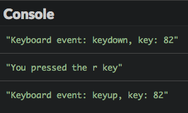
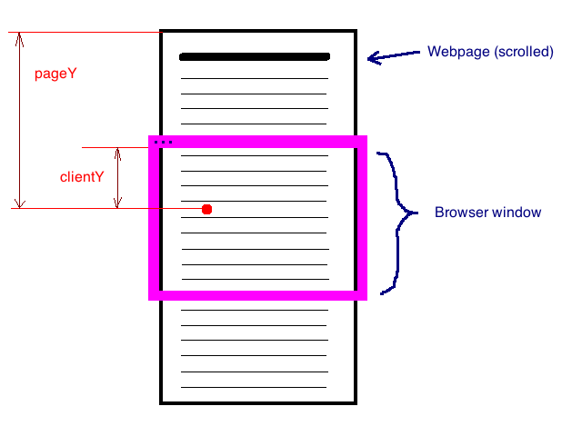

# Reaksi terhadap event

Untuk membuat halaman web interaktif, Kamu harus merespons aksi pengguna. Mari kita cari tahu bagaimana caranya.

## TL;DR

* Kamu bisa membuat halaman web interaktif dengan menulis kode JavaScript yang terikat pada **event** pada browser.

* Beberapa tipe even bisa ditangani. Setiap tipe event terhubung dengan objek `Event` yang mengandung properti yang memberikan informasi tentang event.

* Event `keypress`, `keydown` dan `keyup` memungkinkan Kamu bereaksi terhadap event yang berhubungan dengan keyboard.

* Event `click`, `mousedown` dan `mouseup` memungkinkan Kamu bereaksi terhadap event yang berhubungan dengan mouse.

* Membuka dan menutup halaman web berhubungan dengan event `load` dan `beforeunload`.

* Event meluas di pohon DOM dari node-nya sampai dengan ke akar dokumen. Perluasan ini bisa diinterupsi dengan method `stopPropagation()`.

* Memanggil method `preventDefault()` pada objek `Event` membatalkan perilaku awal yang berhubungan dengan aksi yang memicu event.

## Pengenalan event

Sampai saat ini, kode JavaScript Kamu dieksekusi langsung dari awal. Urutan eksekusi pernyataan ditentukan di awal dan hanya interaksi user hanyalah input data melalui pemanggilan `prompt()`.

Untuk menambah interaktivitas, halaman web harus bereaksi terhadap aksi pengguna: klik tombol, isi formulir, dan lainnya. Di kasus ini, urutan eksekusi pernyataan tidak lagi ditentukan di awal, tetapi tergantung dari perilaku pengguna. Aksi mereka memicu **event** yang bisa ditangani dengan penulisan kode JavaScript.

Cara penulisan program ini dinamakan **event-driven programming**. Hal ini sering digunakan dalam antar muka pengguna, dan umumnya pada program yang membutuhkan interaksi dengan pengguna.

### Contoh pertama 

Berikut contoh awal kode HTML.

```html
<button id="myButton">Click me!</button>
```

 Dan berikut kode JavaScript-nya .

```js
const showMessage = () => {
  alert("Hello!");
};

// Akses tombol
const buttonElement = document.getElementById("myButton");
// Mendengar (listen) event "click" 
buttonElement.addEventListener("click", showMessage);
```

Meng-klik tombol di halaman web menampilkan pesan `"Hello!`.


### Menambah event listener

Mengambil elemen DOM, method `addEventListener()` menambah **handler** untuk event tertentu. Method ini mengambil parameter **event type** dan **fungsi** yang berhubungan. Fungsi ini dipanggil ketika event yang bertipe korespondensi muncul pada elemen DOM.

Kode JavaScript bisa ditulis kembali dengan lebih ringkan menggunakan fungsi anonim, untuk hasil yang sama.

```js
// Menampilkan pesan ketika pengguna klik tombol
document.getElementById("myButton").addEventListener("click", () => {
  alert("Hello!");
});
```

### Menghapus event listener

Di beberapa kasus tertentu, Kamu mungkin ingin menghentikan reaksi terhadap event pada elemen DOM. Untuk mendapatkan ini, panggil `removeEventListener()` pada elemen, dilalui sebagai fungsi parameter yang digunakan untuk menangani event.

> Hal ini hanya bisa bekerja jika handler fungsi tidak anonim

```js
// Menghapus handler untuk klik event
buttonElement.removeEventListener("click", showMessage);
```

## Keluarga event 

Banyak tipe event bisa dipicu oleh elemen DOM. Berikut ini adalah kategori utama event.

| Kategori | Contoh |
|---|---|
| Keyboard events | Memencet atau melepas tombol keyboard |
| Mouse events | Meng-klik tombol mouse, memencet atau melepas tombol mouse button, menunjuk di area tertentu |
| Window events | Membuka atau menutup halaman, mengubah ukuran, scrolling |
| Form events | Mengubah fokus kolom formulir, kirim formulir |

Setiap event terkait kepada objek `Event` yang keduanya memiliki **property** (informasi tentang event) dan **method** (cara beraksi terhadap event). Objek ini bisa digunakan oleh fungsi handler.

Banyak properti objek `Event` terkait pada event tergantung pada tipe event. Beberapa properti selalu ada, seperti `type` yang mengembalikan tipe event dan `target` yang megembalikan target event (elemen DOM yang merupakan sumber event).

Objek `Event` dilalui sebagai parameter untuk fungsi handler. Kode berikut menggunakan objek ini untuk menampilkan tipe event dan target di console.

```js
// Menampilkan tipe event dan target ketika pengguna klik tombol
document.getElementById("myButton").addEventListener("click", e => {
  console.log(`Event type: ${e.type}, target: ${e.target}`);
});
```

> Nama parameter yang dipilih untuk objek `Event` umumnya adalah `e` atau `event`.


## Reaksi pada event umum 

### Penekanan tombol keyboard 

Solusi paling umum untuk reaksi pada penekanan tombok keyboard melibatkan penanganan evenet `keypress` yang terjadi pada halaman web (elemen DOM `body`, yang berhubungan dengan variabel global `document` di JavaScript).

Contoh berikut menampilkan di console karakter yang berhubungan dengan penekanan tombol keyboard. Info karakter diberikan oleh properti `charCode` dari objek `Event` yang terkait pada event. Properti ini mengembalikan nilai numerik (disebut **nilai Unicode**) yang bisa diterjemahkan ke nilai string oleh method `String.FromCharCode()`.

```js
// Menampilkan karakter yang ditekan 
document.addEventListener("keypress", e => {
  console.log(`You pressed the ${String.fromCharCode(e.charCode)} key`);
});
```


Untuk mengatur penekanan dan pelepasan semua tombol keyboard (tidak hanya karakter saja), Kamu akan menggunakan event `keydown` dan `keyup`. Contoh ini menggunakan fungsi yang sama untuk mengatur dua event. Kali ini, kode keyboard nya bisa diakses melalui properti `keyCode` dari objek `Event`.

```js
// Menampilkan informasi event pada keyboard 
const keyboardInfo = e => {
  console.log(`Keyboard event: ${e.type}, key: ${e.keyCode}`);
};

// Integrasi fungsi ini ke penekanan dan pelepasan tombol keyboard 
document.addEventListener("keydown", keyboardInfo);
document.addEventListener("keyup", keyboardInfo);
```



Hasil ini menunjukkan bahwa urutan peluncuran event yang berkaitan dengan keyboard adalah sebagai berikut : `keydown` -> `keypress` -> `keyup`.

> `keydown` akan beberapa kali nyala jika tombol ini terus ditekan.

### Klik mouse 

Klik mouse pada elemen DOM menghasilkan satu event bertipe `click`. Antar muka peraba seperti smartphone dan tablet juga memiliki event `click` yang berhubungan dengan tombol, yang dipicu dengan sentuhan jari.

Objek `Event` yang berhubungan dengan event `click` memiliki properti `button` yang memungkinkan Kamu tahu tombol mouse yang digunakan, juga properti `clientX` dan `clientY` yang mengembalikan koordinat horizontal dan vertikal di tempat di mana klik terjadi. Koordinat ini didefinisikan relatif pada zona halaman yang saat ini ditampilkan oleh browser.



Kode di bawah ini menampilkan informasi semua event klik yang terjadi di sebuah halaman web. Fungsi `mouseInfo()` berkaitan dengan event menggunakan fungsi lain, dinamakan `getMouseButton()`, untuk mendapatkan klik tombol mouse.

```js
// Mengembalikan nama tombol mouse
const getMouseButton = code => {
  let button = "unknown";
  switch (code) {
    case 0: // 0 adalah kode untuk tombol mouse kiri
      button = "left";
      break;
    case 1: // 1 adalah kode untuk tombol mouse tengah
      button = "middle";
      break;
    case 2: // 2 adalah kode untuk tombol mouse kanan
      button = "right";
      break;
  }
  return button;
};

// Menampilkan info tentang event mouse 
const mouseInfo = e => {
  console.log(
    `Mouse event: ${e.type}, button: ${getMouseButton(
      e.button
    )}, X: ${e.clientX}, Y: ${e.clientY}`
  );
};

// Menambah listener event klik mouse 
document.addEventListener("click", mouseInfo);
```


Kamu bisa menggunakan event `mousedown` dan `mouseup` yang mirip dengan `keydown` dan `keyup` untuk menangani tombol penekan dan pelepasan mouse. Kode di bawah ini berkaitan dengan handler yang sama untuk kedua event tersebut.

```js
// Menangani penekanan dan pelepasan tombol mouse 
document.addEventListener("mousedown", mouseInfo);
document.addEventListener("mouseup", mouseInfo);
```


Urutan event terkait mouse adalah: `mousedown` -> `mouseup` -> `click`.

### Membuka halaman 

Tergantung kompleksitas, sebuah halaman web bisa butuh waktu untuk membuka sepenuhnya oleh browser. Kamu bisa menambah event listener pada event `load` yang dihasilkan oleh objek `window` (yang merepresentasikan halaman browser) untuk mengetahui kapan hal ini terjadi. Hal ini mencegah situasi kacau di mana JavaScript berinteraksi dengan halaman yang tidak sepenuhnya terbuka.

Kode berikut menampilkan sebuah pesan di console ketika halaman terbuka sepenuhnya.

```js
// Event pembukaan halaman web
window.addEventListener("load", e => {
  console.log("Halaman ini telah terbuka");
});
```

### Menutup halaman 

Kamu terkadang ingin bereaksi terhadap penutupan halaman. Penutupan terjadi ketika pengguna menutup tab yang menampilkan halaman atau bernavigasi ke halaman lainnya di tab ini. Contoh kasus yang sering digunakan adalah menampilkan dialog konfirmasi ke pengguna. Menangani penutupan halaman dilakukan dengan menambah satu handle untuk event `beforeunload` pada halaman objek `window`.

```js
// Menangani penutupan halaman 
window.addEventListener("beforeunload", e => {
  const message = "Should you stay or should you go?";
  // Cara tandar menampilkan dialog konfirmasi
  e.returnValue = message;
  // Cara spesifik browser dalam menampilkan dialog konfirmasi
  return message;
});
```

> Mengatur nilai properti `returnValue` pada objek `Event` merupakan cara umum dalam memicu dialog konfirmasi dalam menampilkan nilai ini. Meskipun begitu, beberapa browser menggunakan nilai pengembalian dari event listener. Kode sebelumnya berkaitan dengan dua teknik yang universal.

## Lebih lanjut dengan event

### Perluasan event 

DOM merepresentasikan halaman web sebagai hirearki node. Event yang dipicu pada child node akan dipicu pada parent node, lalu parent node dari parent node, sampai dengan akar DOM (variabel `document`). Hal ini dinamakan **perluasan event**.

Untuk melihat bagaimana perluasan bekerja, gunakan kode HTML ini untuk membuat hirearki DOM kecil.

```html
<p id="para">A paragraph with a <button id="propa">button</button> inside</p>
```

Berikut kode tambahan JavaScript-nya. Kode ini menambah event handler `click` pada tombol, parent-nya (paragraf), dan parent dari parent tersebut (akar dari DOM).

```js
// Klik handler pada dokumen
document.addEventListener("click", e => {
  console.log("Document handler");
});
// Klik handler pada paragraf
document.getElementById("para").addEventListener("click", e => {
  console.log("Paragraph handler");
});
// Klik handler pada tombol
document.getElementById("propa").addEventListener("click", e => {
  console.log("Button handler");
});
```


Hasil di console browser mendemonstrasikan perluasan event `click` dari mulai tombol sampai dengan tingkat dokumen. Kamu klik tombol, yang artinya Kamu juga meng-klik paragraf, yang artinya Kamu juga meng-klik dokumen.

Tetapi mungkin Kamu hanya ingin satu event bekerja saat tombol di-klik dan tidak mempertimbangkan ekosistem yang lebih besar? Perluasan event bisa diinterupsi kapanpun dengan memanggil method `stopPropagation()` pada objek `Event` dari satu event handler. Hal ini berguna untuk mencegah event yang sama ditangani secara berulang.

Menambah satu baris pada tombol handler klik mencegah event `click` dari perluasan di mana-mana di pohon DOM.

```js
// Klik handler pada tombol
document.getElementById("propa").addEventListener("click", e => {
  console.log("Button handler");
  e.stopPropagation(); // Menghentikan perluasan event
});
```


### Membatalkan perilaku bawaan dari satu aksi

Kebanyakan aksi pengguna pada halaman berkaitan dengan perilaku bawaan. Meng-klik link yang menavigasi ke sasaran link, meng-klik di manapun dengan tombol kanan mouse menunjukkan menu kontekstual, dan lainnya. Membatalkan perilaku bawaan memungkinan dengan memanggil method `preventDefault()` pada objek `Event` pada event handler.

Mari kita gunakan kode HTML berikut untuk melihat kemungkinannya.

```html
<p>Time on your hands? <a id="forbidden" href="https://9gag.com/">Click here</a></p>
```

```js
// Menangani klik pada link yang dilarang
document.getElementById("forbidden").addEventListener("click", e => {
  alert("Yes... But no.");
  e.preventDefault(); // Membatalkan perilaku bawaan 
});
```

Sekarang meng-klik pada link akan menunjukkan dialog alih-alih pindah ke halaman sesuai target link-nya.


## Waktu koding!

### Menghitung klik

Mulai dari konten HTML berikut.

```html
<button id="myButton">Click me!</button>
<p>You clicked on the button <span id="clickCount">0</span> times</p>
<button id="deactivate">Deactivate counting</button>
```

Tulis kode JavaScript yang bisa menghitung jumlah klik pada tombol `myButton` dengan meng-update elemen `clickCount`. Tombol `deactivate` menghentikan perhitungan.

### Mengubah warna

Berikut konten HTML yang digunakan.

```html
<p>Press the R (red), Y (yellow), G (green) or B (blue) key to change paragraph colors accordingly.</p>

<h1>Paragraph 1</h1>
<div>Lorem ipsum dolor sit amet, consectetur adipiscing elit. Donec dignissim fringilla dapibus. Curabitur placerat efficitur molestie. Quisque quis consequat nibh. Aenean feugiat, eros eget aliquam vulputate, leo augue luctus lectus, non lobortis libero quam non sem. Aliquam sit amet tincidunt ex, mollis interdum massa.</div>

<h1>Paragraph 2</h1>
<div>Vivamus at justo blandit, ornare leo id, vehicula urna. Fusce sed felis eget magna viverra feugiat eget nec orci. Duis non massa nibh. Aenean vehicula velit a magna lobortis tempor ut quis felis. Proin vitae dui a eros facilisis fringilla ut ut ante.</div>

<h1>Paragraph 3</h1>
<div>Lorem ipsum dolor sit amet, consectetur adipiscing elit. Duis sit amet pharetra massa. Nulla blandit erat nulla, et scelerisque libero varius ut. Praesent bibendum eu magna ullamcorper venenatis. Sed ut pellentesque leo. Sed ultrices sapien consequat odio posuere gravida.</div>
```

Tulis kode JavaScript yang dapat meng-update semua warna latar belakang tag `div` sesuai tombol keyboard yang ditekan pengguna (R, Y, G or B).


### A dessert list

Berikut kode HTML yang mendefinisikan daftar desserts, sekarang masih kosong.

```html
<h1>My favourite desserts</h1>

<ul id="desserts">
</ul>

<button id="addButton">Add a dessert</button>
```

Tulis kode JavaScript yang bisa menambah dessert baru ke daftar ketika pengguna klik tombol. Nama dessert dipilih oleh pengguna.

Poin bonus untuk penambahan kemungkinan mengubah nama dessert ketika klik tombol tersebut.


### Kuis interaktif

Berikut kode awal.

```html
<div id="content"></div>
```

Dan kode JavaScript yang berkaitan dengan daftar pertanyaan.

```js
// List of questions (statement + answer)
const questions = [
  {
    statement: "2+2?",
    answer: "2+2 = 4"
  },
  {
    statement: "In which year did Christopher Columbus discover America?",
    answer: "1492"
  },
  {
    statement:
      "What occurs twice in a lifetime, but once in every year, twice in a week but never in a day?",
    answer: "The E letter"
  }
];
```

Lengkapi kode ini sehingga bisa menampilkan pertanyaan di elemen `<div>` pada halaman, dengan tombol `"Show the answer"` di sebelah setiap pertanyaan. Klik tombol ini akan mengganti tombol menjadi jawaban dari pertanyaan ini.


