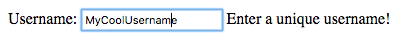
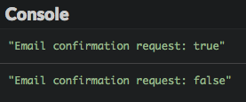
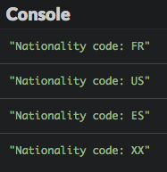
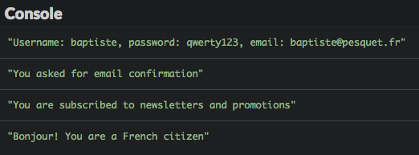
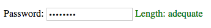
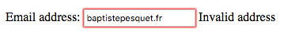
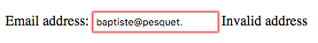
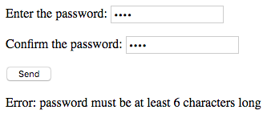
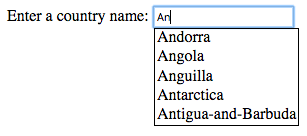

# Manipulasi form

JavaScript memungkinkan Kamu mengatur form yang didefinisikan di halaman web Kamu, untuk meningkatkan interaktivitas.

## TL;DR

* **form** memungkinkan pengguna input data melalui halaman web. Data yang di-input biasanya dikirim ke **web server**. Sebelum data dikirimkan, Kamu bisa menggunakan JavaScript untuk berinteraksi dengan data form dan memvalidasinya.

* Zona teks (`input type="text">` atau `<textarea>`) masing-masing memiliki properti `value` untuk mengakses nilai yang di-input.

* Ketika isian teks menjadi sasaran input, isian ini memiliki **fokus**. Event `focus` dan `blur` dipiscu ketika isian dapat atau hilang fokus. Method `focus()` dan `blur()` bisa meng-update sasaran fokus secara pemrograman.

* Checkboxe, radio button, dan daftar dropdown menghasilkan event `change` kapanpun pengguna memodifikasi pilihan mereka.

* Elemen DOM yang berkorespenden terhadap form memiliki properti `element` yang memungkinkan Kamu mengakses isian input-nya secara pemrograman.

* Mengirim form memicu event `submit` pada elemen DOM form. Kamu bisa mencegah pengiriman data form ke server dengan menggunakan method `preventDefault()` pada objek `Event` terkait.

* Modifikasi apapun pada isian teks memicu event `input`, yang bisa digunakan untuk memvalidasi data tersebut saat pengguna memasukannya.

* **Ekspresi regular** adalah pola di mana string bisa dibandingkan. Ekspresi regular ini biasanya digunakan untuk melakukan validasi data form. 

## JavaScript dan form

### Rekapitulasi form 

Form meningkatkan halaman web dengan cara memungkinkan pengguna untuk meng-input informasi melalui isian teks, check box, menu dropdown, dan lainnya. Di dalam halaman web, form didefinisikan dengan tag HTML `<form>`, dan di dalam tag ini, Kamu memiliki beberapa tag berbeda:  tag `<input>`, tag `<select>`, atau tag `<textarea>`.

> Kalau form benar-benar baru untuk Kamu, Mozilla Developer Network punya intro yang bagus bernama [Your first HTML form](https://developer.mozilla.org/en-US/docs/Learn/HTML/Forms/Your_first_HTML_form). Untuk rekapitulasi form secara umum, bisa cek berikut: [course chapter]( https://openclassrooms.com/courses/build-your-website-with-html5-and-css3/forms) di OpenClassrooms.

### Menangani form dengan JavaScript

Data yang dimasukkan di form oleh pengguna biasanya dikirim melalui jaringan ke **web server** yang memproses dan mengirim respons ke browser sebagai halaman web baru. Untuk bisa melakukan ini, web server menggunakan pemrograman backend seperti PHP atau Ruby.

Terima kasih ke JavaScript, kamu bisa mangatur form (dan data form) langsung di dalam browser *sebelum* mengirimkannya ke server eksternal. Kamu bisa menotifikasi data/anomali yang diinput pengguna, membuat saran tentang tipenya, dan lainnya. Siap bilang form membosankan?

## Isian form 

### Contoh form 

Mari kita mulai dengan form sederhana yang memungkinkan pengguna untuk daftar sebuah layanan.

```html
<form>
  <h1>Signup form</h1>
  <p>
    <label for="username">Username</label>:
    <input type="text" name="username" id="username" required>
    <span id="usernameHelp"></span>
  </p>
  <p>
    <label for="password">Password</label>:
    <input type="password" name="password" id="password" required>
    <span id="passwordHelp"></span>
  </p>
  <p>
    <label for="emailAddress">Email address</label>:
    <input type="email" name="emailAddress" id="emailAddress" required placeholder="user@domain">
    <span id="emailHelp"></span>
  </p>
  <p>
    <input type="checkbox" name="confirmation" id="confirmation">
    <label for="confirmation">Send me a confirmation email</label>
  </p>
  <p>
    <input type="radio" name="subscription" id="newsroom" value="newspromo">
    <label for="newsroom">Subscribe me to newsletters and promotions</label>
    <br>
    <input type="radio" name="subscription" id="news" value="news">
    <label for="news">Subscribe me only to the newsletter</label>
    <br>
    <input type="radio" name="subscription" id="no" value="no" checked>
    <label for="no">No subscriptions</label>
    <br>
  </p>
  <p>
    <label for="nationality">Nationality</label>:
    <select name="nationality" id="nationality">
      <option value="US" selected>American</option>
      <option value="FR">French</option>
      <option value="ES">Spanish</option>
      <option value="XX">Other</option>
    </select>
  </p>

  <input type="submit" value="Submit">
  <input type="reset" value="Cancel">
</form>
```


Contoh ini mengandung beberapa zona input: teks, checkboxe, tombol radio, menu dropdown, juga tombol kirim dan batal. Kita akan belajar bagaimana menangani setiap elemen ini dengan JavaScript.

> Kamu mungkin menyadari bahwa tag `<form>` tidak memiliki atribut `action` dan `method` seperti biasanya. Atribut ini memungkinkan Kamu untuk mendefinisikan permintaan sumber daya server ketika form dikirim oleh pengguna. Karena form kita hanya akan ditangani oleh JavaScript di browser, hal ini tidaklah perlu.

### Zona teks

#### Akses nilai input

**Isian teks** memungkinkan pengguna meng-input teks pada satu atau beberapa baris. Kamu memiliki dua opsi untuk mendefinisikan isian teks: satu baris isian teks yang didefinisikan di HTML sebagai `<input type="text">`, dan isian teks ganda yang didefinisikan dengan `<textarea>`.

Berikut ini contoh kode yang memungkinkan pengguna dapat meng-input username.

```html
<label for="username">Username</label>:
<input type="text" name="username" id="username" required>
<span id="usernameHelp"></span>
```

Di JavaScript, Kamu bisa mengakses nilai dari isian teks dengan menggunakan properti `value` yang berkoresponden dengan elemen DOM. Dengan mengatur nilai baru untuk properti ini, Kamu akan memodifikasi nilai yang ditampilkan di isian teks.

Berikut contoh menambah nilai "MyCoolUsername" di isian teks.

```js
// Mendefinisikan nilai input isian teks "username" 
const usernameElement = document.getElementById("username");
usernameElement.value = "MyCoolUsername";
```

#### Menangani fokus

Saat zona teks dipilih, zona ini menjadi area fokus form. Kamu mungkin menyadari kotak isia teks menjadi biru atau efek lain saat Kamu mengakses area input tertentu. Hal ini membantu Kamu mengetahui di mana Kamu berada di dalam form. Pengguna meng-klik di isian teks (atau menggunakan tab) akan menyalakan event `focus`. Selain itu, event `focus` memicu event `blur` di isian teks yang sebelumnya memiliki fokus.

Kamu bisa menggunakan event ini untuk menampilkan petunjuk pengguna yang berhubungan dengan isian teks saat ini, seperti contoh berikut:

```js
// Menampilkan petunjuk yang berhubungan dengan area teks yang dipilih
usernameElement.addEventListener("focus", e => {
  document.getElementById("usernameHelp").textContent = "Enter a unique username!";
});
// Menyembunyikan petunjuk ketika pengguna menggerakkan ke isian teks yang lain
usernameElement.addEventListener("blur", e => {
  document.getElementById("usernameHelp").textContent = "";
});
```

Dengan memilih isian teks `username`, Kamu akan melihat beberapa pesan berguna di HTML `<span>` yang didefinisikan secara khusus untuk tujuan ini dan pada awalnya kosong.



Dari kode JavaScript, Kamu bisa memodifikasi sasaran input dengan memanggil `focus()` (untuk memberikan fokus) dan method `blur()` (untuk menghilangkannya) pada elemen DOM.

```js
// Memberikan fokus pada isian teks "username" 
usernameElement.focus();
```
Isian teks ganda (tag `<textarea>`) bekerja mirip dengan tag `<input>`.

> Kamu akan belajar bagaimana cara memvalidasi teks yang di-input pengguna (untuk memastikan cocok dengan kriteria) nanti di bab ini.

### Elemen pemilihan

Kamu sering melihat elemen form yang mengizinkan pengguna untuk membuat pilihan dari beberapa kemungkinan yang ada. Event `change` akan menyala saat pengguna mengubah pilihan mereka.

#### Checkbox

Kamu bisa menambah checkbox ke form HTML Kamu dengan menggunakan tag `<input type="checkbox">`.

Berikut kode dari contoh form yang menawarkan pengguna pilihan untuk menerima email konfirmasi (atau tidak).

```html
<input type="checkbox" name="confirmation" id="confirmation">
<label for="confirmation">Send me a confirmation email</label>
```

Kapanpun kotak di cek atau di un-cek oleh pengguna, event `change` akan aktif. Objek `Event` yang berhubungan dengan event ini memiliki properti boolean yang memberikan keadaan baru dari isian teks (di cek atau di un-cek).

Kode di bawah ini mengangani event `change` pada checkbox untuk menampilkan pesan di console.

```js
// Menampilkan apakah konfirmasi email di ceklis atau tidak
document.getElementById("confirmation").addEventListener("change", e => {
  console.log(`Email confirmation request: ${e.target.checked}`);
});
```



#### Tombol radio

Tombol radio memungkinkan pengguna untuk membuat pilihan dari beberapa kemungkinan yang ada. Kamu bisa membuat tombol radio dengan tag `<input type="radio">`, yang memiliki `name` atribut yang sama dan atribut `value` yang berbeda.

Berikut kode yang diambil dari contoh form yang memungkinkan pengguna memilih tiga tombol radio, masing-masing merepresentasikan opsi berlangganan.

```html
<input type="radio" name="subscription" id="newsroom" value="newspromo">
<label for="newsroom">Subscribe me to newsletters and promotions</label>
<br>
<input type="radio" name="subscription" id="news" value="news">
<label for="news">Subscribe me only to the newsletter</label>
<br>
<input type="radio" name="subscription" id="no" value="no" checked>
<label for="no">No subscriptions</label>
<br>
```

Kode JavaScript berikut menambah pesan ke console ketika pilihan tombol radio berubah. 

```js
// Menampilkan tipe langganan melalui tombol radio
const subscriptionElements = Array.from(document.getElementsByName("subscription"));
subscriptionElements.forEach(element => {
  element.addEventListener("change", e => {
    console.log(`Selected subscription: ${e.target.value}`);
  });
});
```


Properti `target.value` event `change` cocok dengan atribut `value` tag `<input>` yang baru saja dipiih.

#### Daftar dropdown 

Daftar dropdown dibuat menggunakan tag `<select>` (untuk menu secara umum) di mana Kamu bisa menambah tag `<option>` untuk beberapa kemungkinan pilihan.

Berikut kode yang diambil dari atas yang memungkinkan pengguna memilih bangsanya:

```html
<label for="nationality">Nationality</label>:
<select name="nationality" id="nationality">
  <option value="US" selected>American</option>
  <option value="FR">French</option>
  <option value="ES">Spanish</option>
  <option value="XX">Other</option>
</select>
```

Kode berikut menggunakan event `change` yang dipicu daftar dropdown untuk menunjukkan pilihan baru yang dibuat pengguna.

```js
// Menunjukkan bangsa yang dipilih
document.getElementById("nationality").addEventListener("change", e => {
  console.log("Nationality code: " + e.target.value);
});
```



Seperti tombol radio, properti `target.value` dari event `change` cocok dengan atribut `value` pada tag `<option>` tag yang berkaitan degan pilihan yang baru -- bukan teks yang ditunjukkan di daftar the dropdown!

## Form sebagai elemen DOM 

### Mengakses isian form 

Tag `<form>` berhubungan dengan elemen DOM. Elemen ini memiliki properti `elements` yang menarik semua isian input form. Kamu bisa menggunakan properti ini untuk mengakses isian melalui atribut `name` atau dengan indeks-nya (sesuai urutan pada form).

Contoh berikut menunjukkan beberapa informasi pada isian input dari contoh form.

```js
// Menunjukkan beberapa info tentang elemen pertama form
const formElement = document.querySelector("form");
console.log(`Number of fields: ${formElement.elements.length}`); // 10
console.log(formElement.elements[0].name);       // "username"
console.log(formElement.elements.password.type); // "password"
```

### Mengirim form

Form akan dikirim saat pengguna meng-klik tombol submit, yang akan memiliki tag `<input type="submit">`. Tag `<input type="reset">` menunjukkan tombol yang me-reset data form.

Berikut ini dua tombol dari contoh form. 

```html
<input type="submit" value="Submit">
<input type="reset" value="Cancel">
```

Ketika pengguna mengirimkan form, perilaku awal browser adalah untuk mengkontak server web dan meminta sumber daya yang diidentifikasi oleh atribut `action` dari tag `<form>`, sambil mengirim data form. Sebelum ini, event `submit` dipicu oleh elemen DOM yang berkorespenden dengan form. Dengan menambah handler untuk tipe event ini, Kamu bisa mengakses data form sebelum form dikirimkan. Kamu bisa membatalkan permintaan ke server dengan memanggil method `preventDefault()` pada objek `Event` terkait event tersebut.

Kode berikut menunjukkan di console semua input di form, lalu membatalkan permintaan ke server. 

```js
// Menunjukkan semua user input dan membatalkan pengiriman data form
formElement.addEventListener("submit", e => {
  const username = e.target.elements.username.value;
  const password = e.target.elements.password.value;
  const email = e.target.elements.emailAddress.value;
  console.log(`Username: ${username}, password: ${password}, email: ${email}`);

  if (e.target.elements.confirmation.checked) {
    console.log("You asked for email confirmation");
  } else {
    console.log("You didn't asked for email confirmation");
  }
  switch (e.target.elements.subscription.value) {
    case "newspromo":
      console.log("You are subscribed to newsletters and promotions");
      break;
    case "news":
      console.log("You are subscribed to newsletters only");
      break;
    case "no":
      console.log("You are not subscribed to anything");
      break;
    default:
      console.error("Unknown subscription code");
  }
  switch (e.target.elements.nationality.value) {
    case "US":
      console.log("Hello! You are a US citizen");
      break;
    case "FR":
      console.log("Bonjour! You are a French citizen");
      break;
    case "ES":
      console.log("Hola! You are a Spanish citizen");
      break;
    default:
      console.log("Your nationality is unknown");
  }
  e.preventDefault(); // Cancel form data sending
});
```



## Validasi form 

Mengecek data yang diinput oleh pengguna sebelum dikirim ke server merupakan penggunaan JavaScript yang cukup besar dengan form web. Menggunakan validasi form, Kamu bisa meningkatkan kesan pengguna dengan cara mengingatkan pengguna tentang permasalahan saat meng-input form. Hal ini merupakan cara yang efisien untuk mencegah permintaan server yang tidak berguna dengan data yang salah. 

Validasi bisa dilakukan dengan beberapa cara:

* saat input dimasukkan;
* setelah input dimasukkan;
* saat pengguna mengirim form.

Teknik terakhir ini hanya menambahkan validasi di events handler `submit` untuk form: Kamu sudah tahu cara melakukan hal ini. Kita akan melihat dua teknik lainnya satu per satu, menggunakan contoh form yang sama dengan sebelumnya.

### Validasi instan 

Validasi saat pengguna meng-input informasi berdasarkan event `input`, yang dipicu pada zona input setiap kali nilai berubah. 

Contoh kode berikut menambah input event handler pada isian password. Handler ini mengecek panjang (jumlah karakter) password yang diketik dan menunjukkan pesan kepada pengguna dengan konten dan warna yang spesifik.

```js
// Validasi panjang password 
document.getElementById("password").addEventListener("input", e => {
  const password = e.target.value; // Nilai isian password 
  let passwordLength = "too short";
  let messageColor = "red"; // Password pendek => merah
  if (password.length >= 8) {
    passwordLength = "adequate";
    messageColor = "green"; // Password panjang => hijau
  } else if (password.length >= 4) {
    passwordLength = "moderate";
    messageColor = "orange"; // Password sedang => oranye
  }
  const passwordHelpElement = document.getElementById("passwordHelp");
  passwordHelpElement.textContent = `Length: ${passwordLength}`; // teks pembantu
  passwordHelpElement.style.color = messageColor; // teks warna pembantu
});
```



### Validasi setelah input 

Zona input teks dikatakan selesai saat fokus hilang pada zona tersebut, yang mengaktifkan event `blur` yang Kamu bisa gunakan untuk memicu validasi. 

Mari kita bayangkan Kamu ingin memvalidasi keberadaan karakter `@` pada alaman email yang diinput oleh pengguna. Berikut kode JavaScript yang menunjukkan validasi ini.

```js
// Mengecek alamat email saat dimasukkan
document.getElementById("emailAddress").addEventListener("blur", e => {
  let emailAddressValidity = "";
  if (e.target.value.indexOf("@") === -1) {
    // alamat email tidak mengandung @
    emailAddressValidity = "Invalid address";
  }
  document.getElementById("emailHelp").textContent = emailAddressValidity;
});
```



### Ekspresi regular 

Validasi sebelumnya cukup primitif: banyak string yang mengandung karakter `@` bukan merupakan alamat email yang valid. Untuk melakukan pengecekan lebih lanjut, Kamu bisa menggunakan tool powerful: **ekspresi regular**.

Ekspresi regular mendefinisikan **pola** di mana string dibandingkan, dicari sampai terjadi kecocokan. Banyak bahasa pemrograman yang mengandungnya. Salah satu skill tambahan yang sangat berguna bagi programer, namun mungkin butuh sedikit waktu sampai nyaman menggunakannya. Berikut adalah sekadar pengenalan ke penggunaan dari ekspresi regular.

Mari kita mulai dengan mencoba membuat regular ekspresi untuk mengecek presensi dari karakter `@` di dalam string. Berikut kode JavaScript-nya.

```js
const regex = /@/; // String harus mengandung @
console.log(regex.test(""));  // salah
console.log(regex.test("@")); // benar
console.log(regex.test("sophie&mail.fr")); // salah
console.log(regex.test("sophie@mail.fr")); // benar
```

Ekspresi regular JavaScript didefinisikan dengan menempatkan pola diantara sepasang karakter `/`. Ini adalah objek di mana method `test()` mengecek kecocokan antara pola dan string yang ditempatkan sebagai parameter. Jika kecocokan terdeteksi, method ini mengembalikan `true`, atau `false`.

Tabel berikut menunjukkan beberapa kemungkinan yang ditawarkan ekspresi regular. 

| Pola | Cocok jika | Cocok  | Tidak cocok |
|---|---|---|---|
| `abc` | String mengandung `"abc"` | `"abc"`, `"abcdef"`, `"123abc456"` | `"abdc"`, `"1bca"`, `"adbc"`, `"ABC"` |
| `[abc]` | String mengandung antara `"a"`, `"b"` atau `"c"` | `"abc"`, `"daef"`, `"bbb"`, `"12c34"` | `"def"`, `"xyz"`, `"123456"`, `"BBB"` |
| `[a-z]` | String mengandung satu huruf kecil | `"abc"`, `"12f43"`, `"_r_"` | `"123"`, `"ABC"`, `"_-_"` |
| `[0-9]` or `\d` | String mengandung satu digit | `"123"`, `"ab4c"`, `"a56"` | `"abc"` |
| `a.c` | String mengandung `"a"`, diikuti oleh karakter apapun, diikuti oleh `"c"`  | `"abc"`, `"acc"`, `"12a.c34"` | `"ac"`, `"abbc"`, `"ABC"` |
| `a\.c` | String mengandung `"a.c"` | `"a.c"`, `"a.cdef"`, `"12a.c34"` | `"ac"`, `"abc"` |
| `a.+c` | String mengandung `"a"`, diikuti oleh paling sedikit satu karakter, diikuti oleh `"c"` | `"abc"`, `"abbc"`, `"12a$ùc34"` | `"ac"`, `"bbc"` |
| `a.*c` | String mengandung `"a"`, diikuti oleh nol atau lebih karakter, diikuti oleh `"c"`  | `"abc"`, `"abbc"`, `"ac"` | `"ABC"`, `"bbc"` |

Observasi contoh ini mengarahkan kita ke beberapa aturan berikut: 

* Kurung kotak `[]` mendefinisikan interval karakter. String dengan paling sedikit satu karakter pada interval ini akan cocok dengan pola.

* Pola `[a-z]` dan `[A-Z]` digunakan untuk mencari keberadaan dari semua huruf, baik huruf kecil maupun kapital.

* Pola `[0-9]` dan `\d` mencocokkan digit di dalam string.

* Karakter `.` menggantikan satu karakter apapun. 

* Karakter `\` (*backslash*) mengindikasikan bahwa karakter berikutnya harus dicari seadanya. Sebagai contoh `\.` digunakan untuk mencocokkan karakter `.` itu sendiri. 

* Karakter `+` mencocokkan satu atau beberapa karakter dari ekspresi yang mendahuluinya.

* Karakter `*` mencocokkan nol, satu, atau beberapa karakter dari ekspresi yang mendahuluinya.

> Situs <https://regex101.com> mudah dipahami untuk mengetes dan debug ekspresi regular.

Mari kita kembali ke contoh kita sebelumnya dan cek isian alamat email. Berikut kemungkinan ekspresi regular-nya (diantara yang lainnya) untuk mengetes terhadap: `/.+@.+\..+/`.

> Sebelum membaca lebih lanjut, apakah Kamu bisa men-decode pola ini untuk memahami kondisi seperti apa sebuah string cocok dengan ekspresi tersebut? 

OK, berikut jawabannya. Pola ini mencocokkan string yang: 

* Dimulai dengan satu atau beberapa karakter (`.+`).
* Selanjutnya, mengandung karakter `@` (`@`).
* Selanjutnya, mengandung satu atau beberapa karakter (`.+`).
* Selanjutnya, mengandung karakter`.` (`\.`).
* Diakhiri dengan satu atau beberapa karaker (`.+`).

Dengan kata lain, string apapun dari bentuk `xxx@yyy.zzz` akan cocok dengan pola ini. Ini bukanlah satu-satunya cara untuk memvalidasi alamat email, tapi hanyalah satu permulaan. 

Cek bagaimana menggunakan solusi ini dalam praktik. 

```js
// Mengecek validitas email ketika isian hilang fokus
document.getElementById("emailAddress").addEventListener("blur", e => {
  // Mencocokkan string dari bentuk xxx@yyy.zzz
  const emailRegex = /.+@.+\..+/;
  let validityMessage = "";
  if (!emailRegex.test(e.target.value)) {
    validityMessage = "Invalid address";
  }
  document.getElementById("emailHelp").textContent = validityMessage;
});
```



## Waktu koding!

### Pengecek password 

Mulai dengan kode HTML berikut.

```html
<form>
  <p>
    <label for="password1">Enter the password</label>:
    <input type="password" name="password1" id="password1" required>
  </p>
  <p>
    <label for="password2">Confirm the password</label>:
    <input type="password" name="password2" id="password2" required>
  </p>

  <input type="submit" value="Send">
</form>

<p id="passwordHelp"></p>
```

Tulis kode JavaScript yang memvalidasi password ketika pengguna mengirim form. Aturan validasi sebagai berikut: 

* Dua password yang diisi pengguna haruslah sama persis.
* Panjang password 6 karakter.
* Password harus mengandung paling sedikit satu digit.

Hasil validasi harus terlihat di halaman dengan pesan yang tepat di setiap kasus. 



### Daftar karakter

Pertunjukkan TV Game of Thrones adalah tentang perebuta kekuasaan antar keluarga bangsawan. Di latihan ini, Kamu harus bisa menunjukkan karakter yang merupakan bagian dari keluarga tersebut yang dipilih oleh pengguna.

Berikut kode HTML-nya.

```html
<h1>A few of the Game of Thrones characters</h1>
<form>
  <label for="house">House</label>:
  <select name="house" id="house">
      <option value="" selected>Select a house</option>
  </select>
</form>

<p>
  <ul id="characters"></ul>
</p>
```

Kode permulaan JavaScript sebagai berikut.

```js
// Daftar karakter. Setiap rumah memiliki nama dan kode.
const houses = [
  {
    code: "ST",
    name: "Stark"
  },
  {
    code: "LA",
    name: "Lannister"
  },
  {
    code: "BA",
    name: "Baratheon"
  },
  {
    code: "TA",
    name: "Targaryen"
  }
];

// Mengembalikan array karakter milik satu rumah
const getCharacters = houseCode => {
  switch (houseCode) {
    case "ST":
      return ["Eddard", "Catelyn", "Robb", "Sansa", "Arya", "Jon Snow"];
    case "LA":
      return ["Tywin", "Cersei", "Jaime", "Tyrion"];
    case "BA":
      return ["Robert", "Stannis", "Renly"];
    case "TA":
      return ["Aerys", "Daenerys", "Viserys"];
    default:
      return []; // Array kosong
  }
};
```

Lengkapi kode ini sehingga:

* Daftar dropdown rumah terisi saat halaman dibuka.
* Daftar karakter ditampilkan ketika pengguna memilih rumah baru pada daftar.


### Autocomplete

Di latihan ini, Kamu akan membantu pengguna dalam memilih satu negara. Saat dia memasukkan nama negara pada kotak input, halaman menampilkan daftar negara tersebut. Mengklik negara yang dipilih menggantikan nilai pada kotak input.

> Agar membuat hal ini sederhana, hanya negara yang dimulai dengan huruf `"A"` yang masuk dalam program ini.

Berikut kode HTML yang membuat kotak input.

```html
<label for="country">Enter a country name</label>:
<input type="text" id="country">
<div id="suggestions"></div>
```

Kode CSS berikut membuat tampilan halaman lebih baik.

```css
/* Menambah spasi antar negara */
.suggestion {
    padding-left: 2px;
    padding-right: 2px;
}

/* Mengubah warna saat di-hover mouse */
.suggestion:hover {
    background-color: #adf;
    cursor: pointer;
}

/* Posisi daftar di bawah kotak input */
#suggestions {
    position: absolute;
    border: 1px solid black;
    left: 155px;
}
```

Terakhir, kode JavaScript untuk daftar negara.

```js
// Country list
const countryList = [
  "Afghanistan",
  "Albania",
  "Algeria",
  "Andorra",
  "Angola",
  "Anguilla",
  "Antarctica",
  "Antigua-and-Barbuda",
  "Argentina",
  "Armenia",
  "Aruba",
  "Australia",
  "Autria",
  "Azerbaïjan"
];
```

Lengkapi kode ini untuk mengimplementasikan autocompletion negara.


