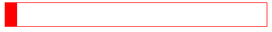
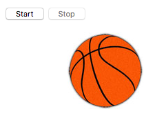

# Animasi elemen

Di bab ini Kamu akan memulai dengan JavaScript untuk animasi! Kita akan lihat bagaimana cara membuat animasi yang berjalan secara berulang atau harus berhenti saat poin tertentu.

## TL;DR

* Fungsi `setInterval()` memulai aksi berulang dan dipanggil pada rentang tertentu. Fungsi `clearInterval()` memberhentikan aksi berulang yang diluncurkan oleh `setInterval()`.

* Fungsi `setTimeout()` mengeksekusi aksi sekali setelah jeda tertentu.

* Fungsi `requestAnimationFrame()` meminta browser untuk mengeksekusi satu fungsi yang mengupdate animasi secepat mungkin. Hal ini cocok diterapkan untuk animasi real-time. Fungsi `cancelAnimationFrame()` memberhentikan animasi yang sedang berlangsung yang diluncurkan oleh `requestAnimationFrame()`.

* Kamu juga bisa membuat animasi web dengan **CSS**.

## Mengulangi satu aksi pada regular interval 

Mari kita mulai dengan animasi dengan belajar bagaimana cara memodifikasi konten elemen secara berulang. Berikut kode HTML-nya.

```html
<h1 id="title">This page will self-destruct in <span id="counter">10</span> second(s)...</h1>
```

Berikut kode JavaScript-nya.

```js
// Hitung mundur 
const decreaseCounter = () => {
  // Mengkonversi teks counter ke angka
  const counter = Number(counterElement.textContent);
  // Mengurangi penghitung 1 angka
  counterElement.textContent = counter - 1;
};

const counterElement = document.getElementById("counter");

// Call the decreaseCounter function every second (1000 milliseconds)
setInterval(decreaseCounter, 1000);
```

[Klik di sini](https://codepen.io/bpesquet/pen/RVWLeY?editors=1010) untuk bisa melihatnya secara langsung. Program ini bekerja dengan semestinya.. Counter-nya tidak pernah berhenti. Kita akan memperbaikinya nanti.

### Memulai aksi berulang

Bagaimana contoh sebelumnya bisa bekerja? Kode JavaScript mendefinisikan fungsi bernama `decreaseCounter()` yang mengakses dan mengurangi nilai satu per satu nilai elemen HTML bernama `counter`.

> Memanggil `Number()` di dalam kode fungi adalah wajib: fungsi ini mengkonversi string counter menjadi angka, yang berfungsi untuk mengurangi nilai.

Pemanggilan `setInterval()` memicu perulangan aksi. Fungsi ini memungkinkan Kamu untuk memanggil fungsi pada regular interval. Parameternya adalah fungsi untuk memanggil dan waktu pemanggilan dalam millisecond diantara setiap panggilan. Nilai yang dikembalikan adalah ID untuk perulangan aksi, yang bisa digunakan untuk dimodifikasi nantinya.

```js
// Mengatur aksi berulang
const intervalId = setInterval(callbackFunction, timeBetweenEachCall);
```

### Menghentikan aksi berulang

Mari kita coba untuk menghentikan counter saat perhitungan mundur selesai. Kita  juga akan memodifikasi teks di halaman. Berikut ini kode JavaScript di contoh kita, di update untuk memproduksi hasil yang diinginkan:

```js
// Hitung mundur counter sampai 0
const decreaseCounter = () => {
  // Mengubah teks counter ke angka
  const counter = Number(counterElement.textContent);
  if (counter > 1) {
    // Mengurangi counter dengan 1
    counterElement.textContent = counter - 1;
  }
  else {
    // Membatalkan eksekusi berulang 
    clearInterval(intervalId);
    // Modifikasi judul halaman
    const title = document.getElementById("title");
    title.textContent = "BOOM!!";
  }
};

const counterElement = document.getElementById("counter");

// Memanggil fungsi decreaseCounter setiap detik (1000 millisecond)
const intervalId = setInterval(decreaseCounter, 1000);
```

[Klik di sini](https://codepen.io/bpesquet/pen/zwvEVz?editors=1010) untuk melihat lebih lanjut.

Pada fungsi `decreaseCounter()`, kita hanya mengurangi counter jika nilai saat ini lebih tinggi dari 1. Jika tidak, kita memanggil fungsi `clearInterval()`, lalu memodifikasi judul halaman.

Fungsi `clearInterval()` memungkinkan Kamu memotong eksekusi kode berulang. Fungsi ini mengambil ID aksi sebagai parameter yang di set oleh panggilan ke `setInterval()`.

```js
// Membatalkan aksi berulang yang di set dengan setInterval()
clearInterval(intervalId);
```

## Memicu aksi setelah delay

Bayangkan ketika Kamu ingin memodifikasi teks halaman setelah "ledakan" di contoh sebelumnya. Kamu akan memodifikasi contoh tersebut sebagai berikut:

```js
// Menghitung mundur sampai dengan 0 
const decreaseCounter = () => {
  // Mengkonversi teks counter ke angka 
  const counter = Number(counterElement.textContent);
  if (counter > 1) {
    // Mengurangi counter dengan 1 
    counterElement.textContent = counter - 1;
  }
  else {
    // Membatalkan eksekusi yang berulang
    clearInterval(intervalId);
    // Modifikasi judul halaman 
    const titleElement = document.getElementById("title");
    titleElement.textContent = "BOOM!!";
    // Modifikasi judul setelah 2 detik
    setTimeout(() => {
      titleElement.textContent = "Everything's broken now :(";
    }, 2000);
  }
};

const counterElement = document.getElementById("counter");

// Memanggil fungsi decreaseCounter setiap detik (1000 milliseconds)
const intervalId = setInterval(decreaseCounter, 1000);
```

[Klik di sini](https://codepen.io/bpesquet/pen/ybYPbb?editors=1010) untuk lihat contohnya secara langsung.

Ketika perhitungan mundur selesai, kita panggil fungsi `setTimeout()` untuk mengatur judul halaman baru setelah delay 2 detik (2000 millisecond).

Fungsi `setTimeout()` memungkinkan Kamu mengeksekusi fungsi setelah delay tertentu, diekspresikan dalam millisecond.

```js
// Eksekusi aksi sekali, setelah delay
setTimeout(callbackFunction, timeBeforeCall);
```

## Animasi elemen halaman 

Solusi sebelumnya sangatlah memudahkan dalam membuat halaman kita menjadi lebih sedikit lebih dinamis, tetapi tidak cukup untuk menambah animasi real-time. Mari kita lihat solusi yang lebih baik dari sisi performansinya.

Ambil contoh, pergerakan tiep elemen `<div>` dari kiri ke kanan pada halaman. Kita mulai dengan kode HTML dan CSS berikut yang menampilkan blok merah di halaman.

```html
<div id="frame">
  <div id="block"></div>
</div>
```

```css
#frame {
  border: 1px solid red;
}

#block {
  width: 20px;
  height: 40px;
  background: red;
  position: relative;
}
```



Dan berikut ini kode JavaScript yang memungkinkan Kamu untuk memindahkan blok merah tersebut.

```js
// Memindahkan blok ke kiri
const moveBlock = () => {
  // Mengkonversi posisi kiri blok (nilai dari bentuk "XXpx") ke angka
  const xBlock = parseFloat(getComputedStyle(blockElement).left);
  // Memindahkan blok ke kanan
  blockElement.style.left = (xBlock + movement) + "px";
  // Membuat browser memanggil moveBlock sesegera mungkin 
  requestAnimationFrame(moveBlock);
};

const blockElement = document.getElementById("block");

// Nilai pergerakan dalam pixel
const movement = 7;

// Memulai animasi
requestAnimationFrame(moveBlock);
```

[Klik di sini](https://codepen.io/bpesquet/pen/RVWxbW) untuk lihat secara langsung.

Saat halaman terbuka, blok merah bergerak (terus menerus) dari kiri ke kanan.

### Memulai animasi

Contoh kode mendefinisikan sebuah fungsi `moveBlock()` yang memindahkan blok secara horizontal ke kanan. Fungsi ini mengambil posisi blok sisi kiri saat ini lalu menambahkan nilai yang ada di dalam variabel `movement`. Selanjutnya, kode memanggil method `requestAnimationFrame()` untuk menjaga agar animasi tetap bergerak. 

Nilai posisi ditulis dalam pixel. Nilai ini adalah string yang Kamu lihat yang menyerupai format "XXpx", yang memerlukan penggunaan fungsi `parseFloat()` untuk mengkonversi nilai numerik sebelum melakukan perhitungan.

> Jangan gunakan konversi `Number()` untuk mengkonversi satu string dengan `"px"` ke nilai numerik. Tidak bisa dan Kamu akan mendapat nilai `NaN` (*Not a Number*) sebagai hasilnya!

Fungsi `requestAnimationFrame()` memungkinkan Kamu untuk meminta browser untuk mengeksekusi fungsi sesegera mungkin, fungsi yang mengupdate animasi. Merupakan tugas browser untuk memastikan animasi berjalan selancar mungkin. Nilai yang dikembalikan dari `requestAnimationFrame()` adalah sebuah ID untuk animsi, yang bisa digunakan untuk dimodifikasi lebih lanjut.

Berikut ini adalah cara `requestAnimationFrame()` digunakan dan dikombinasikan dengan fungsi animasi.

```js
const animate = () => {
    // Kode animasi
    // ...
    // Di akhir animasi, meminta yang lainnya
    animationId = requestAnimationFrame(animate);
};

// Animasi dimulai
let animationId = requestAnimationFrame(animate);
```

### Mengehentikan animasi 

Sekarang mari kita lihat bagaimana menghentikan blok sebelum mencapai batas frame yang ada di dalamnya. Kita haru menverifikasi bahwa posisi perbatasan kiri lebih kecil dari lebar frame, perhatikan ketebalan blok tersebut.

Berikut kode JavaScript terbarunya.

```js
// Memindahkan blok ke kanan, sampai dengan akhir frame
const moveBlock = () => {
  // Konversi posisi kiri dari blok (nilai dari bentuk "XXpx") ke angka 
  const xBlock = parseFloat(getComputedStyle(blockElement).left);
  // Konversi lebar frame (nilai dari bentuk "XXpx") ke angka 
  const xMax = parseFloat(getComputedStyle(frame).width);
  // Jika blok belum sampai dengan akhir frame
  if (xBlock + blockWidth <= xMax) {
    // Pergerakan blok
    blockElement.style.left = (xBlock + movement) + "px";
    animationId = requestAnimationFrame(moveBlock);
  }
  else {
    // Membatalkan animasi 
    cancelAnimationFrame(animationId);
  }
};

const blockElement = document.getElementById("block");
// Konversi lebar blok (nilai dari bentuk "XXpx") ke angka 
const blockWidth = parseFloat(getComputedStyle(block).width);

// Nilai pergerakan dalam pixel
const movement = 7;

// Memulai animasi
let animationId = requestAnimationFrame(moveBlock);
```

[Klik di sini](https://codepen.io/bpesquet/pen/rmOpZE) untuk lihat secara langsung.

Fungsi baru `moveBlock()` mengecek blok telah sampai di akhir frame sebelum bergerak. Jika ini kasusnya, animasi berhenti melalui panggilan ke `cancelAnimationFrame()`.

Fungsi `cancelAnimationFrame()` menghentikan animasi dan mengambil animasi ID yang diset oleh pemanggilan sebelumnya ke `requestAnimationFrame()`.

```js
// Hentikan animasi 
cancelAnimationFrame(animationID);
```

### Alternatif: CSS animasi

Kamu baru saja belajar tentang perbedaan kemungkinan yang JavaScript tawarkan untuk menganimasikan halaman web. Ada juga alternatif lainnya: CSS.

> Paragraf ini hanyalah kulit dari animasi CSS.

Mari kita cek bagaimana mendapatkan efek yang sama dengan contoh sebelumnya dengan menggunakan CSS dibandingkan JavaScript. Hapus semua kode JavaScript code dari contoh Kamu dan modifikasi kode CSS sebagai berikut.

```css
#frame {
  border: 1px solid red;
}

#block {
  width: 20px;
  height: 40px;
  background: red;
  position: relative;
  margin-left: -20px; /* Margin negatif untuk menyederhanakan kalkulasi posisi */
  animation-name: moveBlock; /* Nama animasi */
  animation-duration: 6s; /* Panjang animasi */
  animation-fill-mode: forwards; /* Membiarkan blok di posisi akhir */
}

@keyframes moveBlock {
  from {
    /* Posisi awal: ke kiri frame (mempertimbangkan margin negatif) */
    left: 20px;
  }
  to {
    /* Posisi akhir: di sebelah kanan frame (mempertimbangkan margin negatif) */
    left: 100%;
  }
}
```

[Klik di sini](https://codepen.io/bpesquet/pen/wdKyQb?editors=1100) untuk lihat secara langsung.

Kode ini mendefinisikan animasi CSS dinamakan `moveBlock()`, yang memindahkan blok dari kiri ke kanan frame. Hasilnya hampir sama dengan versi JavaScript.

## Memilih teknik animasi yang tepat

Sekarang, waktu memutuskan. Bagaimana Kamu memilih antara `setInterval()`, `requestAnimationFrame()`, atau CSS untuk menganimasikan halaman Kamu? Jawabannya tergantung seberapa kompleks animasi Kamu. Teorinya, animasi CSS lebih efisien secara performansi, tetapi Kamu tidak bisa melakukan semuanya dengan ini.

Berikut bagaimana Kamu melakukan pendekatan untuk pengambilan keputusan:

* Gunakan `setInterval()` jika animasi tidak real-time dan bergerak secara regular.
* Pilih CSS jika animasi terjadi secara real-time dan bisa dikelola dengan cara ini.
* Gunakan `requestAnimationFrame()` untuk kasus lainnya.

## Waktu koding!

### Chronometer

Tulis halaman web interaktif dengan tombol untuk memulai dan memberhentikan chronometer dalam menghitung detik yang berlalu.

### Bola pantul

Tujuan dari latihan ini adalah membuat bola basket memantul di layar. Kamu bisa download gambar [di sini](https://raw.githubusercontent.com/bpesquet/thejsway/master/resources/basketball.jpg).

Mulai dengan konten HTML dan CSS berikut.

```html
<p>
  <button id="start">Start</button>
  <button id="stop" disabled>Stop</button>
</p>

<div id="frame">
  <!-- Update the "src" attribute if you downloaded the image locally -->
  
</div>
```

```css
#ball {
    position: relative;
    left: 0px;
}
```

Tulis kode JavaScript yang bisa membuat bola tersebut memantul secara horizotal.



Dengan solusi Kamu, buat satu variabel dengan nilai 1 atau -1 yang mengarahkan ke mana bola harus bergerak.
