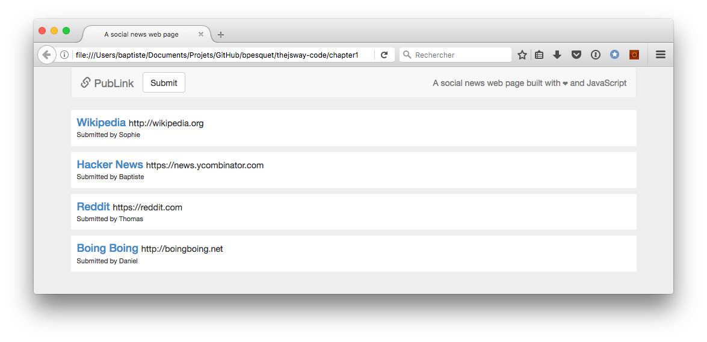

# Proyek: halaman web berita sosial

Kamu sudah cukup tahu JavaScript sekarang dan DOM untuk lanjut dan membuat halaman web interaktif!

## Tujuan

Proyek ini dibuat berdasarkan program berita sosial yang sudah Kamu buat sebelumnya. Kali ini, tujuannya adalah untuk membuat halaman web berita sosial.

> Ide umum dan layout halaman untuk proyek ini terinspirasi dari contoh aplikasi [Discover Meteor book](https://www.discovermeteor.com/).

## Kebutuhan fungsional

* Satu link didefinisikan oleh judul, URL, dan penulisnya (pengirim).
* Jika link baru tidak dimulai dengan `"http://"` atau `"https://"`, `"http://"` ditambahkan otomatis di awalnya.
* Halaman web menampilkan daftar setidaknya 3 link eksisting.
* Satu tombol digunakan pengguna untuk mengirimkan link baru. Ketika diklik, muncul formulir sebelum daftar link untuk memasukkan properti link baru (penulis, judul, dan URL).
* Di formulir ini, semua isian properti link adalah wajib.
* Ketika link baru divalidasi oleh pengguna, link tersebut ditampilkan di atas daftar link, menggantikan formulir. Sebuah pesan mengindikasikan sukses operasi, lalu menghilang setelah dua detik.

## Kebutuhan teknikal

* Kamu harus menggunakan kembali kode yang berguna dari proyek sebelumya.
* Semua kode Kamu harus teridentasi dengan benar.
* Penamaan harus dipilih dengan bijak dan mematuhi aturan camelCase.
* Duplikasi kode harus dihindari.

## Kode permulaan

Karena ini merupakan proyek JavaScript, berikut ini kode HTML/CSS dari halaman web. Kode ini juga online di [CodePen](https://codepen.io/bpesquet/pen/pPyxLG/).

> Halaman web ini menggunakan kerangka [Bootstrap](http://getbootstrap.com/) untuk meningkatkan presentasi dan membuat halaman responsif. Walaupun begitu, pengetahuan Bootstrap tidaklah wajib untuk mendapatkan hasil yang diinginkan. Kamu bisa langsung koding tanpa harus tahu Bootstrap.

```html
<!doctype html>
<html>

<head>
  <meta charset="utf-8">
  <!-- Latest compiled and minified CSS -->
  <link rel="stylesheet" href="https://maxcdn.bootstrapcdn.com/bootstrap/3.3.7/css/bootstrap.min.css">
  <link href="../css/publink.css" rel="stylesheet" type="text/css">
  <title>A social news web page</title>
</head>

<body>
  <div class="container">

    <!-- Bootstrap navigation bar -->
    <nav class="navbar navbar-default">
      <div class="container-fluid">
        <div class="navbar-header">
          <button type="button" class="navbar-toggle collapsed" data-toggle="collapse" data-target="#bs-example-navbar-collapse-1" aria-expanded="false">
            <span class="sr-only">Toggle navigation</span>
            <span class="icon-bar"></span>
            <span class="icon-bar"></span>
            <span class="icon-bar"></span>
        </button>
          <a class="navbar-brand" href="#"><span class="glyphicon glyphicon-link" aria-hidden="true"></span> PubLink</a>
        </div>
        <div class="collapse navbar-collapse" id="bs-example-navbar-collapse-1">
          <button type="button" id="submitButton" class="btn btn-default navbar-btn">Submit</button>
          <p class="navbar-text navbar-right">A social news web page built with ❤ and JavaScript</p>
        </div>
      </div>
    </nav>

    <div id="content">
      <!-- Konten dinamis di sini -->
    </div>

  </div>

  <!-- Kode JavaScript ada di file ini -->
  <script src="../js/publink.js"></script>

  <!-- jQuery (necessary for Bootstrap's JavaScript plugins) -->
  <script src="https://ajax.googleapis.com/ajax/libs/jquery/1.12.4/jquery.min.js"></script>
  <!-- Include all compiled plugins (below), or include individual files as needed -->
  <script src="https://maxcdn.bootstrapcdn.com/bootstrap/3.3.7/js/bootstrap.min.js"></script>
</body>

</html>
```

```css
body {
  background-color: #eee;
}

/* Elemen utama link (<div> tag) */
.link {
  background: white;
  padding: 10px;
  margin-bottom: 10px;
}

/* Link judul (<a> tag) */
.linkTitle {
  color: #428bca;
  text-decoration: none;
  margin-right: 5px;
}
.linkTitle:hover {
  text-decoration: none;
}

/* Link URL (<span> tag) */
.linkUrl {
  font-weight: normal;
  font-size: 80%;
}

/* Link headline mengandung judul & URL (<h4> tag) */
.linkHeadline {
  margin: 0;
}

/* Link penulis (<span> tag) */
.linkAuthor {
  font-weight: normal;
  font-size: 80%;
}

.linkForm {
  margin-bottom: 20px;
}
```

## Hasil yang diharapkan

Berikut ini beberapa tampilan dari hasil yang diharapkan.



