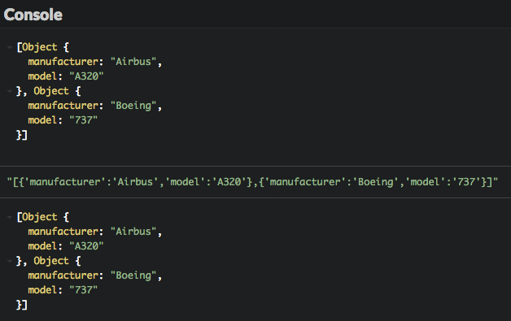
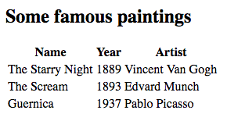

# Query web server

Di bab ini akan mengajarkan Kamu bagaimana mendapatkan data dari web server melalui permintaan HTTP.

## TL;DR

* Permintaan HTTP yang dikirim ke web server harus **asinkron** untuk mencegah pengeblokan aplikasi client saat menunggu respons dari server.

* Method `fetch()` JavaScript menggantikan `XMLHttpRequest` sebagai cara mudah membuat permintaan asinkron. Method `then()` dan `catch()` masing-masing menangani sukses dan kegagalan permintaan.

```js
// Mengirim permintaan HTTP asinkron ke sasaran url
fetch(url)
  .then(() => {
    // Kode dipanggil di masa mendatang ketika permintaan berakhir dengan sukses
  })
  .catch(() => {
    // Kode dipanggil di masa mendatang ketika eror terjadi saat permintaan
  });
```

* Method `fetch()` mendemonstrasikan penggunaan **promise** untuk menulis kode asinkron di JavaScript. Promise adalah pembungkus untuk operasi yang hasilnya akan tersedia di masa mendatang. Hasilnya antara *pending* (status awal),  *fulfilled* (operasi selesai dengan sukses) atau *rejected* (operasi gagal).

* JavaScript berurusan dengan konten JSON dengan `JSON.parse()` (untuk mengubah teks JSON ke objek) dan method `JSON.stringify()` (untuk melakukan hal sebaliknya).

* Hasil pemanggilan `fetch()` adalah objek `Response` HTTP . Method `text()` dan `json()` digunakan untuk membaca konten sebagai teks polos atau data JSON. Kedua method ini mengembalikan promise yang dapat diselesaikan dalam bentuk string atau JSON.

## Membuat permintaan HTTP asinkron di JavaScript

Di bab sebelumnya, kita mendiskusikan permintaan sinkron vs asinkron. Karena permintaan sinkron mengeblok proses pemanggilan sampai dengan hasilnya diterima, hanya permintaan HTTP asinkron yang seharusnya digunakan ketika membuat aplikasi web. Walaupun begitu, kode asinkron bisa agak rumit ditulis dan dipahami, karena pernyataan tidak akan dieksekusi secara linear dan berurutan seperti operasi sinkron.

### Method `fetch()` 

Cara terbaik untuk mengirim permintaan HTTP asinkron di JavaScript adalah dengan menggunakan method `fetch()`. Berikut penggunaannya secara umum.

```js
// Mengirim permintaan HTTP asinkron ke url sasaran
fetch(url)
  .then(() => {
    // Kode dipanggil di masa mendatang ketika permintaan selesai dengan sukses
  })
  .catch(() => {
    // Kode dipanggil di masa mendatang ketika eror terjadi saat permintaan
  });
```

> Kamu mungkin menemui kode JavaScript yang menggunakan objek bernama `XMLHttpRequest` untuk melakukan operasi HTTP. Hal ini merupakan teknik lebih kuno yang kini digantikan oleh `fetch()`.

### Dibalik layar: promise

Ketika method `fetch()` dieksekusi, secara langsung mengembalikan **promise**, yang merupakan pembungkus untuk satu operasi yang hasilnya kemungkinan tersedia di masa depan. Promise adalah salah satu kondisi berikut:

* *pending*: status awal, tidak fulfilled atau rejected.
* *fulfilled*: artinya operasi selesai dengan sukses.
* *rejected*: artinya operasi gagal.

Promise JavaScript adalah objek dengan method `then()` dan `catch()`. `then()` dipanggil ketika promise telah dipenuhi (**fulfilled**). Method ini mengambil hasil operasi sebagai parameter. Sebaliknya, `catch()` dipanggil saat promise ditolak (**rejected**).

Yang luar biasa dari promise adalah bisa dirangkai secara bersamaan. Berikut bagaimana Kamu bisa melakukan serangkaian operasi asinkron di JavaScript.

```js
getData()
  .then(a => filterData(a)) // Dipanggil secara asinkron ketika getData() kembali
  .then(b => processData(b)) // Dipanggil secara asinkron ketika filterData() kembali
  .then(c => displayData(c)) // Dipanggil secara asinkron ketika processData() kembali
  // ...
```

### Contoh: mengambil file teks 

Mari kita mulai dengan contoh dasar: menampilkan konten file teks yang berlokasi di web server. File-nya [ada di GitHub](https://raw.githubusercontent.com/bpesquet/thejsway/master/resources/languages.txt) dan memiliki konten berikut.

```text
C++;Java;C#;PHP
```

Berikut bagaimana melakukannya di JavaScript menggunakan `fetch()`.

```js
fetch(
  "https://raw.githubusercontent.com/bpesquet/thejsway/master/resources/languages.txt"
)
  .then(response => response.text()) // Akses dan mengembalikan response konten teks
  .then(text => {
    console.log(text); // Menampilkan konten file di console
  });

```


Hasil dari permintaan HTTP asinkron yang dibuat oleh `fetch()` tersaji dalam bentuk objek `Response`. Objek ini memiliki beberapa method untuk menangani panggilan respons HTTP. Method `text()` yang digunakan di contoh ini membaca response konten teks dan mengembalikan promise lainnya. Hasilnya diatur oleh method kedua, yang menampilkan file konten tekstual di console.

Untuk belajar lebih lanjut tentang objek `Response`, bisa membaca [Mozilla Developer Network](https://developer.mozilla.org/en-US/docs/Web/API/Response).

### Menangani eror

Secara alami, permintaan eksternal HTTP rentan terhadap eror: kegagalan jaringan, resource yang tak terpenuhi, dan lainnya. Menangani eror ini dilakukan dengan menambah method `catch()` ke panggilan `fetch()`. Penanganan dasar eror adalah dengan membuat log pesan eror di console.

```js
fetch("http://non-existent-resource")
  .catch(err => {
    console.error(err.message);
  });
```


## Menangani data JSON 

Mari kita lanjut ke skenario yang lebih menarik dan realistik. Seringkali data tersedia di web server dipublikasikan dalam bentuk format JSON.

### JSON dan JavaScript

Bahasa JavaScript menawarkan dukungan native untuk format JSON:

* Method `JSON.parse()` mengubah string JSON ke objek JavaScript.
* Sebaliknya, method `JSON.stringify()` mengubah objek JavaScript ke string JSON.

```js
// Mendefinisikan objek JavaScript 
const plane = {
  manufacturer: "Airbus",
  model: "A320"
};
console.log(plane); // Menampilkan objek

const planeText = JSON.stringify(plane);
console.log(planeText); // Menampilkan objek sebagai string JSON 

console.log(JSON.parse(planeText)); // Menampilkan objek
```


Method ini bisa juga menangani array JSON.

```js
// Mendefinisikan array yang mengandung dua objek
const planes = [
  {
    manufacturer: "Airbus",
    model: "A320"
  },
  {
    manufacturer: "Boeing",
    model: "737"
  }
];
console.log(planes); // Menampilkan objek array 

const planesText = JSON.stringify(planes);
console.log(planesText); // Menampilkan array sebagai string JSON

console.log(JSON.parse(planesText)); // Menampilkan objek array 
```



### Contoh: mengambil konten JSON

 Contohnya, file JSON `movies.json` mengandung informasi tentang film. File ini mendefinisikan array yang mengandung tiga objek.

```json
[
  {
    "title": "The Wolf of Wall Street",
    "year": "2013",
    "author": "Martin Scorsese"
  },
  {
    "title": "Inside Out",
    "year": "2015",
    "author": "Pete Docter"
  },
  {
    "title": "Babysitting",
    "year": "2013",
    "author": "Philippe Lacheau and Nicolas Benamou"
  }
]
```

Berikut bagaimana mendapatkan file ini dari URL-nya dan menampilkan setiap judul film di console.

```js
fetch(
  "https://raw.githubusercontent.com/bpesquet/thejsway/master/resources/movies.json"
)
  .then(response => response.json()) // Akses dan mengembalikan response konten JSON 
  .then(movies => {
    // Iterasi array film 
    movies.forEach(movie => {
      // Menampilkan judul setiap film 
      console.log(movie.title);
    });
  })
  .catch(err => {
    console.error(err.message);
  });
```


Method `json()` dari objek `Response` HTTP mengembalikan promise yang mengubah respons teks ke bentuk JSON. Dengan demikian, parameter `movies` dari `then()` kedua adalah array JavaScript yang bisa diiterasi.

## Waktu koding!

### Daftar bahasa 

Tujuan dari latihan ini adalah untuk menampilkan bahasa dari file sebelumnya: `languages.txt` pada halaman web. Berikut kode HTML-nya.

```html
<h2>A few programming languages</h2>
<ul id="languageList">
</ul>
```

Tulis kode JavaScript yang dapat mengambil file dari web server dan isi daftar HTML-nya.


### Lukisan terkenal

Di latihan ini, Kamu akan diberikan informasi tentang beberapa lukisan terkenal pada tabel halaman web. Informasi tentang lukisan ini terdapat di URL:

<https://raw.githubusercontent.com/bpesquet/thejsway/master/resources/paintings.json>

Berikut kontennya.

```json
[
  {
    "name": "The Starry Night",
    "year": "1889",
    "artist": "Vincent Van Gogh"
  },
  {
    "name": "The Scream",
    "year": "1893",
    "artist": "Edvard Munch"
  },
  {
    "name": "Guernica",
    "year": "1937",
    "artist": "Pablo Picasso"
  }
]
```

Mulai dengan kode HTML berikut.

```html
<h2>Some famous paintings</h2>
<table id="paintings">
    <tr>
        <th>Name</th>
        <th>Year</th>
        <th>Artist</th>
    </tr>
</table>
```

Tulis kode JavaScript yang dapat mengisi tabel dengan detail tentang lukisan.


