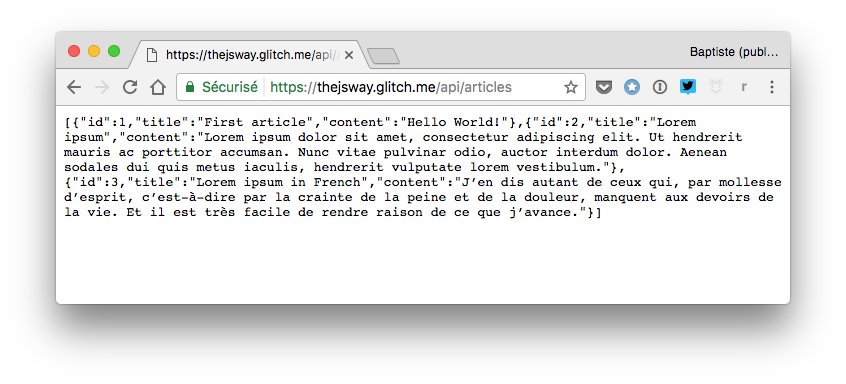
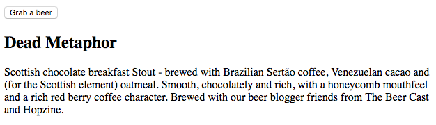

# Gunakan web API

Di bab ini, Kamu akan belajar bagaimana menggunakan layanan web secara nyata di aplikasi Kamu.

## TL;DR

* **API** atau **Application Programming Interface** adalah sekumpulan layanan yang sudah ditentukan dan didefinisikan dengan baik yang ditawarkan oleh program perangkat lunak atau layanan untuk aplikasi lainnya. Developer menggunakan API ini untuk mengintegrasikan teknologi eksternal atau layanan ke aplikasi mereka.

* **Web API** adalah API yang dapat diakses melalui teknologi web (HTTP atau HTTPS). Data format yang digunakan biasanya JSON.

* Web API bisa dikonsumsi secara pemrograman menggunakan **panggilan AJAX**. Sebelum itu, API harus dicek dan dipelajari terlebih dulu dokumentasinya agar dapat dimengerti bagaimana cara kerjanya dan apa yang dikembalikan.

```js
// Fetch data dari API
fetch("http://my-api-url")
  .then(response => response.json()) // Translasi JSON ke JavaScript
  .then(content => {
    // Gunakan konten yang dikembalikan 
    // ...
  })
  .catch(err => {
    console.error(err.message);
  });
```

* Banyak layanan yang berkembang diekspos melalui web API. Beberapa terbuka, lainnya memerlukan **autentikasi** klien, contohnya dengan **kunci akses**.

## Memperkenalkan api

**API** merupakan singkatan dari **Application Programming Interface**. API adalah titik masuk yang ditawarkan oleh program perangkat lunak atau layanan ke program atau aplikasi lainnya. API merupakan sekumpulan metode komunikasi layanan yang sudah ditentukan dan didefinisikan dengan baik. Melalui API, developer bisa dengan mudah mengintegrasikan teknologi eksternal atau layanan ke aplikasi mereka.

API dibentuk dari berbagai variasi. Sebagai contoh, Document Object Model ini adalah API untuk berinteraksi secara pemrograman dengan halaman web: API ini mendefinisikan metode untuk menavigasi dan meng-update struktur halaman.

**Web API** adalah API yang tersedia di Web dan bisa diakses melalui teknologi web, yang dinamakan protokol HTTP atau versi amannya HTTPS. Web API merupakan teknologi kunci untuk interaksi perangkat lunak: kapanpun Kamu mengautentikasi ke website menggunakan akun Google, atau klik tombol untuk post sesuatu di jaringan sosial favorit Kamu, Kamu menggunakan API. Banyak layanan yang berkembang diekspos melalui web APIs, membentuk eksosistem pesat untuk membangun produk digital.

## Mengkonsumsi web API

Untuk bisa menggunakan web API, Kamu harus tahu alamat dan mode penggunaannya. Kebanyakan web APIs bisa diakses melalui **URL** dan menggunakan format **JSON** untuk pertukaran data.

### Mengecek API

Web API yang pertama kali Kamu gunakan di sini mensimulasikan sebuah blog dan mengekspos artikel berseri. URL nya adalah <https://thejsway-server.herokuapp.com/api/articles>. Membuka URL tersebut di sebuah browser menampilkan data JSON yang dikembalikan oleh API.



Hasil mentah ini tidaklah mudah dibaca. Agar mudah berinteraksi dengan web API, gunakan alat spesial seperti [Postman](https://www.getpostman.com) atau [RESTClient](https://addons.mozilla.org/fr/firefox/addon/restclient/) sangatlah disarankan. Berikut bagaimana hasilnya di Postman.


Web API ini mengembalikan array yang mengandung beberapa artikel. Setiap artikel berkorespondensi ke objek JavaScript object dengan properti `id`, `title` dan `content`.

> Penasaran tentang membuat API ini? Kamu akan belajar bagaimana membuat layanan ini (dan lainnya) di bab berikutnya.

API di dunia nyata hampir selalu ditemani dengan **dokumentasi** online yang menunjukkan bagaimana menggunakannya. Mempelajari dokumentasi ini merupakan keharusan untuk menggunakan API dengan lancar.

### Memanggil API dengan JavaScript

Sekarang kita tahu alamat dan format data dari contoh API kita, mari kita coba untuk menampilkan hasilnya di halaman web. Untuk bisa melakukan ini, kita akan memaksimalkan pengetahuan AJAX kita dari bab sebelumnya. Cek contoh berikut ini yang menampilkan bagaimana mengakses daftar artikel dari API.

Berikut kode HTML untuk halaman webnya.

```html
<h2> Some blog articles</h2>
<div id="articles"></div>
```

Dan berikut ini kode JavaScript-nya.

```js
// Fetch data API
fetch("https://thejsway-server.herokuapp.com/api/articles")
  .then(response => response.json()) // Terjemahkan JSON ke JavaScript
  .then(articles => {
    articles.forEach(article => {
      // Buat judul element
      const titleElement = document.createElement("h3");
      titleElement.textContent = article.title;
      // Buat konten element
      const contentElement = document.createElement("p");
      contentElement.textContent = article.content;
      // Tambah judul dan konten ke halaman 
      const articlesElement = document.getElementById("articles");
      articlesElement.appendChild(titleElement);
      articlesElement.appendChild(contentElement);
    });
  })
  .catch(err => {
    console.error(err.message);
  });
```

Menggunakan web API seperti query ke web server: mengambil URL API, menerjemahkan respons JSON ke array JavaScript dan iterasi pada array tersebut.

Berikut ini hasil konten web-nya.


## Web API dan autentikasi

Web API bisa diklasifikasikan ke dua kategori:

* Open API yang tidak memerlukan autentikasi untuk digunakan.
* API yang memerlukan pengkonsumsi untuk meng-autentikasi diri melalui beberapa metode.

### Open API

API ini bebas digunakan semua orang, dengan segala cara. Untuk mencegah penyalahgunaan, biasanya penyedia API menggunakan **rate limiting**: pembatasan jumlah paggilan dari satu sumber spesifik (diidentifikasi oleh alamat IP-nya).

Banya institusi publik seperti [Polisi Inggris](https://data.police.uk/docs/) atau [Pemerintah Perancis](https://www.data.gouv.fr/) mempublikasikan data ke masyarakat menggunakan open API.

Banyak juga API seru di luaran. Contohnya, [Punk API](https://punkapi.com) memungkinkan Kamu mencari ke katalog bir yang sangat besar. Berikut ini cara memperbarui kebiasaan minum Kamu dengan mendapatkan informasi minuman acak dari API ini.

```html
<button id="grabButton">Grab a beer</button>
<div id="beer"></div>
```

```js
// Fungsi anonim untuk mendapatkan dan menampilkan bir secara acak
const grabRandomBeer = () => {
  // Mengambil data beer secara acak dari API
  fetch("https://api.punkapi.com/v2/beers/random")
    .then(response => response.json())
    .then(beers => {
      // API mengembalikan array mengandung hanya satu elemen: kita mendapatkannya 
      const beer = beers[0];
      // Creating DOM element for some beer properties
      const nameElement = document.createElement("h2");
      nameElement.textContent = beer.name;
      const descriptionElement = document.createElement("p");
      descriptionElement.textContent = beer.description;
      // Hapus data bir sebelum
      const beerElement = document.getElementById("beer");
      beerElement.innerHTML = "";
      // Tambah info bir ke halaman
      beerElement.appendChild(nameElement);
      beerElement.appendChild(descriptionElement);
    })
    .catch(err => {
      console.error(err.message);
    });
};

// Pegang bir baru saat klik tombol
document.getElementById("grabButton").addEventListener("click", grabRandomBeer);
```

Setiap kali tombol `"Grab a beer"` diklik di halaman web, fungsi anonim dipanggil untuk mendapatkan dan menampilkan bir secara acak.



### Autentikasi berbasis kunci

Kelas lainnya dari API membutuhkan klien untuk mengautentikasi dirinya ketika mengakses layanan. Autentikasi bisa dilakukan melalui beberapa teknik. Di paragraf ini, kita akan menggunakan cara yang paling sederhana: kunci akses. **Kunci akses** adalah string yang dihasilkan, mengandung karakter dan angka dan terkait dengan pengguna.

> Tentu saja API berbasis autentikasi seringkali juga memiliki rate limit.

Tidak ada standar universal yang baku terkait kunci akses. Setiap layanan bebas digunakan dalam format tertentu. Klien harus menyediakan kunci aksesnya ketika mengakses API, secara umum dengan menambahkannya di akhir URL API.

Prasyarat menggunakan web API berbasis kunci adalah dengan dihasilkannya kunci akses untuk layanan tertentu ini.

Mari kita praktikkan dengan mendapatkan kondisi cuaca hari ini di daerah Kamu. Untuk mengetahui ini, Kamu bisa saja dengan mudah melihat keluar jendela, tetapi lebih seru lagi dengan menggunakan layanan web [weather Underground](https://www.wunderground.com/weather/api).

Layanan ini memiliki API berbasis kunci untuk mendapatkan kondisi cuaca di manapun. Untuk mendapatkannya, Kamu harus daftar terlebih dulu sebagai pengguna (gratis) dan hasilkan kunci API baru dengan mendaftarkan aplikasi Kamu.

Setelah ini, data cuaca tersedia di URL dalam bentuk <http://api.wunderground.com/api/ACCESS_KEY/conditions/q/COUNTRY/TOWN.json>. Ganti `ACCESS_KEY`, `COUNTRY` dan `TOWN` dengan pengaturan Kamu, dan Kamu bisa mendapatkan kondisi cuaca di sekitar Kamu.

Langkah awal utama adalah dengan mengecek dan memahami format data API. Hasil dari pemanggilan API seperti ini ketika mendapatkan kondisi cuaca untuk Bordeaux, Perancis.

```json
{
  "response": {
    "version": "0.1",
    "termsofService": "http://www.wunderground.com/weather/api/d/terms.html",
    "features": {
      "conditions": 1
    }
  },
  "current_observation": {
    "image": {
      "url": "http://icons.wxug.com/graphics/wu2/logo_130x80.png",
      "title": "Weather Underground",
      "link": "http://www.wunderground.com"
    },
    "display_location": {
      "full": "Bordeaux, France",
      "city": "Bordeaux",
      "state": "33",
      ...
    },
    "observation_location": {
      "full": "Bordeaux, ",
      "city": "Bordeaux",
      "state": "",
      "country": "FR",
      ...
    },
    "estimated": {},
    "station_id": "LFBD",
    "observation_time": "Last Updated on June 28, 9:30 PM CEST",
    ...
  }
}

```

Sekarang kita hanya perlu memanggil API dari kode JavaScript kita dan menampilkannya di halaman web.

```html
<h2>The weather in</h2>
<div id="weather"></div>
```

```js
fetch(
  "http://api.wunderground.com/api/YOUR_OWN_KEY/conditions/q/france/bordeaux.json"
)
  .then(response => response.json())
  .then(weather => {
    // Akses beberapa properti cuaca
    const location = weather.current_observation.display_location.full;
    const temperature = weather.current_observation.temp_c;
    const humidity = weather.current_observation.relative_humidity;
    const imageUrl = weather.current_observation.icon_url;
    // Buat elemen DOM untuk properti 
    const summaryElement = document.createElement("div");
    summaryElement.textContent = `Temperature is ${temperature} °C with ${humidity} humidity.`;
    const imageElement = document.createElement("img");
    imageElement.src = imageUrl;
    // Tambah lokasi ke judulnya
    document.querySelector("h2").textContent += ` ${location}`;
    // Tambah elemen ke halaman
    const weatherElement = document.getElementById("weather");
    weatherElement.appendChild(summaryElement);
    weatherElement.appendChild(imageElement);
  })
  .catch(err => {
    console.error(err.message);
  });
```


## Waktu koding!

### Tambah bir lagi

Kembangkan contoh Punk API sebelumnya untuk menampilkan tambahan informasi tentang beer yang dipamerkan: alcohol by volume (ABV), volume dan tanggal pembuatan bir pertama kali.


### Profil GitHub 

Platform sharing kode, [GitHub](https://github.com) memiliki API publik. Tujuan dari latihan ini adalah untuk menampilkan beberapa informasi tentang pengguna GitHub, diidentifikasi dari loginnya. Dokumentasi API-nya ada di [sini](https://developer.github.com/v3/users/).

Gunakan API ini untuk menampilkan gambar profil, nama dan alamat website pengguna GitHub yang login-nya dimasukkan di sebuah kotak teks.


> Kamu bisa mengetes kode Kamu dengan menggunakan login dari anggota komunitas JS terkenal seperti `brendaneich` (ayah JavaScript), `douglascrockford` atau `vjeux`.

### Semesta Star Wars 

Open [Star Wars API](https://swapi.co/) memiliki semua data Star Wars yang Kamu inginkan. Di latihan ini, Kamu akan menampilkan informasi tentang beberapa planet yang ada di angkasa.

Berikut kode permulaan HTML-nya.

```html
<h2>Some Star Wars planets</h2>
<div id="links"></div>
<div id="infos"></div>
```

Tulis kode JavaScript terkait sehingga daftar link id untuk sepuluh planet (dari 1 sampai 10) dihasilkan secara otomatis. Klik di link planet menampilkan informasi tentang planet tersebut.


