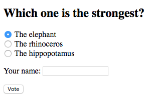
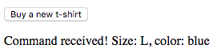

# Kirim data ke web server

Kamu sekarang tahu cara mendapatkan beberapa data dari web server atau API. Bab ini akan mengajarkan Kamu bagaimana mengirim data ke web server.

## TL;DR

* Kamu bisa mengirim informasi ke web server melalui panggilan AJAX yang menerjemahkan ke permintaan HTTP `POST` menggunakan method `fetch()`.

* Untuk mengirimkan data formulir (form data) HTML atau pasangan kunci/nilai, Kamu bisa menggunakan objek `FormData`.

```js
// Buat objek FormData yang mengandung object form data HTML 
const formData = new FormData(myForm);
// Kirim form data ke server dengan permintaan POST asiknron
fetch("https://my-server-url", {
  method: "POST",
  body: formData
})
  .then();
```

* Objek `FormData` bisa juga digunakan untuk mengirim pasangan kunci/nilai ke server.

```js
// Buat objek FormData yang baru dan kosong
const formData = new FormData();
// Isi objek dengan pasangan kunci/nilai
formData.append("size", "L");
formData.append("color", "blue");
// ...
```

* Ketika informasi yang akan dikirim ke server diharuskan lebih terstruktur, mengirimkan data dalam bentuk JSON akan lebih mudah.

```js
// Buat beberapa data JavaScript 
const myData = {
  // ...
};

// Kirim data ini sebagai JSON ke server
fetch("https://https://my-server-url", {
  method: "POST",
  headers: {
    Accept: "application/json",
    "Content-Type": "application/json"
  },
  body: JSON.stringify(myData)
})
  .then();
```

## Mengirim data: dasar 

Mengirim data ke server biasanya dilakukan melalui method HTTP `POST`. Di contoh ini, body permintaan mengandung data yang akan dikirim.

Formata data tergantung pada apa yang diharapkan oleh server. Ini bisa diantara:

* Pasangan kunci/nilai saat formulir dikirim secara langsung.
* JSON untuk data yang lebih terstruktur.

## Mengirim form data

Jika web server mengharapkan form data secara langsung, Kamu bisa menggunakan objek JavaScript `FormData` untuk membungkus informasi yang akan dikirim.

Berikut ini contoh form untuk memilih hewan terkuat.

```html
<h2>Which one is the strongest?</h2>
<form>
    <p>
        <input type="radio" name="strongest" id="elephant" value="ELE" checked>
        <label for="elephant">The elephant</label>
        <br>
        <input type="radio" name="strongest" id="rhinoceros" value="RHI">
        <label for="rhinoceros">The rhinoceros</label>
        <br>
        <input type="radio" name="strongest" id="hippopotamus" value="HIP">
        <label for="hippopotamus">The hippopotamus</label>
        <br>
    </p>
    <p>
        <label for="name">Your name</label>:
        <input type="text" name="name" id="name" required>
    </p>
    <input type="submit" value="Vote">
</form>
<p id="result"></p>
```



Dan berikut ini kode JavaScript terkait yang menangani pengiriman form.

```js
// Tangani pengiriman form
document.querySelector("form").addEventListener("submit", e => {
  // Batalkan perilaku bawaan (mengirim permintaan POST asinkron)
  e.preventDefault();
  // Buat objek FormData, melewatkan form sebagai parameter
  const formData = new FormData(e.target);
  // Kirim data form ke server dengan permintaan POST asinkron
  fetch("https://thejsway-server.herokuapp.com/animals", {
    method: "POST",
    body: formData
  })
    .then(response => response.text())
    .then(result => {
      document.getElementById("result").textContent = result;
    })
    .catch(err => {
      console.error(err.message);
    });
});
```

Event listener memulai dengan menonaktifkan perilaku bawaan pengiriman form, yakni mengirimkan permintaan HTTP `POST` asiknron ke server. Sebagai gantinya, objek `FormData` dibuat dengan form itu sendiri (ekspresi `e.target`) sebagai parameter. Semua isian form ditambahkan secara otomatis sebagai pasangan kunci/nilai di objek ini.

Saat isian form dibungkus dalam objek `FormData`, method `fetch()` yang dibahas sebelumnya digunakan untuk mengirim permintaan asinkron ke URL `https://thejsway-server.herokuapp.com/animals`. Parameter kedua dari panggilan `fetch()` mengeset method HTTP method sebagai `POST` dan menambahkan data form ke body permintan.

Terakhir, `hasil` elemen halaman diupdate ketika server merespon ke permintaan asinkron.


Objek `FormData` bisa juga digunakan secara mandiri dari form apapun, untuk mengirimkan pasangan kunci/nilai sesuai pesanan ke server. Berikut ini contoh dasar form yang mengandung hanya satu tombol.

```html
<button id="buyButton">Buy a new t-shirt</button>
<p id="result"></p>
```

Ketika pengguna mengklik tombol, data custom ditambahkan ke objek `FormData` dan mengirimkannya ke server melalui permintaan `POST` asinkron.

```js
document.getElementById("buyButton").addEventListener("click", () => {
    // Buat objek FormData baru dan kosong 
    const formData = new FormData();
    // Isi objek dengan pasangan kunci/nilai
    formData.append("size", "L");
    formData.append("color", "blue");
    // Kirim data ke server
    fetch("https://thejsway-server.herokuapp.com/tshirt", {
      method: "POST",
      body: formData
    })
    .then(response => response.text())
    .then(result => {
      document.getElementById("result").textContent = result;
    })
    .catch(err => {
      console.error(err.message);
    });
});
```



## Mengirimkan data JSON 

Ketika informasi diharapkan web server lebih terstruktur (dengan tipe kompleks, isian bersarang, dan lainnya), seringkali biasanya, pilihan terbaiknya adalah dengan mengirimkannya dengan data JSON.

Sebagai contoh, cek bagaimana mengirimkan array JavaScript dalam bentuk data JSON ke web server.

```js
// Buat array yang mengandung dua objek
const cars = [
  {
    model: "Peugeot",
    color: "blue",
    registration: 2012,
    checkups: [2015, 2017]
  },
  {
    model: "Citroën",
    color: "white",
    registration: 1999,
    checkups: [2003, 2005, 2007, 2009, 2011, 2013]
  }
];

// Kirim array ini sebagai data JSON ke server
fetch("https://thejsway-server.herokuapp.com/api/cars", {
  method: "POST",
  headers: {
    Accept: "application/json",
    "Content-Type": "application/json"
  },
  body: JSON.stringify(cars)
})
  .then(response => response.text())
  .then(result => {
    console.log(result);
  })
  .catch(err => {
    console.error(err.message);
  });
```


Parameter kedua dari panggilan `fetch()` mengeset `POST` sebagai method HTTP untuk menggunakan, update header permintaan yang mengindikasikan bahwa format datanya adalah JSON, dan menambah representasi JSON dari array JavaScript pada body permintaan.

## Waktu koding!

### Artikel baru 

Tulis kode HTML yang menampilkan isian untuk membuat artikel blog baru dengan mengisi judul dan kontennya.

Lalu, tulis kode JavaScript terkait untuk mengirimkan isian artikel sebagai data form ke URL `https://thejsway-server.herokuapp.com/articles`. Kamu hrus menerima pesan konfirmasi dari server dan menampilkannya di halaman.


W> Server hanya menerima permintaan `POST` pada URL ini.

### Negara yang dikunjungi

Tujuan dari latihan ini adalah untuk mengirimkan info perjalanan wisata Kamu ke server. Data diharapkan dalam bentuk objek JSON yang mengandung dua isian:

* `name` yang merepresentasikan nama Kamu. Nilainya adalah string.
* `countries` yang merepresentasikan negara yang sudah Kamu kunjungi. Nilainya adalah objek array. Setiap objek memiliki isian `name` (string) untuk nama negara, dan isian `year` (integer) untuk tahun saat Kamu mengunjungi negara tersebut.

Data ini harus dikirim ke URL `https://thejsway-server.herokuapp.com/api/countries`. Kamu harus menerima pesan konfirmasi dari server dan menampilkannya di console.


