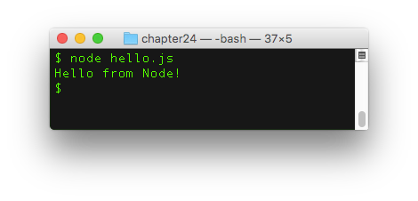
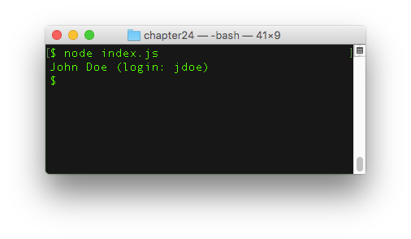
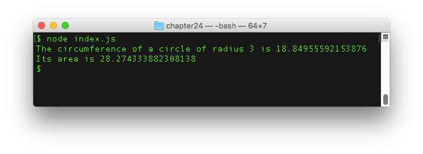
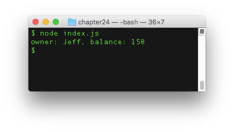

# Temukan Node.js

Di bab ini, Kamu akan temukan bagaimana cara membuat aplikasi JavaScript di luar browser, terima kasih kepada teknologi bernama Node.js.

## TL;DR

* **Node.js** (atau cukupNode) adalah platform yang dibangun dari mesin JavaScript Chrome (V8) untuk membuat aplikasi JavaScript di luar browser.

* Node mengutamakan ke-modularan: dibandingkan menjadi monolitik, aplikasi didesain dari beberapa set modul kecil dan terfokus yang bekerja bersamaan untuk mendapatkan perilaku aplikasi yang diinginkan.

* Node mengacu pada format modul [CommonJS](http://requirejs.org/docs/commonjs.html). Modul ini menyediakan `require()` untuk memuat satu modul.

* Di dalam sebuah modul, objek `module.exports` digunakan untuk mengekspor potongan kode. Kamu bisa **menambah properti** pada modul tersebut untuk mengekspor elemen. Kamu juga bisa **menugaskan kembali** `module.exports` untuk mengekspor hanya untuk elemen yang spesifik.

* Node menyediakan satu cara untuk menstruktur aplikasi dalam bentuk **package**. Package adalah berkas mengandung aplikasi yang dideskripsikan oleh file `package.json`. Titik masuk bawaan package adalah file `index.js`.

* Versi package didefinisikan menggunakan format **pem-versi-an semantik**: tiga digit string dalam bentuk `MAJOR.MINOR.PATCH`. Format ini memfasilitasi manajemen of **dependensi** antar package.

* [npm](https://www.npmjs.com) (Node Package Manager) adalah standar pengelola package untuk ekosistem Node. npm terdiri dari klien baris perintah dan registrasi online dari package publik yang diakses oleh klien. Registrasi ini adalah ekosistem terbesar library open source di dunia.

* Perintah utama npm adalah `npm install` (untuk menginstal semua ketergantungan package atau menambah package) dan `npm update` (untuk mengupdate semua package dan instal package yang terlewati berdasarkan `package.json`).

* Ketika sudah terinstal melalui npm, package yang didefinisikan sebagai dependensi disimpan di subfolder `node_modules/` dan bisa dimuat sebagai module menggunakan `require()`.

* Beberapa package (mengandung hanya file yang dapat dieksekusi atau tidak ada titik masuknya) tidak bisa dimuat sebagai modul. Beberapa modul (satu file JavaScript) bukanlah package.

## Memperkenalkan Node.js

### Sedikit sejarah

Untuk memahami apa itu [Node.js](https://nodejs.org) (atau Node), kita harus kembali ke tahun 2000-an. Ketika JavaScript meningkat menjadi sangat penting untuk meng-improve user experience di web, desainer web browser menghabiskan banyak sumber daya dalam mengeksekusi kode JS secepat mungkin. Pada waktu tertentu, mesin JavaScript Chrome, bernama kode V8, menjadi open source di tahun 2008 dan merupakan langkah besar dalam performansi dan optimasi secara umum.


Ide utama dibalik Node.js adalah sederhana namun visioner: karena mesin V8 sangatlah baik dalam mengeksekusi kode, kenapa tidak memanfaatkan kekuatannya untuk membuat aplikasi JavaScript yang efisien *di luar browser*? Dan akhirnya Node.js dilahirkan di tahun 2009, ditulis asli oleh Ryan Dahl. Proyeknya menjadi sangat populer dan Node sekarang merupakan salah satu teknologi papan atas untuk membuat app dan membuat API dengan JavaScript.


Node juga mempermudah developer untuk mempublikasikan, membagi, dan menggunakan kembali kode. Hari ini, ratus ribuan library yang siap untuk digunakan, dinamakan **packages**, tersedia dan mudah untuk diintegrasikan ke proyek berbasis Node (akan dibahas nanti). Ekosistem kaya ini adalah salah satu kekuatan terkuat dari Node.

### Contoh pertama

> Mulai dari sini sampai akhir bab ini diasumsikan menggunakan environment kerja Node. Rujuklah ke lampiran tentang bagaimana mengeset environment ini.

Program Node paling sederhana sebagai berikut.

```js
console.log("Hello from Node!");
```

Seperti yang Kamu lihat, perintah `console.log()` juga tersedia di Node. Seperti di web browser, perintah ini mengeluarkan output nilai yang ditempatkan sebagai parameter ke console. Diasumsikan kode ini disimpan di file bernama `hello.js`, berikut ini cara mengeksekusinya melalui Node di terminal.

```console
node hello.js
```



Studi mendalam platform Node di luar lingkup buku ini. Mari kita fokus pada dua dari fitur utamanya: **module** and **package**.

## Module Node.js 

### Manfaat modularitas

Ide umum dibalik module cukup mudah dan mirip dengan fungsi. Daripada menulis semua kode di satu tempat, lalu membuat aplikasi monolitik, seringkali lebih baik membagi fungsionalitas ke bagian-bagian kecil yang terpisah. Setiap bagian harus fokus pada satu tugas spesifik, membuat bagian tersebut lebih mudah dipahami dan digunakan kembali. Perilaku umum aplikasi dihasilkan dari interaksi antara blok bangunan ini.

Bagian-bagian kecil ini terkadang disebut sebagai komponen di environment lain. Di Node, ini dinamakan **module** dan bisa dilihat dari bentuk yang berbeda. Definisi umum module adalah: apapun yang bisa dimuat menggunakan fungsi Node `require()`. Platform Node.js mengikuti format module [CommonJS](http://requirejs.org/docs/commonjs.html).

### Membuat module

Bentuk paling sederhana dari module adalah satu file JavaScript, mengandung perintah spesial untuk **mengekspor** bagian kode yang spesifik. Sisa kodenya adalah **privat** terhadap module dan tidak dapat dilihat dari luar.

Contohnya, module `greetings.js` bisa mengandung kode berikut.

```js
// Buat tiga fungsi
const sayHello = name => `Hello, ${name}`;
const flatter = () => `Look how gorgeous you are today!`;
const sayGoodbye = name => `Goodbye, ${name}`;

// Ekspor dua diantaranya
module.exports.sayHello = sayHello;
module.exports.flatter = flatter;
```

Di Node, fungsi bisa *diekspor* (dapat diakses di luar) dengan menetapkan properti tambahan pada objek spesial `module.exports`. Di sini, dua fungsi diekspor di bawah nama `sayHello` dan `flatter`. Fungsi ketiga tidak diekspor.

Module ini bisa ditulis dengan cara yang lebih ringkas dengan mendefinisikan secara langsung fungsi sebagai properti dari objek `module.exports`.

```js
// Buat dan ekspor dua fungsi
module.exports.sayHello = name => `Hello, ${name}`;
module.exports.flatter = () => `Look how gorgeous you are today!`;

// Buat fungsi non-ekspor 
const sayGoodbye = name => `Goodbye, ${name}`;
```

### Memuat modul

Diasumsikan kedua file terletak di directory yang sama, file JavaScript lainnya bisa memuat module yang sebelumnya dimuat dengan menggunakan fungsi `require()` yang disediakan oleh Node.js.

```js
// Memuat module "greetings.js"
const greetings = require("./greetings.js");

// Gunakan fungsi yang diekspor
console.log(greetings.sayHello("Baptiste")); // "Hello, Baptiste"
console.log(greetings.flatter()); // "Look how gorgeous you are today!"
console.log(greetings.sayGoodbye("Baptiste")); // Error: sayGoodbye doesn't exist
```

Parameter yang ditempatkan di `require()` mengidentifikasi module yang akan dimuat. Di sini, substring `"./"` di awal mengindikasi **relative path**: module seharusnya dicari di directory yang sama dengan file yang memuatnya.

Hasil dari panggilan ke `require()` adalah sebuah objek, yang bernama `greetings` di sini. Objek ini mereferensikan nilai objek `module.exports` di dalam module. Maka, objek `greetings` memiliki dua fungsi `sayHello` dan `flatter` sebagai properti. Mencoba untuk mengakses properti fungsi yang tidak ada: `sayGoodbye` memicu eror saat eksekusi.

> Memberikan objek yang dihasilkan dari panggilan ke `require()` yang namanya sama dengan nama module yang dimuat, walaupun tidak wajib, adalah praktis yang umum.

### Mengekspor hanya satu objek spesifik

Beberapa module di ekosistem Node.js hanya mengekspor hanya satu objek yang meng-agregasi semua fungsionalitas module. Untuk melakukan ini, module menugaskan kembali objek `module.exports` dibandingkan menambah properti pada module tersebut.

Sebagai contoh, cek bagaimana module `calculator.js` ini didefinisikan.

```js
// Deklarasi fungsi factory yang mengembalikan objek literal
const createCalc = () => {
  // Objek yang dikembalikan memiliki 4 method
  return {
    add(x, y) {
      return x + y;
    },
    subtract(x, y) {
      return x - y;
    },
    multiply(x, y) {
      return x * y;
    },
    divide(x, y) {
      return x / y;
    }
  };
};

// Ekspor fungsi factory 
module.exports = createCalc;
```

Di module ini, elemen yang diekspor hanyalah satu fungsi yang mengembalikan objek literal. Menggunakan fungsi ini di file yang lain (terletak di folder yang sama) sebagai berikut.

```js
const calculator = require("./calculator.js");

// Buat objek dengan memanggil fungsi yang diekspor dari module ini
const calc = calculator();

// Gunakan method objek
console.log(`2 + 3 = ${calc.add(2, 3)}`); // "2 + 3 = 5"
```

Hasil dari pemanggilan `require()` adalah fungsi yang tersimpan di variabel `calculator`, mereferensikan fungsi `createCalc()`. Memanggil fungsi ini mengembalikan objek dengan beberapa method, yang dapat digunakan nantinya.

### Mengekspor hanya satu class

Ketika Kamu ingin module hanya mengekspor satu class yang spesifik, Kamu bisa juga menugaskan kembali objek `module.exports`.

Berikut ini module `user.js` yang mendefinisikan dan mengekspor class `User`.

```js
// Ekspor class User 
module.exports = class User {
  constructor(firstName, lastName) {
    this.firstName = firstName;
    this.lastName = lastName;
    // Buat pengguna login dengan mengkombinasikan huruf pertama dari nama pertama + nama terakhir
    this.login = (firstName[0] + lastName).toLowerCase();
  }
  describe() {
    return `${this.firstName} ${this.lastName} (login: ${this.login})`;
  }
};
```

Berikut bagaimana menggunakan class ini di file lainnya (terletak di folder yang sama).

```js
// Perhatikan huruf kapital pertama, karena User adalah sebuah class
const User = require("./user.js");

// Buat objek dari class ini
const johnDoe = new User("John", "Doe");

// Gunakan objek yang dibuat
console.log(johnDoe.describe());
```



## Package Node.js 

Platform Node menyediakan satu cara untuk menstruktur satu aplikasi dalam bentuk **package**.

### Anatomi package

Secara teknis, package adalah yang mengandung elemen berikut:

* File `package.json` yang mendeskripsikan aplikasi dan ketergantungannya.
* Titik masuk ke aplikasi, yang secara bawaan merujuk ke file `index.js`.
* Subfolder `node_modules/`, yang lokasi bawaannya di mana Node mencari module yang akan dimuat ke aplikasi.
* Semua file lainnya yang membentuk sumber kode aplikasi.

### File `package.json`

File JSON ini mendeskripsikan aplikasi dan dependensinya: Kamu bisa bayangkan ini sebagai dokumen ID dari aplikasi. File ini memiliki format yang telah didefinisikan dengan baik, terdiri dari banyak isian, kebanyakan opsional. Dua isian wajib diantaranya:

* `name` (semua huruf kecil tanpa titik, garis bawah, dan karakter non-URL safe).
* `version` (mengikuti format versi semantik - dibahas nanti).

Di bawah ini adalah contoh khas file `package.json`.

```json
{
  "name": "thejsway-node-example",
  "version": "1.0.0",
  "description": "Node example for the book \"The JavaScript Way\"",
  "scripts": {
    "start": "node index.js"
  },
  "dependencies": {
    "moment": "^2.18.1",
    "semver": "^5.3.0"
  },
  "keywords": [
    "javascript",
    "node",
    "thejsway"
  ],
  "author": "Baptiste Pesquet"
}
```

### Pembuatan versi semantik (semantic versioning) 

Package Node diversikan menggunakan format yang dinamakan **semantic versioning**. Nomor versi adalah tiga digit string dalam bentuk `MAJOR.MINOR.PATCH` (contoh : `2.18.1`).

Berikut ini adalah aturan untuk mendefinisikan nomor versi:

* Versi paling pertama seharusnya `1.0.0`.
* Perbaikan bug dan perubahan minor sebaiknya menaikkan digit `PATCH`.
* Fitur baru yang ditambahkan dengan cara backwards-compatible harus menaikkan digit `MINOR`.
* Perubahan besar harus menaikkan digit `MAJOR`.

Aturan ketat ini ada untuk memfasilitasi manjemen **dependensi** antar package.

### Dependensi

Di definisi file `package.json`, isian `dependencies` digunakan untuk mendeklarasikan package eksternal yang dibutuhkan oleh package saat ini. Setiap dependensi dibuat dengan nama package diikuti oleh **version range**. Version range ini menentukan versi package yang diterima untuk digunakan.

Ada beberapa cara untuk mendefinisikan version range. Yang sering digunakan adalah:

* Mensasar versi yang sangat spesifik. Contoh: `2.18.1`.
* Menggunakan operator the `~` untuk mengijinkan perubahan patch-level. Contohnya, version range `~2.18.1` menerima versi `2.18.7`, tetapi tidak untuk versi `2.19.0` ataupun versi `3.0.0`.
* Menggunakan operator `^` untuk mengijinkan perubahan yang tidak memodifikasi digit tidak nol yang paling kiri pada versi. Contoh:
  * Version range `^2.18.1` menerima versi `2.18.7` dan `2.19.0`, tetapi tidak untuk versi `3.0.0`.
  * version range `^0.2.3` tidak menerima versi `0.2.5` tetapi tidak untuk versi `0.3.0` ataupun `1.0.0`.

Mencari konfigurasi versi yang pas dari package eksternal melalui version range membantuk membatasi risiko merusak aplikasi ketika mengupdate dependensinya.

## Manajemen package dengan **npm**

Segera setelah pembuatan Node.js, sangatlah jelas ada yang terlewatkan terkait bagaimana mengorkestrasi sharing kode dan menggunakannya kembali melalui module. Maka [npm](https://www.npmjs.com) (Node Package Manager) muncul di tahun 2010. npm ini masih menjadi standar pengelola package untuk ekosistem Node, walaupun ditantang oleh [yarn](https://yarnpkg.com), yang merupakan alternatif terbaru. npm ini terdiri dari baris perintah dari klien, juga dinamakan **npm**, dan database online dari package publik, dinamakan **npm registry** dan diakses oleh klien.


Lebih dari 477,000 package saat ini tersedia di registry, siap untuk digunakan kembali dan meng-cover banyak kebutuhan. Hal ini membuat npm menjadi ekosistem library sumber kode terbesar di dunia.

Klien npm digunakan dengan mengetik perintah di terminal di folder package. Perintah ini memberikan banyak kemungkinan untuk mengelola package. Mari kit pelajari dua diantaranya yang paling penting.

### Instal dependensi

Untuk menginstal semua dependensi package, Kamu ketik perintah npm berikut.

```console
npm install
```

Perintah ini akan membaca file `package.json`, cari package yang memenuhi version range yang dideklaraikan di isian `dependencies`, dan unduh dan instal (dan dependensinya sendiri) pada subfolder `node_modules/`.

### Menambah dependensi baru

Ada dua cara untuk menambah dependensi baru ke sebuah package. Cara pertama adalah dengan mengedit secara manual `package.json` untuk mendeklarasikan dependesinya dan version range terkait. Langkah selanjutnya adalah dengan menjalankan perintah npm berikut.

```console
npm update
```

Perintah ini akan mengupdate semua package yang terdaftar pada versi terbaru yang memenuhi version range-nya, dan instal package yang terlewat.

Cara lainnya adalah dengan menjalankan perintah berikut.

```console
npm install <package-id>
```

Perintah ini akan mengambil package yang spesifik dari registry, unduh di subfolder `node/modules/` dan (sejak npm 5) update file `package.json` untuk menambahkannya sebagai dependensi baru. Parameter `<package-id>` biasanya merupakan nama package dependensi.

## Menggunakan dependensi

Saat package eksternal telah terinstal di `node_modules/`, aplikasi bisa dimuat sebagai module dengan fungsi `require()`.

Contohnya, daftar npm memiliki package **semver** yang menangani semantic versioning. Diasumsikan package ini telah terinstal sebagai dependensi, package ini bisa digunakan untuk menjalankan pengecekan manual version range.

```js
// Muat package npm semver sebagai module
// Perhatikan dihilangkannya "./" karena package diinstal di node_modules/
const semver = require("semver");

// Cek jika versi yang spesifik memenuhi range
console.log(semver.satisfies("2.19.0", "^2.18.1")); // benar
console.log(semver.satisfies("3.0.0", "^2.18.5")); // salah
```

### Hubungan antara package dan module

Mari kita ringkas apa yang telah Kamu pelajari sampai sini:

* *module* adalah apapun yang bisa dimuat dengan `require()`.
* *package* adalah aplikasi Node yang dideskripsikan oleh file `package.json`.

Package digunakan di aplikasi Node lainnya dimuat dengan `require()`, membuatnya menjadi sebuah module. Agar bisa dimuat sebagai module, package harus mengandung file `index.js` atau isian `main` di `package.json` didefinisikan titik masuk yang spesifik.

Beberapa package hanya mengandung satu perintah yang dapat dieksekusi dan tidak dapat dimuat sebagai module. Di samping itu, satu file JavaScript dimuat dengan `require()` adalah module tetapi bukan package, karena tidak memiliki file `package.json`.

Cek [dokumentasi npm](https://docs.npmjs.com/how-npm-works/packages) untuk informasi detail tentang aspek ini.

## Waktu koding!

### Lingkaran lagi

Buat module `circle.js` yang mengekspor dua fungsi `circumference()` dan `area()`, setiap fungsi mengambil jari-jari lingkaran sebagai parameter.

Muat module ini dalam file `index.js` dan tes kedua fungsinya.



### Accounting

Buat module ekspor `accounting.js`.

Muat module ini di file `index.js` dan tes kedua fungsinya.

```js
// TODO: muat module "accounting.js"

// Buat objek dari class yang diekspor
const myAccount = new Account("Jeff");
myAccount.credit(150);
console.log(myAccount.describe());
```



### Bermain dengan tanggal

Package npm [moment](https://momentjs.com/) sangatlah populer untuk mengelola tanggal dan waktu.

Buat package Node dan instal versi terbaru `moment` sebagai dependensi. Lalu, muat package ini dan gunakan untuk:

* Menampilkan tanggal saat ini.
* Hitung jumlah tahun dari 26 Nopember 1976.


> Gunakan [dokumentasi moment](https://momentjs.com/docs/) untuk mempelajari cara menggunakan package ini.
