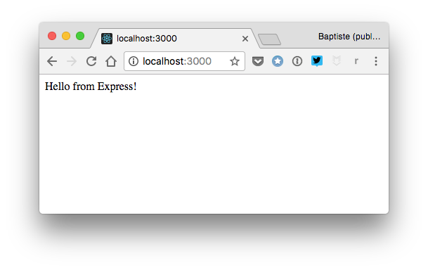

# Buat web server

Inilah saatnya untuk mempraktikkan pengetahuan Kamu dan buat web server secara nyata di JavaScript. Hal ini seringkali disebut **back-end programming**.

> Kamu akan membuat server yang digunakan di bab sebelumnya yang menangani pengembangan web di sisi klien. Untuk mengetes kode server, Kamu bisa balik lagi ke contoh kode dari bab 22 dan 23, dan hanya mengganti URL server dari `https://thejsway-server.herokuapp.com` ke URL server Kamu sendiri (yang nantinya adalah `http://localhost:3000` jika server Kamu berjalan di mesin lokal Kamu).

## TL;DR

* Platform Node.js sangat cocok untuk membuat **web server** di JavaScript, dengan atau tanpa bantuan framework.

* **Framework** menyediakan satu cara terstandarisasi untuk mendesain dan menstrukturisasi sebuah aplikasi. **Express** adalah framework yang biasanya dipilih untuk membangun web server dengan Node.

* Untuk merespons permintaan, aplikasi Express mendefinisikan **rute** (titik masuk yang berkaitan dengan URL) dan menanti permintaan HTTP yang akan tiba.

* Method utama Express adalah `get()` untuk menangani permintaan `GET`, `post()` untuk menangani permintaan `POST` dan `use()` untuk mendefinisikan **middleware** (kode yang berjalan saat siklus permintaan/respons).

* Data formulir atau JSON yang akan tiba bisa dikelola melalui package spesial seperti **multer** dan **body-parser**.

* JavaScript bisa digunakan pada sisi klien dan sisi server dari aplikasi web. Hal ini memberdayakan Kamu untuk membuat **aplikasi web** yang komplit.

## Menggunakan framework

Kita sudah lihat di bab sebelumnya bahwa Node.js adalah platform untuk membangun aplikasi JavaScript di luar browser. Karena inilah, Node sangatlah cocok untuk membuat **web server** di JavaScript.

> Sebagai pengingat, web server adalah mesin yang dibuat secara khusus untuk mempublikasikan resource di Web.

### Tentang framework

Sangatlah mungkin untuk membangun web server secara keseluruhan dari awal dengan Node, tetapi kita akan ambil pendekatan berbeda dan menggunakan framework.

Dalam pemrograman komputer, **framework** menyediakan cara terstandarisasi untuk  mendesain dan menstrukturisasi aplikasi. Framework ini membereskan banyak detail kecil sehingga developer bisa berkonsentrasi pada pekerjaan yang high-level, yang terkait bisnis.

### Memilih framework

Di antara banyak kemungkinan frameworks untuk membuat web server di JavaScript, kita akan membuat salah satu yang paling terkenal: **Express**. Di ambil dari [situs webnya](http://expressjs.com/), Express adalah "a minimal and flexible Node.js web application framework that provides a robust set of features for web and mobile applications".

Dengan kata lain, Express menyediakan satu fondasi di mana Kamu bisa dengan mudah dan dengan cepat membangun web server.

### Instal Express

Framework Express tersedia sebagai pacakage npm dan instalasinya cukup mudah. Pertama, Kamu akan memerlukan aplikasi Node eksisting dengan file `package.json` di dalamnya. Jalankan perintah berikut di terminal di foler aplikasi Kamu untuk menginstal Express sebagai dependensi.

```console
npm install express
```

Alternatif lainnya, Kamu bisa secara langsung manambah Express sebagai dependensi di file `package.json` Kamu dan jalankan perintah `npm install`.

```json
"dependencies": {
  "express": "^4.15.3"
},
```

## Merespons ke permintaan

Tugas utama web server adalah untuk merespons permintaan HTTP. Berikut ini kode JavaScript untuk web server minimal berbasis Express yang mengembalikan `"Hello from Express!"` untuk permintaan ke URL root.

```js
// Muat pacakage Express sebagai module
const express = require("express");

// Akses layanan yang diekspor
const app = express();

// Kembalikan string untuk permintaan ke URL root ("/")
app.get("/", (request, response) => {
  response.send("Hello from Express!");
});

// Mulai menanti permintaan yang masuk
// Jika process.env.PORT tidak didefinisikan, nomor port 3000 digunakan
const listener = app.listen(process.env.PORT || 3000, () => {
  console.log(`Your app is listening on port ${listener.address().port}`);
});
```

Kamu bisa meluncurkan server Kamu dengan `node index.js` atau `npm start`, lalu ketik URL root (<http://localhost:3000> jika server Kamu berjalan di lokal mesin Kamu) di browser. Kamu akan lihat string `"Hello from Express!"` muncul.



Mari kita uraikan contoh ini.

### Mengakses layanan Express

Sekali Express diinstal, Kamu bisa memuat package-nya di file aplikasi utama aplikasi dan mengakses layanan yang diekspor yang disediakan oleh framework. Permulaan kode server berikut ini.

```js
// Muat package Express sebagai module
const express = require("express");

// Akses objek utama Express 
const app = express();
```

### Mendefinisikan route

Di terminologi pengembangan web, **route** adalah titik masuk ke aplikasi yang relatif terhadap URL aplikasi. Route `"/"` route cocok dengan aplikasi root.

```js
// Kembalikan string untuk permintaan ke URL root ("/")
app.get("/", (request, response) => {
  response.send("Hello from Express!");
});
```

Ketika permintaan HTTP dibuat ke URL route, fungsi callback terkait dieksekusi. Fungsi ini mengambil parameter objek yang merepresentasikan permintaan dan respons HTTP. Berikut ini body fungsi mengirimkan respons teks dengan konten `"Hello from Express!"`.

### Menanti permintaan

Untuk memproses permintaan masuk, web server harus menanti di port yang spesifik. **Port** adalah komunikasi endpoint pada mesin.

Objek utama Express memiliki method `listen()` yang mengambil parameter port dan fungsi callback yang dipanggil setiap permintaan. Bagian akhir dari kode memanggil method ini untuk memulai menanti.

```js
// Mulai menanti permintaan masuk
// Jika process.env.PORT tidak didefinisikan, 3000 digunakan
const listener = app.listen(process.env.PORT || 3000, () => {
  console.log(`Your app is listening on port ${listener.address().port}`);
});
```

## Membuat API

Web server Kamu sangat terbatas untuk sekarang, menangani hanya satu route dan selalu mengembalikan string yang sama. Mari kita buat API kecil Kamu sendiri dengan mempublikasikan beberapa data dalam format JSON.

### Mengaktifkan permintaan AJAX 

Di bab sebelumnya, kita berbicara tentang permintaan cross-origin (dari satu domain ke domain lainnya). Mengijinkan permintaan tersebut adalah wajib untuk menerima permintaan AJAX dari klien.

Mengaktifkan CORS pada web server Express dilakukan dengan menambah kode berikut di file aplikasi utama Kamu.

```js
// Mengaktifkan CORS (lihat https://enable-cors.org/server_expressjs.html)
app.use((req, res, next) => {
  res.header("Access-Control-Allow-Origin", "*");
  res.header(
    "Access-Control-Allow-Headers",
    "Origin, X-Requested-With, Content-Type, Accept"
  );
  next();
});
```

Ini adalah contoh **middleware**: kode yang berjalan di tempat lain diantara penerimaan permintaan HTTP dan pengiriman respons HTTP.

## Membuka data

Untuk menyesuaikan apa yang sudah selesai di sisi klien pada bab sebelumnya, kita akan mempublikasikan beberapa artikel blog. Route API-nya adalah `"/api/articles"`, dan callback terkait mengembalikan daftar objek JavaScript.

Berikut ini yang akan ditambahkan ke server sebelum bagian akhir (yang akan memulai menanti permintaan).

```js
// Definisikan daftar artikel
const articles = [
  { id: 1, title: "First article", content: "Hello World!" },
  {
    id: 2,
    title: "Lorem ipsum",
    content:
      "Lorem ipsum dolor sit amet, consectetur adipiscing elit. Ut hendrerit mauris ac porttitor accumsan. Nunc vitae pulvinar odio, auctor interdum dolor. Aenean sodales dui quis metus iaculis, hendrerit vulputate lorem vestibulum."
  },
  {
    id: 3,
    title: "Lorem ipsum in French",
    content:
      "J’en dis autant de ceux qui, par mollesse d’esprit, c’est-à-dire par la crainte de la peine et de la douleur, manquent aux devoirs de la vie. Et il est très facile de rendre raison de ce que j’avance."
  }
];

// Kembalikan daftar artikel dalam format JSON
app.get("/api/articles", (request, response) => {
  response.json(articles);
});
```

Ketika mengakses route `"/api/articles"` (<http://localhost:3000/api/articles> jika server Kamu berjalan di lokal) dengan sebuah browser atau tool khusus seperti Postman atau RESTClient, Kamu akan melihat daftar artikel dalam format JSON.


## Menerima data

Sejauh ini, web server Kamu menawarkan layanan *read-only*: layanan ini mempublikasikan beberapa data tetapi tidak menerima apapun.. sampai sekarang!

Seperti yang Kamu lihat di beberapa bab, informasi yang dikirim ke web server bisa data formulir atau data JSON.

### Menangani data formulir 

Data formulir dibungkus di permintaan `POST` HTTP yang dikirimkan oleh klien ke server. Tugas server pertama adalah untuk meng-ekstrak informasi ini dari permintaan. Cara termudah untuk melakukan ini adalah dengan menggunakan package npm spesial, seperti [multer](https://www.npmjs.com/package/multer). Install pacakage ini dengan perintah `npm install multer` atau secara langsung di aplikasi dependensi Kamu.

```json
"dependencies": {
  ...
  "multer": "^1.3.0"
},
```

Setelah **multer** diintal, tambah kode berikut di awal file utama server Kamu.

```js
// Muat package multer sebagai module
const multer = require("multer");

// Akses layanan yang diekspor
const upload = multer();
```

Route berikut ini menerima data formulir yang dikirimkan ke route `"/animals"`. Perhatikan penggunaan `app.post()` dibandingkan `app.get()` untuk menangani permintaan HTTP `POST`, dan penambahan `upload.array()` sebagai parameter kedua untuk menambah objek `body` yang mengandung isian dari formulir ke objek `request`.

```js
// Tangani pengajuan data formulir ke route "/animals" 
app.post("/animals", upload.array(), (request, response) => {
  const name = request.body.name;
  const vote = request.body.strongest;
  response.send(`Hello ${name}, you voted: ${vote}`);
});
```

Nilai variabel `name` dan `vote` di-ekstrak dari body permintaan, dan string disusun dan dikirim balik ke klien.


### Menangani data JSON

Mengelola data JSON yang masuk memerlukan penguraian dari penerimaan permintaan `POST`. Menggunakan package npm seperti [body-parser](https://www.npmjs.com/package/body-parser) adalah solusi termudah. Instal package tersebut dengan perintah `npm install body-parser` atau secara langsung di dependensi aplikasi Kamu.

```json
"dependencies": {
  ...
  "body-parser": "^1.17.2"
},
```

Lalu, tambah kode berikut di permulaan file utama server Kamu.

```js
// Muat pacakage body-parser sebagai module
const bodyParser = require("body-parser");

// Akses layanan penguraian JSON 
const jsonParser = bodyParser.json();
```

Kode berikut menangani permintaan `POST` ke route `"/api/cars"`. Data JSON diurai oleh `jsonParser` dan didefinisikan sebagai permintaan body.

```js
// Tangani pengajuan array mobil JSON
app.post("/api/cars", jsonParser, (request, response) => {
  const cars = request.body;
  response.send(`You sent me a list of cars: ${JSON.stringify(cars)}`);
});
```


## Mempublikasikan halaman web

Akhirnya, mari kita belajar bagaimana melayani konten HTML sehingga web server Kamu bisa melakukan hal ini.

Contoh, permintaan HTTP `GET` ke route `"/hello"` akan menampilkan halaman web dasar. Cara termudahnya adalah hanya dengan mengembalikan string HTML.

```js
// Mengembalikan konten HTML untuk permintaan "/hello"
app.get("/hello", (request, response) => {
  const htmlContent = `<!doctype html>
    <html>
    <head>
      <meta charset="utf-8">
      <title>Hello web page</title>
    </head>
    <body>
      Hello!
    </body>
    </html>`;
  response.send(htmlContent);
});
```

Bagaimanapun, terkadang sesuatu akan cepat diluar kendali ketika halaman web berkembang menjadi cukup kompleks. Solusi yang lebih baik adalah dengan mendefinisikan konten di file eksternal yang disimpan di subfolder tersendiri, dan mengembalikan file tersebut sebagai hasil dari permintaan.

Contohnya, buat subfolder bernama `views` dan satu file bernama `hello.html` di dalamnya. Berikan file HTML konten berikut.

```html
<!doctype html>
<html>

<head>
    <meta charset="utf-8">
    <title>Hello web page</title>
</head>

<body>
    <h2>Hello web page</h2>
    <div id="content">Hello!</div>
</body>

</html>
```

Lalu, update callback untuk route `"/hello"` untuk mengirim file HTML sebagai respons permintaan.

```js
// Kembalikan halaman web untuk permintaan "/hello"
app.get("/hello", (request, response) => {
  response.sendFile(`${__dirname}/views/hello.html`);
});
```

Tujukan browser Kamu ke URL `"/hello"` (<http://localhost:3000/hello> jika server Kamu berjalan di lokal) maka akan tampil halaman web-nya.


Kebanyakan halaman web perlu memuat resource di sisi klien seperti gambar, CSS dan file JavaScript. Praktik umumnya adalah dengan menaruh aset ini di subfolder tersendiri.

Contohnya, buat subfolder `public` dan file JavaScript `hello.js`  di dalamnya dengan konten sebagai berikut.

```js
// Update elemen DOM "content"
document.getElementById("content").textContent = "Hello from JavaScript!";
```

Sekarang Kamu punya struktur folder untuk server Kamu.


Update `hello.html` untuk memuat file JavaScript ini.

```html
<script src="/hello.js"></script>
```

Terakhir, Kamu harus memberitahu Express bahwa aset klien terletak di subfolder `public`, sehingga server bisa melayaninya secara langsung. Tambah kode berikut di file aplikasi utama Kamu.

```js
// Layani konten subfolder "public" secara langsung
app.use(express.static("public"));
```

Mengakses URL `"/hello"` memperlihatkan Kamu sedikit perbedaan hasilnya. File `hello.js` dimuat dan dieksekusi oleh browser, mengupdate konten halaman web.


Di contoh ini, JavaScript digunakan pada pemrograman back-end (sisi server) dan front-end (sisi klien). Hal ini adalah salah satu dari kekuatan utamanya: mengetahui satu bahasa pemrograman memberdayakan Kamu untuk membuat **aplikasi web** secara lengkap. Keren kan?

## Waktu koding!

### Warna T-shirt

Tambah route `"/tshirt"` ke server Kamu untuk menangani pengajuan data formulir yang mengandung isian `size` dan `color`, seperti di contoh bab 23. Pada callback route, kirim balik pesan konfirmasi ke klien.


### Negara yang dikunjungi

Tambah route `"/api/countries"` ke server Kamu untuk  mengelola informasi wisatawan yang diterima sebagai data JSON, seperti latihan di bab 23. Pada callback route, kirim balik pesan konfirmasi ke klien.


### Artikel baru

Tambah route `"/articles"` di server Kamu. Route ini menerima artikel blog baru sebagai data formulir dan menambahkannya ke daftar artikel server, seperti latihan di bab 23 exercise. ID artikel yang baru harus sama dengan ID maksimum di antara artikel eksisting ditambah 1.


