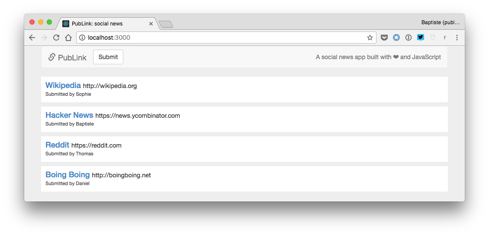

# Proyek: aplikasi web berita sosial 

Proyek akhir ini adalah puncak dari buku ini. Kamu bisa mengecek [hasil yang diharapkan](https://thejsway-publink.herokuapp.com). Sukses ya!

## Tujuan

Proyek ini dibangun dari program berita sosial dan halaman web yang Kamu buat sebelumnya. Kali ini, tujuannya adalah untuk membuat *aplikasi* berita sosial berbasis server Node.js.

## Kebutuhan fungsional

* Sebuah link didefinisikan berdasarkan judul, URL, dan penulisnya (pengirim).
* Jika URL link baru tidak dimulai dengan `"http://"` atau `"https://"`, `"http://"` ditambahkan secara otomatis di depannya.
* Aplikasi web menampilkan daftar setidaknya tiga eksisting link, diambil dari server melalui permintaan AJAX.
* Satu tombol digunakan oleh pengguna untuk mengirim link baru. Ketika diklik, sebuah formulir muncul sebelum daftar link untuk memasukkan properti link yang baru (penulis, judul, dan URL).
* Pada formulir ini, semua isian link adalah wajib.
* Saat link baru divalidasi oleh pengguna, link tersebut dikirim sabagai data formulir ke server. Jika operasi sukses, server mengembalikan link baru sebagai data JSON. Link baru ditambahkan di atas daftar link, menggantikan formulir. Satu pesan mengindikasikan kesuksesan operasi, lalu hilang setelah dua detik.

## Kebutuhan teknikal

* Server harus menggunakan module yang didefinisikan pengguna yang mengekspor kode link terkait.
* Kamu harus menggunakan kembali kode yang berguna dari proyek sebelumnya.
* Semua kode Kamu harus terindentasi dengan benar.
* Nama variabel harus dipilih dengan bijak dan mentaati aturan camelCase.
* Duplikasi kode harus dihindari.

## Hasil yang diharapkan

Berikut beberapa screenshot dari hasil yang diharapkan.

