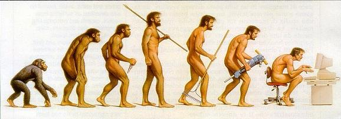

# Selamat datang di pemrograman

## TL;DR

* **Komputer** adalah mesin yang berfungsi untuk mengeksekusi serangkaian aksi atau perintah yang diberikan oleh penggunanya.

* **Program** adalah serangkaian aksi yang diberikan ke komputer. Aksi ini diberikan dalam bentuk perintah tekstual. Semua perintah ini membentuk **sumber kode** program.

* Tugas **programer** membuat program. Untuk mencapai tujuan ini, programer bisa menggunakan bahasa pemrograman yang berbeda.

* Sebelum menulis kode, programer harus berpikir ke depan dan memilah permasalahan dan operasi dasar dalam bentuk **algoritma**.

## Apa itu program?



Sejak ditemukan di tahun 1950, **komputer** telah merevolusi kehidupan kita sehari-hari. Mengkalkulasi rute dari website atau GPS, memesan tiket kereta atau pesawat, atau bertemu dan *chatting* bersama teman di balik belahan dunia: semua ini bisa dilakukan dan dimungkinkan berkat komputer.

> Mari ambil istilah "komputer" dalam pandangan umum, yang artinya mesin yang dapat melakukan operasi aritmetik dan logik. Bisa juga berarti *desktop* atau laptop komputer (PC, Mac), server komputer, atau perangkat *mobile* seperti tablet atau *smartphone*.

Meskipun demikian, komputer hanya bisa melakukan serangkaian operasi sederhana ketika diinstruksikan. Komputer biasanya tidak memiliki kemampuan untuk belajar, menilai, atau berimprovisasi. Hanya bisa melakukan apa yang diperintahkan oleh pengguna! Nilai komputer didapat dari bagaimana komputer bisa memproses informasi yang sangat melimpah.

Komputer seringkali membutuhkan intervensi manusia. Inilah di mana programer dan developer dibutuhkan! Mereka menulis program yang menghasilkan instruksi ke komputer.

**Program komputer** (atau biasa disebut aplikasi atau *software*) biasanya terdiri dari satu atau beberapa file yang berisi perintah dalam bentuk kode. Inilah kenapa developer juga disebut koder.

**Bahasa pemgrograman** merupakan salah satu cara untuk memberi perintah ke komputer. Ini seperti bahasa manusia! Setiap bahasa pemrograman memiliki kosa kata (kata kunci yang memiliki peran atau instruksi tertentu) dan tata bahasa (aturan yang menentukan bagaimana cara menulis program dalam bahasa tersebut).

## Bagaimana Kamu membuat program?

### Mendekati perangkat keras: bahasa assembly

Bahasa pemrograman yang langsung dimengerti oleh komputer adalah bahasa mesin. Representasi bahasa mesin yang lebih bisa dibaca oleh manusia adalah **bahasa asembly**. Bahasa ini terdiri dari serangkaian operasi primitif yang terhubung dengan keluarga prosesor yang spesifik ("otak" komputer) dan memanipulasi memori.

Berikut contoh pemrograman dasar yang ditulis dalam bahasa assembly. Program ini menampilkan `"Hello"` ke pengguna.

```assembly
str:
    .ascii "Hello\n"
    .global _start

_start:
movl $4, %eax
movl $1, %ebx
movl $str, %ecx
movl $8, %edx
int $0x80
movl $1, %eax
movl $0, %ebx
int $0x80
```
Sangat menyeramkan, ya? Untungnya, bahasa pemrograman lainnya lebih sederhana dan mudah digunakan dibandingkan bahasa assembly.

### Keluarga bahasa pemgrograman

Bahasa pemrograman ada banyak, masing-masing menyesuaikan terhadap penggunaan tertentu dan memiliki sintaks tersendiri. Walaupun begitu, banyak persamaan diantara bahasa pemrograman yang populer. Berikut ini contoh program sederhana yang ditulis dalam bahasa Python:

```python
print("Hello")
```
Kamu juga bisa menulis hal yang sama dalam bahasa PHP:

```php
<?php
    echo("Hello\n");
?>
```

Atau bahkan bahasa C#!

```csharp
class Program {
    static void Main(string[] args) {
        Console.WriteLine("Hello");
    }
}
```
Bagaimana dengan bahasa Java?

```java
public class Program {
    public static void main(String[] args) {
        System.out.println("Hello");
    }
}
```

Semua program ini menampilkan `"Hello"` melalui serangkaian instruksi yang berbeda.

### Eksekusi program

Fakta meminta komputer untuk memproses perintah yang terdapat dalam program disebut **eksekusi**. Terlepas dari bahasa pemrograman yang digunakan, sebuah program harus diterjemahkan ke kode assembly agar bisa dieksekusi. Proses penerjemahan tergantung dari bahasa yang digunakan.

Dengan menggunakan beberapa bahasa, terjemahan ke kode assembly terjadi baris demi baris secara *real time*. Dalam kasus ini, program dieksekusi seperti halnya manusia membaca sebuah buku, di mulai dari atas halaman, lalu ke bawah baris demi baris. Bahasa ini disebut **terinterpretasi** *(interpreted)*. Python dan PHP merupakan contoh bahasa terinterpretasi.

Kemungkinan lainnya adalah membaca dan mengecek eror di seluruh sumber kode sebelum eksekusi. Kalau tidak ada eror terdeteksi, sebuah sasaran yang dapat dieksekusi untuk platform perangkat keras spesifik akan dihasilkan. Langkah selanjutnya disebut **kompilasi** *(compilation)*, dan bahasa pemrograman yang menggunakan itu disebut **terkompilasi** *(compiled)*.

Yang terakhir, beberapa bahasa ter-*pseudo-compiled* agar bisa dieksekusi di platform perangkat keras yang berbeda. Contohnya ada di bahasa Java dan juga pada keluarga Microsoft .NET (VB.NET, C#, dan lainnya).

## Belajar koding

### Pengenalan algoritma

Kecuali terjadi di kasus sangat sederhana, Kamu tidak membuat program dengan cara langsung menuliskan sumber kodenya. Pertama-tama, Kamu harus berpikir terlebih dulu tentang instruksi yang akan Kamu buat.

Ambil contoh nyata dalam kehidupan sehari-hari: Saya ingin membuat burrito (kebab meksiko). Langkah apa yang harus saya lakukan agar tujuan saya tercapai?

```text
Mulai
    Ambil penanak nasi
    Isi dengan beras
    Isi dengan air
    Masak nasi
    Potong sayuran
    Tumis sayuran
    Cicipi sayuran
        Kalau sayurannya enak
            Keluarkan dari kompor
        Kalau sayurannya kurang enak
            Tambahkan lada dan bumbu
        Kalau sayurannya kurang matang
            Tumis kembali sayurannya
    Panaskan tortilla
    Tambahkan nasi ke tortilla
    Tambahkan sayuran ke tortilla
    Gulung tortilla
Selesai
```


Kamu capai tujuan Kamu dengan mengkombinasikan serangkaian perintah dalam urutan yang spesifik. Ada beberapa jenis perintah yang berbeda:

* Perintah sederhana ("Ambil penanak nasi")
* Perintah dengan syarat ("Kalau sayurannya kurang enak")
* Perintah yang berulang ("Tumis kembali sayurannya")

Kita gunakan gaya menulis yang sederhana, dan bukan bahasa pemrograman yang spesifik. Faktanya, kita hanya menulis apa yang dinamakan **algoritma**. Kita bisa mendefinisikan algoritma sebagai perintah berurut untuk menyelesaikan suatu persoalan. Algoritma memilah persoalan yang rumit ke serangkaian operasi sederhana.

### Peran programer

Menulis program yang dapat mensolusikan persoalan yang diharapkan merupakan tujuan dari programer. Seorang pemula bisa belajar dengan cepat untuk membuat program yang sederhana. Menjadi suatu hal yang sangat rumit ketika program bervolusi dan menjadi sangat kompleks. Dibutuhkan pengalaman dan banyak latihan sebelum Kamu merasa bisa mengendalikan kompleksitas ini! Ketika Kamu sudah mempunyai dasar yang kuat, batasannya hanyalah imajinasi Kamu!

> "Programer komputer adalah kreator semesta yang dia sendiri merupakan hakim. Bukan penulis naskah, bukan sutradara, bukan kaisar, tetapi *powerful*, bisa menggerakan dan mengatur pentas dan medan perang dengan teguhnya memerintah aktor dan pasukan yang sangat patuh kepadanya." (Joseph Weizenbaum)
