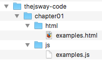
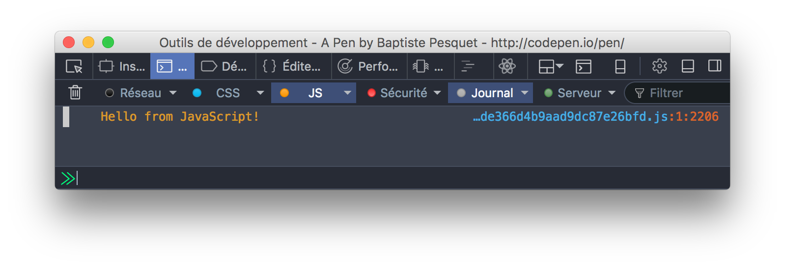

# Environment setup

## Prasyarat: browser modern

Buku ini menyesuaikan dengan bahasa JavaScript versi terbaru. Lebih spesifik lagi, Kamu membutuhkan browser yang dapat menjalankan kode yang ditulis dalam spesifikasi bahasa ES2015 (ES6).

Sebuah **browser** adalah software yang Kamu gunakan untuk mengunjungi halaman web dan aplikasi web. Cek ini: [tabel *compatibility*](https://kangax.github.io/compat-table/es6/) untuk melihat lebih detail tentang dukungan ES2015 di berbagai browser.

Pilihan paling aman: gunakan antara Google Chrome atau Mozilla Firefox. Browser versi terbarunya memiliki dukungan ES2015 yang sangat baik dan bisa meng-update sendiri. Browser lain yang kapabel di antaranya adalah Opera dan Microsoft Edge (browser bawaan di Windows 10). Di lain pihak, semua versi Internet Explorer memiliki banyak isu dengan kode ES2015: jangan pakai ini.

## Solusi: koding online 

Mungkin Kamu orang yang sedikit kurang sabaran, atau mungkin Kamu lebih memilih untuk tidak mengeset mesin lokal Kamu sekarang. Untungnya, salah satu keindahan JavaScript adalah bahasa ini bisa jalan di hampir semua browser. Semua yang perlu Kamu lakukan hanyalah dengan menggunakan koneksi Internet. 

Koding online perlu **JavaScript playground**, suatu layanan online di mana Kamu bisa mengetik kode JavaScript dan langsung bisa melihat hasilnya.

### Untuk bab 11 sampai 23: CodePen

Untuk mengikuti bab ini, Kamu perlu koding *playground* **front-end** yang dapat menjalankan kode HTML, CSS dan JavaScript. Ada banyak online front-end playgrounds. Favorit saya adalah [CodePen](http://codepen.io), tetapi juga ada alternatif lain seperti [JSFiddle](https://jsfiddle.net/) dan [JS Bin](http://jsbin.com/).


Kalau Kamu memilih CodePen, Kamu *benar-benar harus* mulai mengunjungi [Welcome to CodePen](https://codepen.io/hello/). Halaman web ini akan mengenalkan Kamu tentang platform tersebut dengan cara yang bersahabat dan memberi Kamu segala keperluan untuk memulai.

Selain itu, banyak artikel yang dapat membantu Kamu dengan membaca dokumentasi CodePen tentang [autocomplete](https://blog.codepen.io/documentation/editor/autocomplete/), [console](https://blog.codepen.io/documentation/editor/console/), [pen autosaving](https://blog.codepen.io/documentation/editor/autosave/), [keybindings](https://blog.codepen.io/documentation/editor/key-bindings/) dan [auto-updating](https://blog.codepen.io/documentation/editor/auto-updating-previews/). Walaupun bukan suatu keharusan, menguasai CodePen akan membuat Kamu lebih produktif ketika mempelajari buku ini.

> Saya sarankan Kamu untuk mengaktifkan *autosave* dan menon-aktifkan *auto-update* untuk semua *book-related pens*. Menampilkan console CodePen seringkali dibutuhkan untuk dapat melihat hasil dari kode.

Kamu sebaiknya menggunakan *pen* (tidak perlu disimpan) untuk mencoba setiap contoh kode yag ada di buku ini. Kamu juga sebaiknya mendedikasikan satu *pen* yang spesifik dan tersimpan untuk setiap latihan dan proyek yang akan Kamu cari nantinya.

> Untuk alasan performansi, console CodePen tidak selalu menampilkan sejumlah informasi yang sama seperti halnya console browser yang "asli".

### Dari bab 24 dan selanjutnya: Glitch

Mulai bab 24, playground **back-end** akan diperlukan untuk membuat aplikasiNode.js. Pilihan terkenal adalah [Glitch](https://glitch.com), platform untuk membuat aplikasi web berbasis Node dengan cepat. Glitch meniru setup Node lokal dan mengotomasi hal-hal seperti eksekusi kode, manajemen paket, *hosting* dan *deployment*. Kamu juga bisa mengkostumisasi (duplikasi) aplikasi Glitch untuk kebutuhan sesuai selera Kamu.


Kamu bisa mempelajari lebih banyak tentang Glitch [di sini](https://glitch.com/about/) dan mulai memadukan [proyek ini](https://glitch.com/edit/#!/thejsway-starterapp).

## Solusi B: membangun environment pengembangan lokal 

Mengeset mesin lokal Kamu memerlukan banyak usaha, tetapi akan memberikan Kamu *environment* yang *powerful* dan sesuai yang Kamu butuhkan. Hal ini akan menjadi pilihan utama Kamu kalau Kamu perlu bekerja dalam mode offline.

Langkah berikut ini akan membantu Kamu agar bisa koding secara efektif di mesin Kamu.

### Instal editor kode 

Intinya, pemrograman adalah mengetik kode sebagai teks di berbagai file. Untuk benar-benar memprogram, Kamu akan membutuhkan sebuah **editor kode** di mesin Kamu. Ini beberapa yang bisa Kamu gunakan:

* [Visual Studio Code](https://code.visualstudio.com/) (pilihan saya).
* [Brackets](http://brackets.io/).
* [Atom](https://atom.io/).
* [Sublime Text](https://www.sublimetext.com/).

### Instal Node.js dan npm

Platform **Node.js** diperlukan pada bab 24 dan selanjutnya. Manajemen paket **npm** akan terotomatis ter-instal bersama dengan Node.

Untuk mengeset Node di mesin lokal Kamu, untuk versi terbarunya [di sini](https://nodejs.org), eksekusi file hasil unduhan dan ikuti instruksinya.

> Beberapa contoh di buku ini perlu versi 8 atau versi yang lebih baru.

Cara termudah untuk mengetes apakah node sudah ter-instal adalah dengan menjalankan perintah `node --version` di terminal dan cek hasil outputnya. Perintah ini akan menampilkan versi node yang sedang Kamu gunakan.

```console
node --version
```
### Instal *formatter* kode dan *linter*

Bertahun-tahun, banyak *tool* telah dibuat untuk memudahkan developer JavaScript. Secara umum, 2 jenis *tool* ini banyak digunakan oleh para profesional JavaScript:

* **Formatter kode** membebaskan Kamu dari beban berat untuk mem-format kode secara manual dan meningkatkan konsistensi. [Prettier](https://github.com/prettier/prettier) merupakan standar yang banyak digunakan saat ini.
* **Linter** bisa membuat Kamu meningkatkan kualitas kode Kamu secara signifikan, mendeteksi *bug* dan membuat Kamu mengikuti praktik yang baik. [ESLint](http://eslint.org) merupakan pilihan yang umum.

Cara termudah untuk mengeset ESLint dan Prettier adalah dengan menambahkannya sebagai **extension** (terkadang dinamakan *add-ons*) ke editor kode Kamu. Untuk VS Code, gunakan tautan berikut:

* [Prettier extension](https://marketplace.visualstudio.com/items?itemName=esbenp.prettier-vscode).
* [ESLint extension](https://marketplace.visualstudio.com/items?itemName=dbaeumer.vscode-eslint).

Ikuti instruksi yang disediakan di dokumentasi tersebut.

> Konfigurasi ESLint akan dibahas di bab berikutnya. 

### Atur kode Kamu

Mengeset berkas (folder) dan struktur file sebelum mulai kode sangatlah penting. Dengan melakukan ini, proyek Kamu akan lebih terorganisir, dan Kamu bisa memulai koding dengan kebiasaan pemrograman yang baik.

Buat berkas di komputer Kamu secara terpisah untuk mengikuti koding di buku ini. Nama berkas Kamu tidaklah penting, `kode thejsway` juga bisa. Semua file lokal yang Kamu buat harus disimpan di sub-berkas dari berkas utama ini. Solusi yang paling logis adalah dengan membuat sub-berkas untuk setiap bab dari buku ini.

Kamu juga bisa mengunduh [struktur berkas yang sudah diatur](https://raw.githubusercontent.com/bpesquet/thejsway/master/resources/code-skeleton.zip) atau mengikuti instruksi di paragraf berikut untuk membuat struktur berkas secara manual.

#### Untuk bab 1 sampai 23

Di bab ini, Kamu akan mengeksekusi kode JavaScript Kamu di browser. File Kamu akan disimpan berdasarkan tipenya: file HTML (`.html` extension) di sub-berkas `html`, file CSS (`.css`) di sub-berkas `css` dan file JavaScript (`.js`) di sub-berkas `js`. Setiap bab diset dalam berkas sebagai berikut.



Sebagai contoh untuk setiap latihan di satu bab, buat file HTML di sub-berkas `html` dari berkas bab. Di file HTML ini, sebuah `<script>` akan memuat kode JavaScript terkait.

```html
<!doctype html>
<html>

<head>
    <meta charset="utf-8">
    <title>Contoh kode</title>
</head>

<body>
    <!-- Kode HTML di sini -->

    <script src="../js/examples.js"></script>
</body>

</html>
```
Tag `<script>` ini memerintahkan browser untuk memuat file JavaScript `examples.js` dengan lokasi path `../js/examples.js`. Dua titik (`..`) di setiap awal path mengindikasikan bahwa Kamu kembali ke satu level struktur direktori relatif terhadap file HTML, sebelum mencari sub-berkas `js`, ke file bernama `examples.js`.

Selanjutnya, buka file HTML di browser Kamu untuk mengeksekusi kode JavaScript yang tersimpan di file `.js`. Hasilnya akan terihat di console browser (lihat di bawah).

#### Mulai bab 24 dan selanjutnya 

Di bab ini, Kamu akan membuat aplikasi Node.js untuk mengeksekusi kode JavaScript. Setiap aplikasi Node harus berada di berkasnya sendiri dan terlihat di file `package.json` yang berlokasi di root berkas ini. Sub-direktori mungkin akan digunakan untuk menyimpan file spesifik berikut:

* `node_modules` (otomatis terbuat) untuk dependensi eksternal.
* `public` untuk *client assets* yang dimuat oleh browser, seperti file CSS dan JavaScript.
* `views` untuk file HTML.
* `modules` untuk internal modul.

### Gunakan *tool* pengembangan browser

Browser modern memiliki **developer tools** untuk membantu pengembangan web. Setiap browser berbeda satu sama lainnya, namun ada juga beberapa persamaannya.

Tool ini biasanya ada **JavaScript console** (untuk menampilkan output JS dan mengetik perintah), **page inspector** (untuk melihat struktur halaman) dan lainnya!



Lihat tautan berikut untuk mengetahui tentang *browser developer tool*:

* [Khan Academy - Inspeksi HTML dan CSS](https://www.khanacademy.org/computing/computer-programming/html-css/web-development-tools/a/using-the-browser-developer-tools).
* [OpenClassrooms - Optimasi website Mamu dengan DevTools](https://openclassrooms.com/courses/optimize-your-website-with-devtools).
* [Chrome DevTools Overview](https://developer.chrome.com/devtools).
* [Firefox Developer Tools](https://developer.mozilla.org/en-US/docs/Tools).
